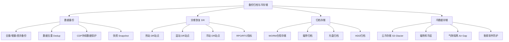
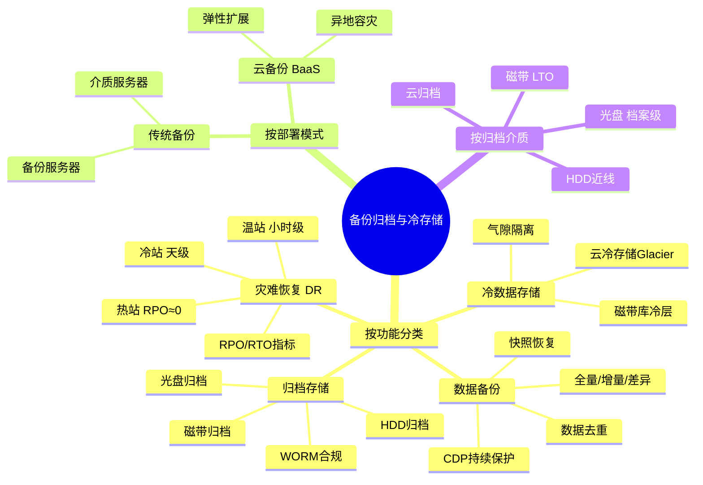
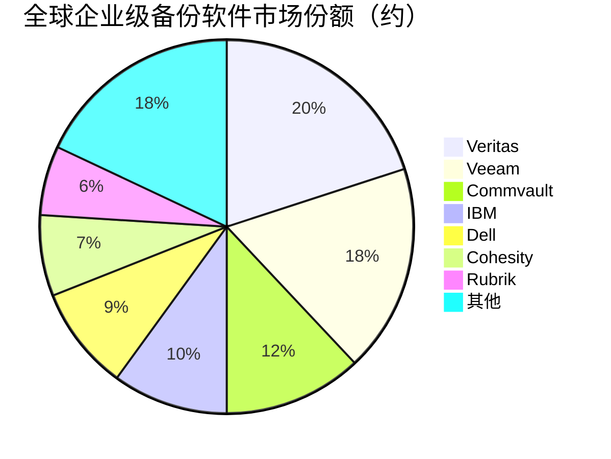

# 备份归档与冷存储

> 面向数据保护、长期保存和灾难恢复的存储解决方案，是数据生命周期管理的最后一环。

## 概述

备份归档与冷存储是存储产业链下游面向数据保护和长期保存的关键领域，涵盖数据备份、灾难恢复、合规归档和冷数据存储等场景。随着数据量的指数级增长和合规要求的日趋严格，备份归档与冷存储市场规模持续扩大，成为存储产业中稳定增长的重要细分市场。

数据备份是数据保护的基础，通过定期复制数据到备用存储介质，在原始数据丢失或损坏时进行恢复。现代备份方案已从传统的定期全量备份演进为增量备份、去重、CDP（持续数据保护）和快照等高效方案。灾难恢复（DR, Disaster Recovery）在备份基础上提供整个IT系统的快速恢复能力，确保业务连续性。

归档存储面向长期数据保存需求——金融交易数据需保存7-15年，医疗影像数据需保存15-30年，电子档案需永久保存。归档存储使用最低成本的存储介质（磁带、大容量HDD、光盘），数据写入后很少访问，但对数据完整性和长期可靠性要求极高。

冷存储是归档存储在云时代的延伸——AWS S3 Glacier、阿里云归档存储、腾讯云归档存储等提供超低成本的云端冷数据存储服务，后端大量使用磁带和低成本HDD。勒索软件的泛滥使备份归档的"气隙隔离"（Air Gap）价值凸显——离线备份副本可有效防范勒索软件加密攻击。

## 技术原理

**数据备份**通过复制生产数据到备用存储实现数据保护。现代备份技术包括：**全量备份**（Full Backup，复制所有数据）、**增量备份**（Incremental Backup，仅复制变化数据）和**差异备份**（Differential Backup，复制自上次全量以来变化的数据）。**合成全量备份**（Synthetic Full Backup）在备份服务器上合并增量数据生成全量备份，减少生产系统负载。

**数据去重**（Deduplication）是备份系统的核心技术——通过识别和消除重复数据块，将备份数据量降低10-30倍。去重分为源端去重（在客户端去重，减少网络传输）和目标端去重（在备份服务器去重），以及在线去重和后处理去重。

**CDP（Continuous Data Protection）**持续记录数据变化，提供任意时间点的恢复能力（Recovery Point Objective接近0），适用于关键业务数据保护。**快照**（Snapshot）通过Copy-on-Write技术快速创建数据时间点副本，恢复速度快但占用存储空间。

**归档存储**采用WORM（Write Once Read Many）技术确保数据不可篡改，满足合规要求。归档介质选择需平衡成本、寿命和可访问性——磁带成本最低但需机械加载，HDD访问较快但功耗较高，光盘寿命最长但单盘容量有限。

**气隙隔离**（Air Gap）通过将备份副本离线存储（如磁带离库、光盘归档），在物理层面隔离备份数据与生产网络，有效防范勒索软件通过网络传播加密备份数据。

## 分类与技术路线

备份归档与冷存储按功能分为**数据备份**（定期复制数据用于恢复）、**灾难恢复**（系统级快速恢复能力）、**归档存储**（长期合规保存）和**冷数据存储**（低频访问数据的经济存储）。

按备份部署模式分为**传统备份**（备份服务器+介质服务器+客户端代理）和**云备份**（Backup-as-a-Service，备份数据存储到云端）。云备份具有弹性扩展、异地容灾和按量付费优势，但面临数据传输带宽和云出口费用挑战。

按归档介质分为**磁带归档**（LTO磁带，成本最低，寿命30年+）、**HDD归档**（大容量近线HDD，访问较快）、**光盘归档**（档案级蓝光，寿命50-100年）和**云归档**（S3 Glacier等，弹性容量）。不同介质的成本、访问速度和寿命特征适合不同归档场景。

按灾难恢复能力分为**热站**（Hot Site，DR站点实时同步，RPO≈0，RTO分钟级）、**温站**（Warm Site，定期同步，RTO小时级）和**冷站**（Cold Site，仅基础设施，RTO天级）。RPO（恢复点目标）和RTO（恢复时间目标）是衡量DR能力的核心指标。

## 市场格局

全球备份归档与冷存储市场规模约150-200亿美元，其中企业级备份软件约80-100亿美元，归档存储约30-40亿美元，云备份/DR服务约30-40亿美元。

企业级备份软件市场由Veritas、Veeam、Commvault、IBM（Spectrum Protect/Tivoli）、Dell（Avamar/Networker）等主导。**Veritas**是传统备份软件市场的老牌领导者，NetBackup在企业级市场占有率领先。**Veeam**是虚拟化/云时代备份的领导者，在VMware和Hyper-V环境备份中份额领先，正在向云原生和Kubernetes备份扩展。**Commvault**以一体化数据管理平台著称。

云备份和DR服务方面，AWS Backup、Azure Backup、Google Cloud Backup等云原生备份服务快速增长，Druva、Cohesity、Rubrik等云原生备份创业公司也获得市场认可。归档存储介质方面，磁带（Fujifilm/Sony）和光盘（Sony/Panasonic）由日本企业主导，HDD归档由希捷和西部数据主导。

## 代表企业

| 企业 | 国家/地区 | 主要产品/技术 | 市场地位 |
|------|----------|-------------|---------|
| Veritas | 美国 | NetBackup/Backup Exec | 传统企业级备份龙头 |
| Veeam | 瑞士/美国 | Veeam Backup & Replication | 虚拟化/云备份领导者 |
| Commvault | 美国 | Complete Backup & Recovery | 一体化数据管理平台 |
| Cohesity | 美国 | Cohesity DataPlatform | 云原生二级存储/备份 |
| Rubrik | 美国 | Rubrik Cloud Data Management | 云原生备份/勒索防护 |
| Dell Technologies | 美国 | Avamar/Networker/PowerProtect | 企业级备份解决方案 |
| IBM | 美国 | Spectrum Protect/Defender | 大型企业备份方案 |
| Druva | 美国 | Druva Cloud Platform | 云原生备份BaaS |

## 发展趋势

1. **勒索软件防护集成**：备份系统集成勒索软件检测、不可变备份（Immutable Backup）和气隙隔离功能，成为企业网络安全最后一道防线，Rubrik/Cohesity等在此领域领先。

2. **云原生备份普及**：备份从本地部署向云原生架构转型，AWS Backup/Azure Backup等云服务商原生备份服务增长，Druva等纯云备份厂商份额提升。

3. **Kubernetes/容器备份**：容器化应用的数据保护需求催生Kubernetes备份方案，Velero、Kasten K10等容器备份工具快速发展。

4. **冷存储成本优化**：AI和大数据产生的海量冷数据推动冷存储成本优化，磁带和云Glacier类服务的成本优势凸显，分层存储策略更加精细。

5. **CDP与即时恢复**：CDP持续数据保护和即时恢复（Instant Recovery）技术普及，将RPO和RTO压缩到分钟级甚至秒级，关键业务数据保护能力显著提升。

## AI基建拉动分析

AI训练和使用产生的海量数据需要长期保存和备份——训练数据集、模型快照、推理日志、用户交互数据等构成AI数据的完整生命周期，备份归档与冷存储是这一生命周期的最后一环。AI训练数据通常在热存储层使用完毕后归档到冷存储层，长期保存以备模型迭代和合规审计。AI模型的备份和版本管理也需要备份系统支持，确保模型资产安全。勒索软件对AI训练数据的威胁使气隙隔离备份价值凸显——离线备份的AI训练数据可有效防范勒索攻击，避免数月训练成果被加密勒索。

从备份角度看，AI训练集群的大规模部署增加了需要保护的数据量和系统复杂度，推动企业级备份软件和DR服务需求。从归档角度看，AI数据的长期保存需求推动磁带、光盘和云冷存储等低成本归档介质需求。预计AI基建浪潮将在2025-2028年为备份归档与冷存储市场带来5-8%的年化额外增长，云备份/DR服务和冷存储归档是最受益的细分领域。

---
[← 返回总目录](../README.md)
