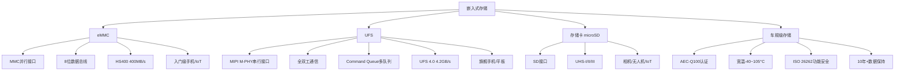
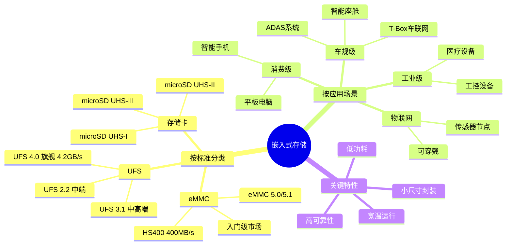
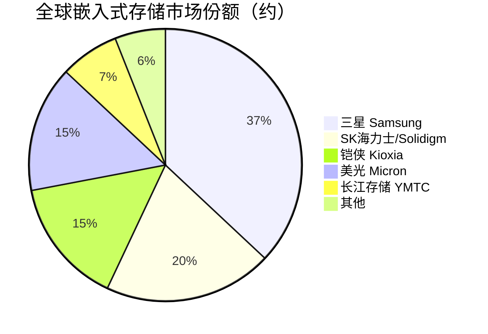

# 嵌入式存储

> 集成在电子设备内部的小型化存储器件，包括eMMC、UFS、存储卡等产品形态，是手机、汽车和物联网设备的核心存储。

## 概述

嵌入式存储是存储产业链下游面向移动和嵌入式应用的重要产品领域，以小尺寸、低功耗、高可靠性为特征，广泛应用于智能手机、平板电脑、汽车电子、物联网设备和工业控制等场景。嵌入式存储产品将NAND Flash芯片和主控芯片封装在单一芯片或小型模块内，通过标准化接口与主机处理器通信，提供一体化的存储解决方案。

eMMC（embedded Multi Media Card）和UFS（Universal Flash Storage）是嵌入式存储的两大主流标准。eMMC是较早的标准，采用并行接口，速率约400MB/s，已逐步被UFS替代。UFS采用串行接口（类似PCIe），支持全双工通信，UFS 4.0理论速率可达4.2GB/s，是当前旗舰智能手机的主流存储方案。

汽车电子是嵌入式存储增长最快的应用领域之一。车规级eMMC和UFS需要满足AEC-Q100标准，在宽温（-40°C至+105°C）、长寿命（10年以上）、高可靠性和功能安全方面有严格要求。随着智能座舱、ADAS和车联网的普及，单车存储容量从32GB向256GB+发展，车规存储市场快速增长。

## 技术原理

**eMMC**将NAND Flash芯片和主控芯片集成在单一BGA封装内（通常11.5mm×13mm），通过MMC接口（8位并行数据总线）与主机通信。eMMC内部包含FTL（Flash Translation Layer）固件，管理NAND的磨损均衡、垃圾回收和纠错，对主机呈现为简单的块设备。eMMC 5.1标准最高速率为400MB/s（HS400模式），使用TLC NAND，容量从4GB到256GB。

**UFS**采用串行差分信号接口（MIPI M-PHY物理层 + UniPro协议层），支持全双工通信和多命令队列（Command Queue, CQ），显著提升随机读写性能。UFS 4.0理论带宽为4.2GB/s（每方向2.1GB/s×2），是eMMC的10倍以上。UFS内部同样集成主控和FTL，支持TLC/QLC NAND，容量从64GB到1TB+。UFS还支持写入增强器（Write Booster）和深度睡眠等低功耗模式。

**存储卡**（microSD卡）将NAND和主控封装在更小的卡片形态中（11mm×15mm），通过SD接口通信。高端microSD卡（UHS-II/UHS-III）速率可达624MB/s-1040MB/s，但功耗和尺寸限制使其在手机中逐渐被UFS替代，更多用于相机、无人机和物联网设备。

**车规级嵌入式存储**在消费级产品基础上增加可靠性设计：宽温运行（-40°C至+105°C）、长数据保持（10年+）、高P/E循环耐久性、ISO 26262功能安全（ASIL-B/ASIL-D）、AEC-Q100 Grade 2/3认证。车规eMMC/UFS通常采用更保守的TLC甚至MLC NAND，预留更多OP（Over-Provisioning）空间。

## 分类与技术路线

嵌入式存储按标准分为**eMMC**（eMMC 5.0/5.1，入门级市场）、**UFS**（UFS 2.2/3.1/4.0，主流市场）和**存储卡**（microSD UHS-I/II/III）。eMMC逐步退出旗舰手机市场，但在入门级手机、智能家居和工业设备中仍有广泛应用。UFS 4.0是2023年起新旗舰手机的标配，UFS 3.1在中端手机中广泛使用。

按应用场景分为**消费级嵌入式存储**（手机/平板）、**车规级嵌入式存储**（智能座舱/ADAS/T-Box）、**工业级嵌入式存储**（工控机/医疗设备/网关）和**物联网存储**（穿戴设备/传感器节点）。不同场景对可靠性、温度范围和寿命的要求差异显著。

按NAND类型，消费级嵌入式存储主要使用TLC NAND（部分入门级使用QLC），车规级倾向于TLC/MLC以确保可靠性，工业级使用TLC/SLC。3D NAND在嵌入式存储中的渗透率快速提升，112-162层TLC是当前主流。

## 市场格局

全球嵌入式存储市场规模约150-200亿美元，其中手机嵌入式存储占70%以上，车规存储占10-15%且增长最快。嵌入式存储市场高度集中于NAND原厂——三星约占35-40%份额，SK海力士/Solidigm约20%，铠侠（Kioxia）约15%，美光约15%，长江存储约5-8%。

车规级存储市场方面，三星、美光、Kioxia是主要供应商，中国企业在车规存储领域起步较晚但正快速追赶。江波龙、北京君正（ISSI）、兆易创新等在车规级eMMC和SPI NOR Flash领域有一定市场份额。

手机品牌厂商（华为、小米、OPPO、vivo等）是嵌入式存储的主要采购方。旗舰手机普遍采用512GB-1TB UFS 4.0存储，中端手机采用128-256GB UFS 3.1，入门级手机采用64-128GB eMMC 5.1或UFS 2.2。

## 代表企业

| 企业 | 国家/地区 | 主要产品/技术 | 市场地位 |
|------|----------|-------------|---------|
| 三星电子 | 韩国 | UFS 4.0嵌入式存储、车规UFS | 全球嵌入式存储龙头 |
| SK海力士 | 韩国 | UFS 3.1/4.0、eMMC | 全球第二大嵌入式存储供应商 |
| 铠侠 Kioxia | 日本 | UFS、eMMC、车规存储 | 3D NAND先驱，嵌入式存储主力 |
| 美光科技 | 美国 | UFS 4.0、车规级eMMC/UFS | 车规存储领先供应商 |
| 长江存储 | 中国 | UFS 3.1嵌入式存储 | 中国嵌入式存储新兴力量 |
| 江波龙 | 中国 | eMMC/UFS模组、车规存储 | 中国嵌入式存储模组领先 |
| 北京君正/ISSI | 中国 | 车规级存储、SRAM/DRAM | 车规存储国产化先行者 |
| 兆易创新 | 中国 | SPI NOR Flash、嵌入式存储 | 国内NOR Flash龙头 |

## 发展趋势

1. **UFS 4.0全面普及**：UFS 4.0在旗舰手机中普及，UFS 4.1和下一代标准研发推进，带宽向6GB/s+发展，满足AI手机端侧推理需求。

2. **车规存储爆发增长**：智能座舱大屏化、ADAS高精地图和行车记录仪推动车规存储需求，单车存储容量向256GB-1TB发展，UFS逐步进入车载市场。

3. **AI手机端侧存储**：AI手机端侧运行大模型（如7B参数模型需约7GB存储）推动大容量UFS 4.0需求，LPDDR5X+UFS 4.0组合成为AI手机标配。

4. **国产化替代加速**：基于长江存储NAND的国产嵌入式存储在手机和车载市场加速替代进口产品，江波龙等模组厂配合推进。

5. **存储与计算融合**：嵌入式存储中集成轻量级计算功能（如数据压缩、加密），减轻主处理器负担，在IoT和可穿戴设备中尤为重要。

## AI基建拉动分析

AI基建对嵌入式存储的拉动主要体现在两个维度：一是AI手机的端侧推理需求推动大容量高速UFS存储增长——7B参数大模型需要约7GB存储空间，加上模型推理的临时数据，AI手机需要至少256GB甚至512GB以上的UFS 4.0存储；二是AI汽车（自动驾驶）对车规级大容量存储的需求急剧增长——高精地图、多路摄像头数据缓存、ADAS模型推理数据等需要256GB-1TB的车规UFS存储。虽然嵌入式存储不直接参与云端AI训练，但AI在终端设备（手机、汽车、IoT）的部署间接拉动了嵌入式存储市场。预计AI终端化趋势将在2025-2028年为嵌入式存储市场带来8-12%的年化额外增长，大容量UFS 4.0和车规存储是最受益的细分领域。

---
[← 返回总目录](../README.md)
