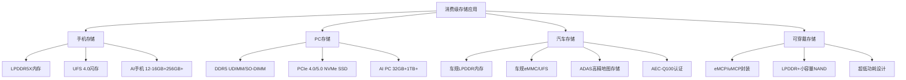
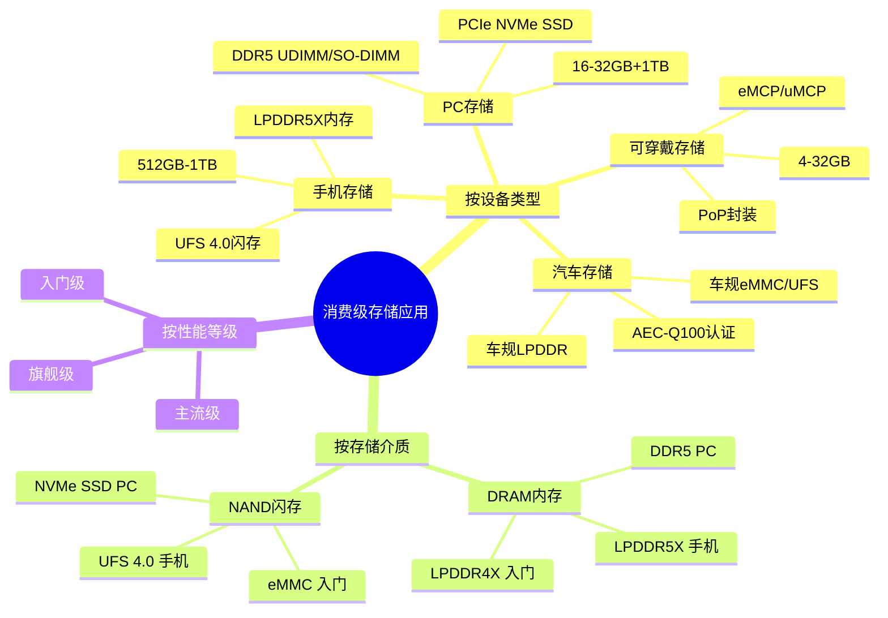
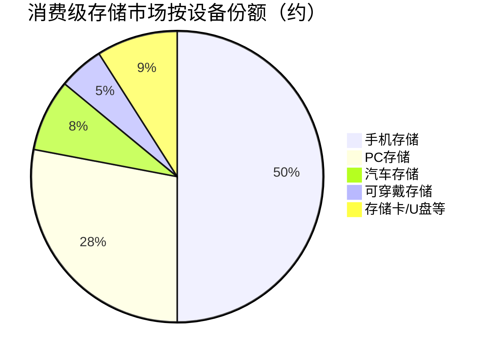

# 消费级存储应用

> 面向个人消费者的存储产品和应用场景，涵盖手机、PC、汽车和可穿戴设备的存储解决方案。

## 概述

消费级存储应用是存储产业链下游体量最大的市场领域，直接面向终端消费者，覆盖智能手机、个人电脑、汽车电子和可穿戴设备等多样化的应用场景。消费级存储以NAND Flash（SSD/UFS/eMMC）和DRAM（内存条/LPDDR）为核心介质，具有出货量大、价格敏感、迭代快速的特点，是存储芯片产能的主要消耗方。

智能手机是消费级存储最大的单一市场。旗舰手机普遍采用12-16GB LPDDR5X内存和512GB-1TB UFS 4.0存储，中端手机采用8-12GB LPDDR5和256GB UFS 3.1。AI手机的兴起进一步推动存储需求——端侧运行大模型需要至少12GB内存和256GB以上存储空间。

PC市场方面，DDR5内存和PCIe 4.0/5.0 NVMe SSD已成为新PC标配，16GB DDR5和512GB-1TB NVMe SSD是主流配置。AI PC的兴起推动内存容量向32GB+发展，以容纳端侧AI模型。汽车存储是增长最快的消费存储细分市场，智能座舱、ADAS和车联网推动单车存储容量从64GB向512GB+发展。可穿戴设备（智能手表、AR/VR眼镜）虽然单设备存储容量较小，但出货量大且对低功耗和小尺寸有严格要求。

## 技术原理

消费级存储的技术架构围绕移动和嵌入式应用的特殊需求设计。**手机存储**采用LPDDR（Low-Power DDR）内存 + UFS闪存的组合：LPDDR5X提供高带宽低功耗的运行内存（速率可达8533-9600MT/s，电压1.05V），UFS 4.0提供高速非易失性存储（4.2GB/s带宽，支持Command Queue多队列）。

**PC存储**采用DDR5内存 + NVMe SSD的组合：DDR5 UDIMM/SO-DIMM提供主内存（4800-6400MT/s），PCIe 4.0/5.0 NVMe M.2 SSD提供系统盘和数据存储（7-14GB/s带宽）。AI PC需要在内存中驻留AI模型，推动DDR5容量从16GB向32GB+发展。

**汽车存储**采用车规级LPDDR + eMMC/UFS组合：智能座域控制器使用LPDDR4X/5内存（4-16GB）和eMMC/UFS存储（64-512GB）；ADAS域控制器使用LPDDR5内存（8-32GB）存储高精地图和传感器数据缓存；行车记录仪使用microSD或eMMC存储。车规存储需满足AEC-Q100认证和ISO 26262功能安全要求。

**可穿戴存储**采用超小封装NAND + LPDDR：智能手表使用eMCP/uMCP（eMMC+LPDDR多芯片封装）或PoP（Package on Package），容量4-32GB；AR/VR眼镜需要更高带宽的存储，采用LPDDR5 + UFS组合。

## 分类与技术路线

消费级存储按设备类型分为**手机存储**（LPDDR + UFS）、**PC存储**（DDR5 UDIMM/SO-DIMM + NVMe SSD）、**汽车存储**（车规LPDDR + eMMC/UFS）、**可穿戴存储**（eMCP/uMCP/PoP）和**消费级存储卡/U盘**（microSD/USB Flash Drive）。

按存储介质分为**DRAM内存**（LPDDR5X/DDR5，运行内存）和**NAND闪存**（UFS 4.0/NVMe SSD/eMMC，非易失性存储）。LPDDR5X是手机主流内存标准，速率8533MT/s起步；DDR5是PC主流内存标准，速率4800-6400MT/s；UFS 4.0是手机主流闪存标准，带宽4.2GB/s；PCIe 4.0/5.0 NVMe SSD是PC主流存储，带宽7-14GB/s。

按性能等级分为**旗舰级**（LPDDR5X + UFS 4.0 / DDR5-6400 + PCIe 5.0 SSD）、**主流级**（LPDDR5 + UFS 3.1 / DDR5-5600 + PCIe 4.0 SSD）和**入门级**（LPDDR4X + UFS 2.2 / DDR4 + SATA SSD）。

## 市场格局

消费级存储市场规模约800-1000亿美元，其中手机存储约400-500亿美元，PC存储约200-300亿美元，汽车存储约50-80亿美元，可穿戴存储约30-50亿美元。

手机存储市场高度集中于NAND和DRAM原厂：三星约占35-40%份额，SK海力士约20%，美光约15-18%，铠侠约12-15%，长江存储在NAND领域约5-8%。手机品牌（苹果、三星、华为、小米、OPPO、vivo）是主要采购方，其中苹果自研存储控制器但采购原厂NAND/DRAM芯片。

PC存储市场方面，DDR5内存模组和NVMe SSD由三星、SK海力士、美光、铠侠等原厂和金士顿、威刚、江波龙等模组厂商供应。汽车存储市场由三星、美光、铠侠等原厂主导，江波龙、北京君正等中国企业正在追赶。可穿戴存储市场以小型化封装为主，台系封测厂（力成、南茂等）和原厂参与。

## 代表企业

| 企业 | 国家/地区 | 主要产品/技术 | 市场地位 |
|------|----------|-------------|---------|
| 三星电子 | 韩国 | LPDDR5X/UFS 4.0/DDR5/NVMe SSD | 全球消费级存储全品类龙头 |
| SK海力士 | 韩国 | LPDDR5X/UFS/DDR5 | 全球移动存储主要供应商 |
| 美光科技 | 美国 | LPDDR5/UFS/车规存储 | 移动和车规存储主力 |
| 铠侠 Kioxia | 日本 | UFS/eMMC/NVMe SSD | 3D NAND原厂，消费存储主力 |
| 长江存储 | 中国 | UFS 3.1/消费级SSD | 中国消费存储新兴力量 |
| 金士顿 | 美国/中国台湾 | DDR5模组/NVMe SSD | 全球消费级存储模组龙头 |
| 江波龙 | 中国 | eMMC/UFS模组/消费SSD | 中国消费存储模组领先 |
| 苹果 | 美国 | 自研存储控制器+原厂NAND | 全球最大消费存储采购方之一 |

## 发展趋势

1. **AI手机推动存储升级**：端侧AI大模型（7B-13B参数）需要12-16GB+ LPDDR5X内存和256GB+ UFS 4.0存储，AI手机成为高端存储需求的新增长点。

2. **AI PC内存容量增长**：AI PC需要在内存中驻留AI模型，推动DDR5容量从16GB向32GB甚至64GB发展，DDR5-6400+高频模组渗透。

3. **汽车存储爆发增长**：智能座舱大屏化、ADAS L3+和车联网推动车规存储需求，单车存储从64GB向512GB+发展，UFS进入车载市场。

4. **PCIe 5.0消费SSD普及**：PCIe 5.0 NVMe SSD在高端PC和游戏中普及，14GB/s读取带宽满足大型游戏和创作需求。

5. **国产化替代深化**：基于长江存储NAND的国产消费级存储产品（致钛SSD、江波龙UFS等）在手机和PC市场加速替代进口。

## AI基建拉动分析

AI在终端设备的部署间接但显著地拉动了消费级存储市场。AI手机的端侧推理需求推动大容量高速存储增长——7B参数模型需要约7GB内存空间，加上模型推理临时数据和用户数据，AI手机至少需要12GB内存和256GB存储。AI PC同样需要更大内存来驻留AI模型，推动DDR5从16GB向32GB+发展。AI汽车（自动驾驶）对车规大容量存储的需求更为显著——高精地图、ADAS模型和多路传感器数据缓存需要256GB-1TB车规UFS存储。可穿戴AI设备（AI眼镜、AI耳机）虽然单设备存储较小，但出货量大且增长快。预计AI终端化趋势将在2025-2028年为消费级存储市场带来8-12%的年化额外增长，大容量LPDDR5X/UFS 4.0和车规存储是最受益的细分领域。

---
[← 返回总目录](../README.md)
