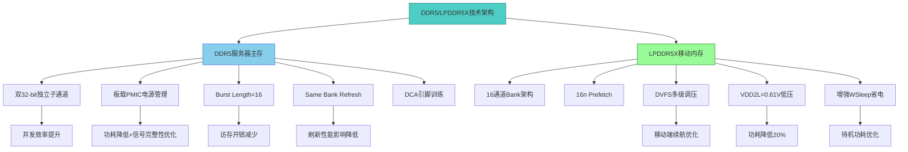
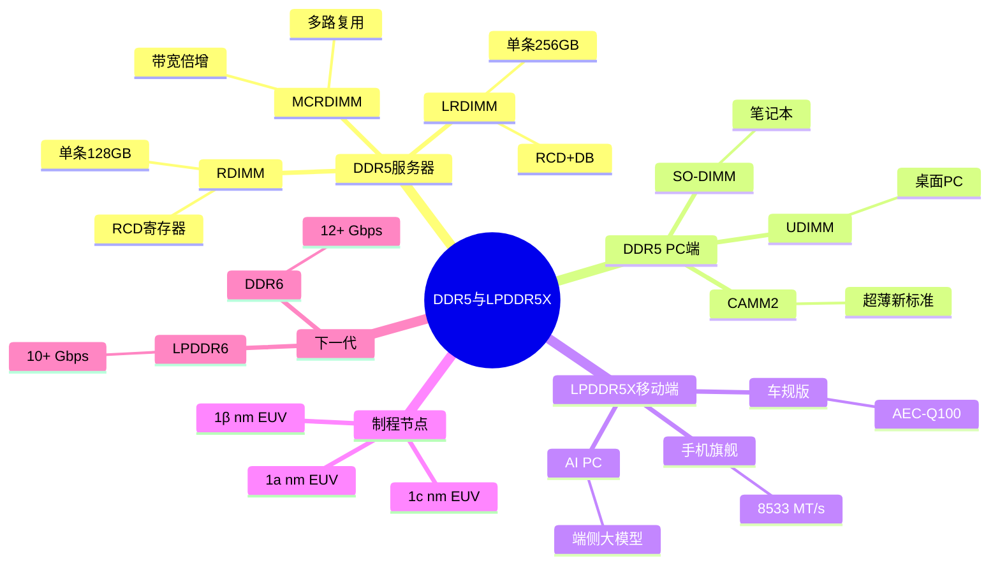
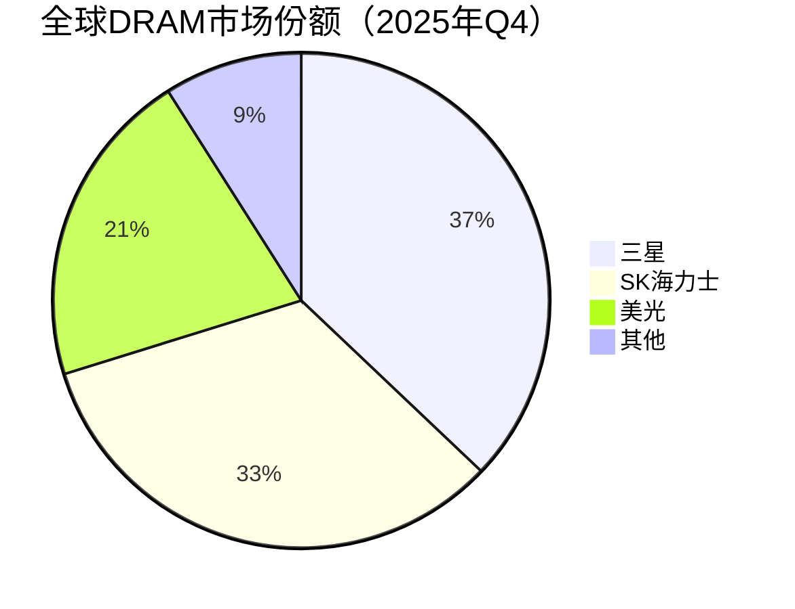

# DDR5与LPDDR5X

> DDR5是新一代服务器与PC主存标准，LPDDR5X是面向移动端的高端低功耗内存，二者共同构成AI时代计算系统的主存基石。

## 概述

DDR（Double Data Rate）DRAM是计算机和服务器系统中最为核心的易失性主存技术。从DDR1到DDR5，每一代都在数据速率、功耗效率和容量密度上实现显著跨越。DDR5作为最新一代标准，由JEDEC于2020年正式发布，起始数据速率达4800 MT/s，较DDR4的最高3200 MT/s提升50%，后续可扩展至8800 MT/s以上。DDR5在服务器领域的渗透正随着AI训练和推理工作负载的爆发而加速推进。

在移动端，LPDDR（Low Power DDR）系列是智能手机、平板电脑和轻薄笔记本的标准内存。LPDDR5X由三星于2021年率先推出，数据速率从LPDDR5的6400 MT/s提升至8533 MT/s，同时功耗降低约20%。随着端侧AI推理需求增长，LPDDR5X正成为旗舰手机和AI PC的标准配置，为端侧大模型运行提供高速内存带宽支撑。

DDR5和LPDDR5X在AI产业链中扮演着不可替代的角色：服务器端，DDR5 RDIMM/LRDIMM为CPU提供大容量主存，与GPU侧的HBM形成互补；移动端，LPDDR5X为NPU/APU提供高带宽，支撑端侧AI模型推理。两者都是存储产业链中游芯片设计制造环节的核心产品线。

## 技术原理

DDR5 DRAM的核心架构创新体现在多个层面。首先，DDR5引入了双32-bit通道架构（此前DDR4为单64-bit通道），每个DIMM拥有两个独立子通道，每个子通道32-bit数据宽度加8-bit ECC，这意味着DDR5每个通道可独立寻址和刷新，大幅提升内存并发访问效率。其次，DDR5将电源管理芯片（PMIC）从主板移至DIMM模块上，实现更精确的电压调节，降低功耗并提升信号完整性。

在内部阵列设计上，DDR5将Burst Length（突发长度）从DDR4的8提升至16，单次突发可传输64字节，恰好与CPU缓存行大小匹配，减少访存开销。DDR5还引入了Same Bank Refresh（同库刷新）功能，允许在刷新某一Bank Group时其他Bank Group继续正常工作，显著降低刷新对性能的影响。此外，DDR5支持DCA（DRAM Command Address）引脚训练，优化命令/地址信号的时序裕量。

LPDDR5X在LPDDR5基础上优化了I/O设计和电路架构。其采用16通道Bank架构， Prefetch机制升级至16n，数据速率可达8533 MT/s甚至10.7 Gbps。LPDDR5X引入了改进的DVFS（动态电压频率调节）机制，支持多级电压调节，在空闲和轻载时大幅降低功耗。其VDD2L低压供电降至0.61V，较LPDDR5进一步省电。LPDDR5X还增强了WSleep（睡眠唤醒）功能，缩短自刷新退出延迟，对移动设备待机功耗优化明显。

## 分类与技术路线

DDR5按应用场景和模组类型可分为多条技术路线。服务器端以RDIMM（Registered DIMM）和LRDIMM（Load-Reduced DIMM）为主，通过RCD（Register Clock Driver）和DB（Data Buffer）芯片提升信号完整性和容量支持，单条容量可达128GB/256GB。PC端以UDIMM（Unbuffered DIMM）和SO-DIMM为主，适用于桌面和笔记本。此外，DDR5还衍生出MCRDIMM（Multi-Rank DIMM）等新型模组，通过多路复用提升带宽。

LPDDR系列按世代和速率划分：LPDDR5（6400 MT/s）已广泛应用于中高端手机；LPDDR5X（8533 MT/s）成为旗舰标配；下一代LPDDR6/LPDDR6X预计数据速率突破10 Gbps甚至12 Gbps，瞄准端侧AI大模型推理需求。此外，LPDDR还有车规版本（AEC-Q100认证），满足车载信息娱乐系统和ADAS的内存需求。

按制程节点划分，DDR5主流制程为1a/1β nm（10nm级EUV），三星、SK海力士、美光三大原厂均已量产1β nm DDR5。LPDDR5X同样采用1a/1β nm EUV工艺，三星率先量产1c nm节点。

## 市场格局

全球DRAM市场高度集中，三星、SK海力士、美光三大原厂合计占据全球91%以上份额。根据2025年Q4最新数据，三星以约37.1%的份额位居第一，SK海力士约33.1%，美光约20.8%。在DDR5细分领域，三家原厂均已完成1a/1β nm量产，竞争格局与整体DRAM基本一致。值得注意的是，2025年Q2 SK海力士曾凭借HBM优势以38.2%份额首次超越三星，但Q3三星凭借194亿美元营收（34.8%份额）夺回第一。

LPDDR5X方面，三星率先量产并供应苹果iPhone和Galaxy系列旗舰，SK海力士和美光紧随其后。中国国内，长鑫存储（CXMT）在合肥建设12英寸DRAM晶圆厂，已量产19nm DDR4和17nm DDR4/LPDDR4X，正在推进1Xnm DDR5和LPDDR5研发，是国内DRAM自主化的核心力量，并逐步进入全球DRAM市场竞争。

2025年全球DRAM市场规模约1290亿美元（较2024年~970亿美元显著增长），其中DDR5渗透率已超过DDR4成为主流。2025年Q3全球DRAM营收达400.37亿美元（环比+24.7%），创季度历史新高。LPDDR5/LPDDR5X市场随手机出货量和AI PC渗透而增长。AI服务器对DDR5 RDIMM的需求尤其强劲，单台AI服务器内存配置可达1-2TB以上。

## 代表企业

| 企业 | 国家/地区 | 主要产品/技术 | 市场地位 |
|------|----------|-------------|---------|
| 三星 | 韩国 | DDR5/LPDDR5X/GDDR/HBM全系列 | 全球DRAM龙头，2025Q4份额约37.1% |
| SK海力士 | 韩国 | DDR5/LPDDR5X/HBM | 全球第二大DRAM厂商，2025Q4份额约33.1%，Q2曾首超三星 |
| 美光 | 美国 | DDR5/LPDDR5X/HBM | 全球第三大DRAM厂商，2025Q4份额约20.8% |
| 长鑫存储(CXMT) | 中国 | DDR4/LPDDR4X/DDR5研发 | 中国DRAM自主化领军企业 |
| 南亚科 | 中国台湾 | DDR4/DDR5 | 中国台湾DRAM厂商 |
| 铠侠(Kioxia) | 日本 | NAND为主/少量DRAM | 存储综合厂商 |
| 华邦电子 | 中国台湾 | 利基DRAM/NOR Flash | 特色存储厂商 |
| 晶豪科技 | 中国台湾 | 利基型DRAM | 消费电子DRAM供应商 |

## 发展趋势

### 市场规模预测

| 年份 | 市场规模 | 同比增长 | 备注 |
|------|---------|---------|------|
| 2024 | ~970亿美元 | — | 基准年 |
| 2025 | ~1290亿美元 | +32.9% | DDR5渗透率超DDR4，AI服务器需求驱动 |
| 2026E | ~2000亿美元+ | +55%+ | 存储超级周期，价格Q1预计上涨40-50% |
| 2027E | ~3000亿美元+ | +50%+ | AI算力持续扩张，HBM/DDR5需求爆发 |

**速率持续提升**：DDR5从4800 MT/s起步，未来将扩展至6400/7200/8800 MT/s，DDR6已在规划中，目标速率突破12 Gbps。LPDDR5X后续版本将向10.7 Gbps甚至更高速率演进，LPDDR6标准正在制定中。

**容量密度突破**：DDR5单条RDIMM容量从32GB向128GB/256GB扩展，采用3D DRAM堆叠和TSV技术可进一步提升密度。高容量DDR5满足AI服务器海量模型参数加载需求。

**功耗持续优化**：DVFS、PMIC板载化、低VDD等技术持续降低功耗。LPDDR系列在移动端的能效比是核心竞争指标，未来将向0.5V以下供电发展。

**国产替代加速**：长鑫存储持续推进先进制程研发，预计未来2-3年内实现1Xnm DDR5量产，国内供应链安全意义重大。

**AI PC拉动LPDDR**：端侧AI大模型运行需要高带宽内存支撑，LPDDR5X成为AI PC和AI手机标配，需求量大幅增长。

## AI基建拉动分析

AI基建浪潮对DDR5与LPDDR5X形成双重拉动效应。服务器端，AI训练和推理服务器CPU需要大容量高带宽DDR5 RDIMM作为主存。单台AI服务器（如NVIDIA DGX系列）通常配置1-2TB以上DDR5内存，是普通服务器的4-8倍。随着大模型参数量从数十亿到数千亿增长，DDR5内存容量需求持续攀升。2025年Q3全球DRAM营收达400.37亿美元创历史新高，其中AI服务器DDR5需求是核心驱动力。2026年Q1 DRAM价格预计上涨40-50%，Q2继续涨20%，AI算力扩张持续拉动DDR5量价齐升。DDR5的高带宽和大容量特性使其成为AI服务器不可或缺的内存基础。

移动端和边缘端，AI PC和AI手机需要在端侧运行量化后的大模型（如7B/13B参数模型），这对内存带宽和容量提出极高要求。LPDDR5X的8533 MT/s高带宽为端侧AI推理提供了关键支撑，旗舰手机内存配置已从8GB向16GB/24GB升级。端侧AI推理需求的爆发直接拉动了LPDDR5X的出货量和ASP。

从投资角度看，DDR5渗透率提升和LPDDR5X在AI终端的普及，为三大原厂和中国长鑫存储带来明确的量价齐升逻辑。DDR5模组相关的接口芯片（RCD/DB/SPD Hub）供应商也受益于AI服务器扩容浪潮。

---
[← 返回总目录](../../README.md)
