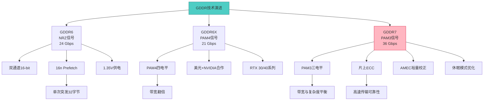
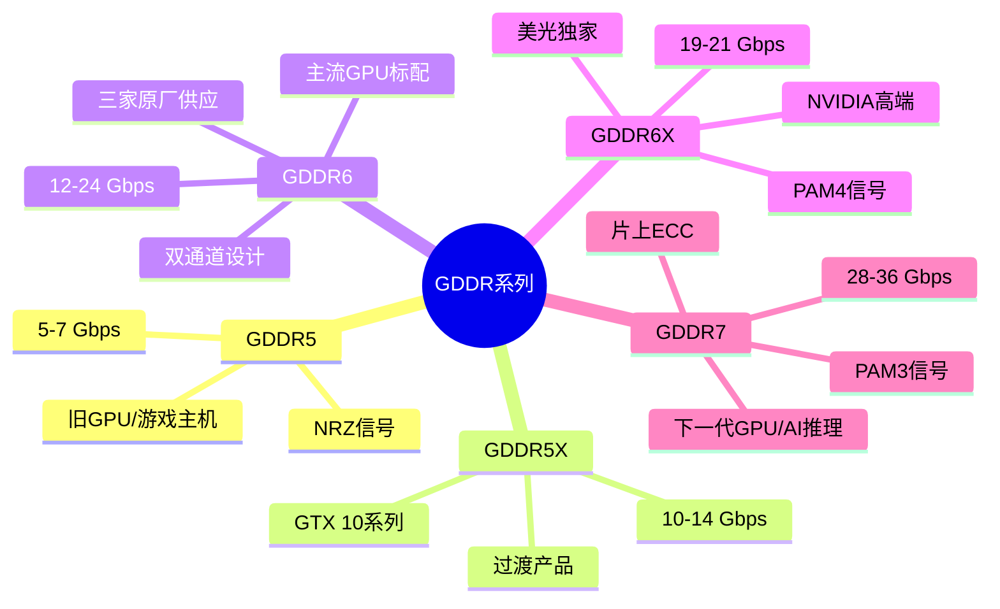
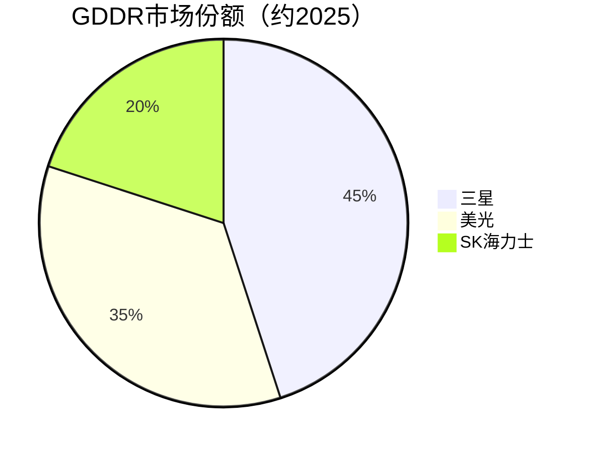

# GDDR系列

> GDDR（Graphics DDR）是专为GPU显卡设计的高带宽DRAM，GDDR6X/GDDR7在AI推理和图形渲染中扮演关键角色。

## 概述

GDDR（Graphics Double Data Rate）DRAM是专为图形处理器（GPU）设计的高带宽内存系列。与传统DDR DRAM相比，GDDR系列在数据速率、带宽和功耗优化方面具有显著优势，是独立显卡、游戏主机和AI推理加速卡的标准显存。从GDDR3到GDDR6X，每一代GDDR都在数据速率上实现翻倍级提升。

GDDR6X由美光与NVIDIA联合开发，于2020年随RTX 30系列显卡首发，数据速率达19-21 Gbps，采用PAM4（四电平脉冲幅度调制）信号技术，是首款使用PAM4的DRAM产品。GDDR7由JEDEC于2024年正式标准化，数据速率起步即达28 Gbps，最高可达36 Gbps，引入了PAM3信号调制和多项可靠性增强技术，瞄准下一代AI推理和图形渲染需求。

在AI产业链中，GDDR系列虽然不如HBM那样受瞩目，但其在边缘推理、中端AI加速卡和游戏AI应用中具有成本优势。与HBM的3D堆叠高成本不同，GDDR采用传统封装，成本显著低于HBM，适合大规模部署的中端AI推理场景。GDDR7的出现进一步缩小了GDDR与HBM之间的带宽差距，成为AI推理存储的重要补充方案。

## 技术原理

GDDR系列的核心技术创新集中在信号调制和高速I/O设计上。GDDR6采用NRZ（不归零编码）信号，每个时钟周期传输2 bit数据，最高速率24 Gbps。GDDR6X突破性地引入PAM4（Pulse Amplitude Modulation 4-level）信号，使用4个电平编码，每个时钟周期传输2 bit数据，在相同时钟频率下将数据速率翻倍，达到19-21 Gbps。PAM4的关键挑战在于信号完整性和误码率控制，需要精密的均衡和训练算法。

GDDR7是GDDR系列的最新一代标准，引入了多项重要技术革新。首先，GDDR7采用PAM3信号调制，使用3个电平编码1.5 bit/符号，相比PAM4在信号复杂度和带宽之间取得更好平衡。其次，GDDR7引入了AMEC（Asynchronous Margin Extension Capability）功能，可实时监测和校正信号裕量，提升高速传输的可靠性。第三，GDDR7支持片上ECC（On-Die ECC），降低高速传输下的误码风险。第四，GDDR7引入了休眠模式优化，在空闲时大幅降低功耗。

在架构方面，GDDR系列采用独立的双通道设计（GDDR6/GDDR7），每个芯片有两个独立的数据通道，每通道16-bit宽度。GDDR6/GDDR7采用16n Prefetch机制，单次突发传输32字节。与HBM的TSV 3D堆叠不同，GDDR采用传统FBGA封装，PCB布线需精确匹配等长走线，封装成本低但功耗和面积大于HBM。

## 分类与技术路线

GDDR系列按世代可分为多条技术路线。GDDR5是上一代标准，数据速率5-7 Gbps，主要应用于较老GPU和游戏主机。GDDR5X是过渡产品，速率10-14 Gbps，用于NVIDIA GTX 10系列。

GDDR6是当前主流标准，由三星、SK海力士、美光三家供应，速率12-24 Gbps。GDDR6支持双通道独立访问，每个芯片容量可为8Gb/16Gb。GDDR6广泛应用于中端到高端GPU，包括NVIDIA RTX 40系列中低端型号和AMD Radeon RX 7000系列。

GDDR6X是美光独家的增强版本，采用PAM4信号，速率19-21 Gbps，目前仅美光生产，专供NVIDIA高端显卡。GDDR6X相比GDDR6带宽提升约30-40%。

GDDR7是下一代标准，速率28-36 Gbps，三星已率先展示36 Gbps GDDR7样品。GDDR7预计将用于下一代RTX 50系列和AMD RDNA 5架构GPU，同时也是AI推理加速卡的候选显存方案。2025年美光和三星已启动GDDR7量产，GDDR7开始配套新一代AI推理GPU。

## 市场格局

GDDR市场与GPU市场高度绑定，供应商为三星、SK海力士和美光三大原厂。三星在GDDR6和GDDR7上处于领先地位，率先展示了36 Gbps GDDR7样品并于2025年启动量产。美光凭借GDDR6X与NVIDIA的独家合作占据高端市场，2025年也已量产GDDR7。SK海力士虽然在GDDR领域份额相对较小，但在GDDR6量产上保持竞争力。

2024年GDDR市场规模约60-80亿美元，2025年随AI推理需求增长和GDDR7量产，预计GDDR市场将保持稳健增长。在AI推理领域，GDDR相比HBM具有成本优势，适合大规模部署的中端推理场景。GDDR7的量产进一步强化了GDDR在AI推理存储中的地位。

## 代表企业

| 企业 | 国家/地区 | 主要产品/技术 | 市场地位 |
|------|----------|-------------|---------|
| 三星 | 韩国 | GDDR6/GDDR7量产 | GDDR技术领先者，36Gbps GDDR7已量产 |
| 美光 | 美国 | GDDR6/GDDR6X/GDDR7独家 | GDDR6X独家供应商，GDDR7已量产，NVIDIA战略伙伴 |
| SK海力士 | 韩国 | GDDR6 | GDDR主要供应商之一 |
| NVIDIA | 美国 | GPU设计采购方 | GDDR最大采购方，定义GDDR规格需求 |
| AMD | 美国 | GPU/APU设计采购方 | Radeon系列GPU使用GDDR |
| 索尼 | 日本 | 游戏主机 | PS5使用GDDR6显存 |
| 微软 | 美国 | 游戏主机 | Xbox Series X使用GDDR6 |
| Intel | 美国 | GPU/AI加速器 | Arc系列GPU使用GDDR6 |

## 发展趋势

### 市场规模预测

| 年份 | 市场规模 | 同比增长 | 备注 |
|------|---------|---------|------|
| 2024 | ~70亿美元 | — | 基准年，GDDR6为主力 |
| 2025 | ~85亿美元 | +21% | GDDR7量产，AI推理GPU需求拉动 |
| 2026E | ~110亿美元 | +29% | GDDR7渗透率提升，边缘AI推理放量 |
| 2027E | ~140亿美元 | +27% | AI推理加速卡大规模部署 |

**GDDR7量产加速**：GDDR7标准已由JEDEC发布，三星、美光、SK海力士均在推进量产。GDDR7将率先用于下一代高端GPU和AI推理卡，36 Gbps的速率将带宽提升50%以上。

**PAM3信号技术普及**：GDDR7引入PAM3信号作为PAM4和NRZ之间的平衡方案，PAM3在信号复杂度和带宽之间取得最优折中，未来可能推广至更多高速接口。

**AI推理场景扩展**：GDDR7在AI推理加速卡中的应用值得关注，相比HBM3E的高成本，GDDR7方案可大幅降低推理卡成本，适合大规模推理部署。

**功耗优化持续**：GDDR7的休眠模式和片上ECC降低功耗和提升可靠性，未来GDDR将向更低功耗和更高能效比发展。

**封装创新**：虽然GDDR采用传统封装，但未来可能引入2.5D/3D封装与GPU更紧密集成，缩短互连距离提升能效。

## AI基建拉动分析

AI基建浪潮对GDDR系列形成间接但重要的拉动。虽然AI训练几乎全部使用HBM，但AI推理场景对成本敏感，GDDR成为中端推理卡的有力候选。GDDR7的28-36 Gbps带宽接近早期HBM2水平，而成本仅为HBM的1/3-1/2，在大规模推理部署中具有显著成本优势。2025年美光和三星GDDR7已量产，开始配套新一代AI推理GPU，AI推理需求成为GDDR市场增长的核心驱动力。

边缘AI推理是GDDR的重要增长点。自动驾驶、工业AI和边缘推理服务器需要大量中端AI加速卡，GDDR6/GDDR7为这些场景提供了性价比极高的显存方案。与HBM不同，GDDR采用传统封装，供应链成熟，产能不受TSV先进封装瓶颈限制。

游戏AI也是GDDR的重要应用。DLSS、AI超分辨率和AI生成内容（AIGC）等技术在消费GPU中的普及，推动了GDDR带宽需求的持续增长。GDDR7在下一代消费GPU中的采用将带来可观的出货量增长。

从投资角度看，GDDR7的量产和AI推理场景的扩展为三大原厂带来增量收入。美光凭借GDDR6X与NVIDIA的独家合作，在高端消费GPU市场具有独特优势。

---
[← 返回总目录](../../README.md)
