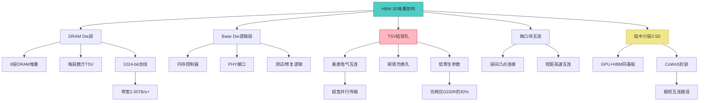
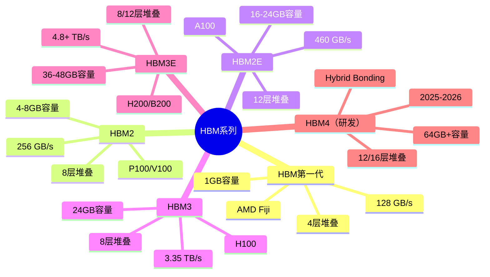
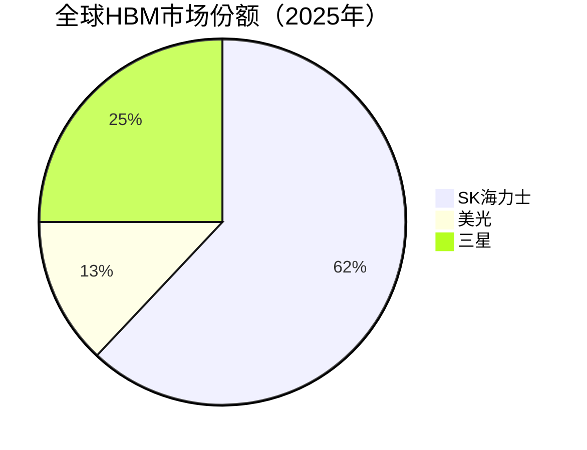

# HBM高带宽存储

> HBM（High Bandwidth Memory）是通过TSV硅穿孔和3D堆叠技术实现超高带宽的DRAM，是AI训练GPU的核心标配存储。

## 概述

HBM（High Bandwidth Memory）是存储行业中技术含量最高、战略意义最重大的DRAM产品。HBM通过TSV（Through-Silicon Via，硅穿孔）技术和3D堆叠封装，将多层DRAM芯片与逻辑芯片垂直堆叠，实现超高带宽密度和极低功耗。自2013年第一代HBM问世以来，HBM已发展至HBM2E、HBM3、HBM3E和正在研发的HBM4，带宽从128 GB/s飙升至超过1.2 TB/s。

HBM是AI大模型训练的绝对刚需。NVIDIA的H100/H200/B200 GPU、AMD的MI300系列、Intel的Gaudi系列AI加速器均以HBM作为标准显存。没有HBM，当前的大模型训练在带宽上将无法实现。一台NVIDIA DGX H100系统配备6颗H100 GPU，每颗GPU搭载80GB HBM3，带宽达3.35 TB/s，整个系统的HBM带宽超过20 TB/s。2025年HBM持续成为AI训练核心存储，NVIDIA B200等新一代GPU进一步推高HBM需求。

HBM在存储产业链中占据中游DRAM的最顶端。其单价远高于普通DRAM，一颗HBM3 8层堆叠芯片售价约100-150美元，而同等容量的DDR5芯片仅约15-20美元。HBM毛利率超过70%，是三大原厂最赚钱的产品线。AI训练GPU对HBM的需求呈指数级增长，2025年HBM市场规模突破250亿美元，HBM价格持续上涨。

## 技术原理

HBM的核心技术是TSV（Through-Silicon Via）硅穿孔和3D堆叠封装。TSV是在硅片上制作垂直贯通的微孔，孔内填充铜等导电金属，实现芯片层间的垂直电气互连。相比传统引线键合（Wire Bonding），TSV互连路径极短，寄生电容和电感大幅降低，支持超高并行数据传输。

HBM的3D堆叠架构是将多层DRAM芯片（Die）与底部的逻辑控制芯片（Base Die）垂直堆叠。以HBM3为例，采用8层DRAM Die堆叠在Base Die之上，层间通过TSV互连，整体封装在与GPU紧邻的硅中介层上。每层DRAM Die有数万个TSV穿孔，8层堆叠意味着数十万个TSV连接点。堆叠后的HBM通过微凸块与硅中介层上的GPU连接，形成2.5D集成。

HBM的接口采用超宽并行总线设计。HBM3的接口宽度达1024-bit，远超GDDR6的32-bit。虽然单引脚速率仅约6.4 Gbps（远低于GDDR6X的21 Gbps），但凭借超宽总线，总带宽仍达3.35 TB/s以上。HBM3E进一步提升至8 Gbps以上，带宽超过4.8 TB/s。HBM4预计将接口宽度扩展至2048-bit，带宽突破1.5 TB/s。

HBM的功耗效率远优于GDDR。HBM的每GB功耗仅为GDDR的1/3-1/2，得益于短互连路径和超宽并行总线设计。HBM的功耗约为GDDR6的30%，在AI训练高功耗场景下，HBM的能效优势显著。

## 分类与技术路线

HBM按世代可分为HBM、HBM2、HBM2E、HBM3、HBM3E和HBM4（研发中）。每代在容量、带宽和堆叠层数上持续提升。

HBM（第一代）：2013年由SK海力士和AMD联合推出，4层堆叠，1GB容量，128 GB/s带宽，用于AMD Fiji GPU。

HBM2：2016年推出，8层堆叠，4GB/8GB容量，256 GB/s带宽，用于NVIDIA Tesla P100/V100和AMD Vega。

HBM2E：2019年推出，增强版，12层堆叠，16GB/24GB容量，460 GB/s带宽，用于NVIDIA A100（40GB/80GB版本）和AMD MI200。

HBM3：2022年随NVIDIA H100推出，8层堆叠，24GB容量（单颗），3.35 TB/s带宽，6.4 Gbps引脚速率。SK海力士为H100独家供应商。

HBM3E：2023-2024年推出，8/12层堆叠，36GB/48GB容量，4.8 TB/s以上带宽，8 Gbps引脚速率。用于NVIDIA H200和B200、AMD MI300X。SK海力士领先量产，三星和美光跟进。

HBM4（研发中）：预计2025-2026年推出，12/16层堆叠，64GB+容量，2048-bit接口，带宽突破1.5 TB/s，采用Hybrid Bonding混合键合替代微凸块。

## 市场格局

HBM市场由SK海力士、三星和美光三强瓜分，其中SK海力士以绝对优势领先。2025年HBM市场份额：SK海力士约62%（Q2 2025），美光首次超越三星升至第二，三星约20-30%。SK海力士凭借与NVIDIA的深度合作及TSV产能150K（2025）的领先优势，在HBM3E上获得NVIDIA H100/H200/B200主力供应权。

2025年HBM市场格局发生重大变化：美光在2025年Q2首次在HBM出货量上超越三星，凭借HBM3E量产切入NVIDIA供应链并提升份额。三星预计2025年HBM份额将超过30%，正在加速推进HBM3E产能和HBM4开发以夺回份额。

HBM市场的核心特征是产能严重受限。HBM的生产需要3D堆叠和TSV先进封装能力，封装环节高度依赖台积电的CoWoS（Chip on Wafer on Substrate）封装产能。2025年HBM需求仍远超供应，缺口约20-30%，NVIDIA H100/H200/B200的出货量受HBM供应限制。HBM价格在2025年持续上涨。

HBM市场规模从2023年的约45亿美元爆发式增长至2024年的150亿美元以上，2025年突破250亿美元，预计2026年随AI训练规模进一步扩大将继续大幅增长。HBM单价是普通DRAM的5-8倍，是三大原厂利润率最高的产品。

## 代表企业

| 企业 | 国家/地区 | 主要产品/技术 | 市场地位 |
|------|----------|-------------|---------|
| SK海力士 | 韩国 | HBM3/HBM3E/HBM4研发 | HBM全球绝对龙头，2025份额~62%，TSV产能150K，NVIDIA主力供应商 |
| 三星 | 韩国 | HBM3E/HBM3/HBM4 | HBM第三大供应商（被美光超越），2025份额~20-30%，预计超30%，HBM4开发中 |
| 美光 | 美国 | HBM3E量产 | HBM第二大供应商，2025Q2首次超越三星，NVIDIA/AMD供应 |
| NVIDIA | 美国 | AI GPU设计方 | HBM最大采购方，定义HBM规格需求 |
| 台积电(TSMC) | 中国台湾 | CoWoS先进封装 | HBM封装核心环节，产能瓶颈所在 |
| AMD | 美国 | AI加速器MI300 | HBM第二大采购方 |
| Intel | 美国 | Gaudi AI加速器 | HBM采购方 |
| 长鑫存储(CXMT) | 中国 | HBM研发中 | 国内HBM自主化探索 |

## 发展趋势

### 市场规模预测

| 年份 | 市场规模 | 同比增长 | 备注 |
|------|---------|---------|------|
| 2024 | ~150亿美元 | — | 基准年，HBM3E量产 |
| 2025 | ~250亿美元+ | +67% | 美光首超三星，SK海力士份额62%，HBM价格持续上涨 |
| 2026E | ~400亿美元+ | +60% | HBM4推出，NVIDIA B200/GB200放量，AI训练需求爆发 |
| 2027E | ~550亿美元+ | +38% | HBM4规模化，AI推理侧HBM需求增长 |

**HBM4堆叠层数突破16层**：HBM4预计采用12-16层堆叠，容量提升至48-64GB以上，带宽突破1.5 TB/s。Hybrid Bonding混合键合将替代传统微凸块，实现更密的层间互连。

**接口带宽翻倍**：HBM4将接口从1024-bit扩展至2048-bit，引脚速率向10+ Gbps演进，总带宽可达2 TB/s以上。下一代AI GPU将受益于更大的模型加载容量和更高带宽。

**封装产能扩张**：台积电CoWoS产能从2023年的月1.5万片扩向2025年的月3万片以上，三星和SK海力士也在自建先进封装能力，缓解HBM产能瓶颈。

**三家原厂竞争白热化**：SK海力士领先但三星和美光在追赶。2025年美光首次在HBM出货超越三星，竞争格局发生重大变化。三星引入先进封装技术提升竞争力，预计2025年HBM份额超30%，并在HBM4开发中加速追赶。美光凭借成本优势和HBM3E量产切入中端市场。HBM4时代三家将展开更激烈的技术和市场份额竞争。

**中国自主化探索**：长鑫存储和国内封测企业开始HBM技术预研，虽然与三大原厂差距巨大，但长期来看国产HBM替代是战略方向。

## AI基建拉动分析

HBM是AI基建浪潮中受益最大的存储产品，没有之一。AI大模型训练对内存带宽的极端需求使HBM成为GPU的刚性标配。以GPT-4级别训练为例，单次训练需要数百颗H100 GPU，每颗GPU配备80GB HBM3，总HBM需求以数十TB计。全球AI训练算力扩张直接转化为HBM需求爆发。

从需求侧看，NVIDIA H100/H200/B200系列、AMD MI300系列、Intel Gaudi系列、Google TPU等所有主要AI加速器均以HBM为标准显存。2025年NVIDIA B200/GB200系列大规模出货进一步推高HBM需求。AI推理侧也在加速采用HBM——AMD MI300X推理GPU配备192GB HBM3，支持更大batch size推理。端侧AI未来可能采用简化版HBM方案。

从供给侧看，HBM产能受限于两大瓶颈：DRAM先进制程（1a/1β nm）和CoWoS先进封装产能。台积电CoWoS封装是最大瓶颈，2025年产能缺口仍约20-30%。SK海力士TSV产能达150K领先，美光HBM3E量产提升份额。这一供需失衡使得HBM价格在2025年持续走高，三大原厂利润大幅增长。

从投资价值看，HBM是整个存储产业链中AI弹性最大的环节。SK海力士的HBM业务毛利率超过70%，是其市值增长的核心驱动力。HBM供应链上的先进封装（台积电、日月光）、TSV设备（ASMPT）、HBM测试设备等环节也具有高投资价值。HBM的持续技术迭代（HBM3E→HBM4）将维持高景气度至少3-5年。

---
[← 返回总目录](../../README.md)
