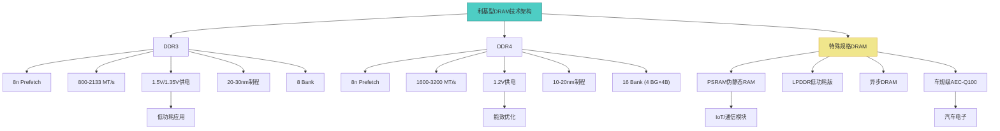
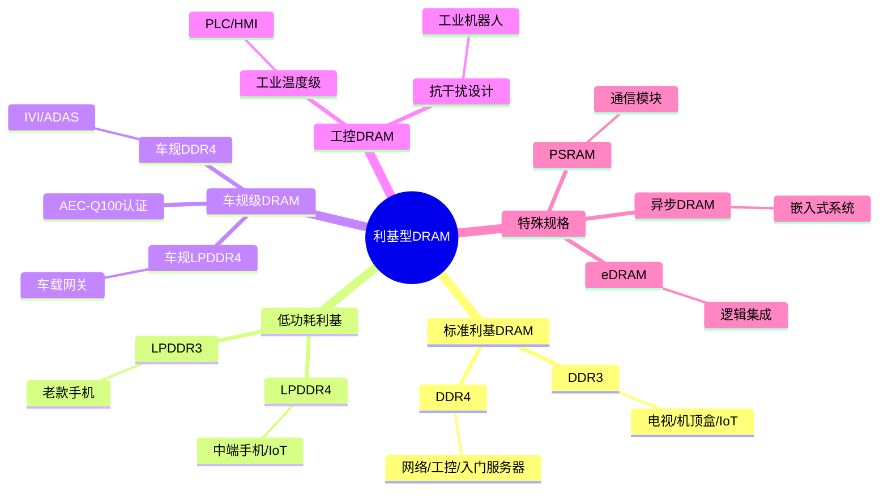
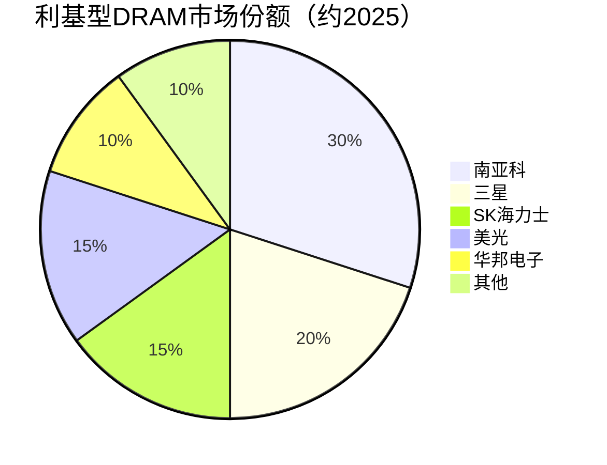

# 利基型DRAM

> 利基型DRAM指DDR3/DDR4等成熟制程、面向特殊应用场景的DRAM产品，涵盖消费电子、车规级、工控等领域。

## 概述

利基型DRAM（Niche DRAM）是相对于主流DDR5/HBM/LPDDR5X而言的成熟代际DRAM产品，主要包括DDR3、DDR4以及部分特殊规格DRAM。虽然不是最前沿的技术，但利基型DRAM在全球存储市场中占据重要的稳定市场份额，应用场景覆盖电视机顶盒、网络通信、工业控制、汽车电子等广泛领域。

利基型DRAM的核心价值在于其成熟稳定、成本低廉、供应可靠。在许多嵌入式和工业应用中，不需要最先进的带宽和容量，而是更看重长期供货稳定性、宽温工作范围和车规级可靠性认证。DDR3虽然在服务器和PC领域已被DDR5取代，但在IoT、智能家居和通信设备中仍大量使用。

中国台湾厂商在利基型DRAM领域占据重要地位。南亚科、华邦电子、晶豪科技等台湾存储企业专注利基市场，避开与三星、SK海力士的正面竞争，形成了独特的差异化竞争格局。中国大陆方面，长鑫存储在推进先进制程的同时，也在DDR4利基市场布局，合肥晶合集成等代工厂也开始提供利基DRAM制造服务。

## 技术原理

利基型DRAM的技术原理与主流DDR DRAM一致，基于1T1C（一个晶体管一个电容）存储单元架构。DRAM存储单元由一个访问晶体管（Access Transistor）和一个存储电容（Storage Capacitor）组成，数据以电容上的电荷量表示（有电荷为"1"，无电荷为"0"）。由于电容存在漏电流，DRAM需要周期性刷新以维持数据，这是DRAM"动态"名称的由来。

DDR3采用8n Prefetch架构，数据速率800-2133 MT/s，供电电压1.5V（标准版）或1.35V（L版低功耗）。DDR3的Bank数为8，接口宽度64-bit，单条容量从1GB到8GB不等。DDR3的制程节点通常在20-30nm级别，不需要EUV光刻，制造成本较低。

DDR4采用8n Prefetch架构升级，数据速率1600-3200 MT/s，供电电压降至1.2V。DDR4引入了Bank Group机制（4个Bank Group，每个含4个Bank，共16个Bank），提升连续访问性能。DDR4的制程在10-20nm级别，三星、SK海力士、美光均有DDR4产能，台湾南亚科也有20nm DDR4量产能力。

特殊规格DRAM包括伪静态RAM（PSRAM/Cellular RAM）、低功耗DDR（LPDDR/DDR2/DDR3低功耗版）和异步DRAM等，主要用于嵌入式系统。PSRAM具有自刷新功能，接口类似SRAM，简化控制器设计，广泛用于物联网和通信模块。

## 分类与技术路线

利基型DRAM按应用和规格可分为多条路线。标准利基DRAM以DDR3和DDR4为主，用于消费电子、网络通信和入门级服务器。低功耗利基DRAM包括LPDDR3/LPDDR4，用于移动设备和便携式终端。

车规级DRAM是利基市场的高价值细分领域。车规DRAM需通过AEC-Q100认证，满足-40°C至+105°C宽温工作范围和零缺陷质量要求。车规DDR4/DDR5用于车载信息娱乐系统（IVI）、ADAS域控制器和车载网关。随着智能汽车普及，车规DRAM需求快速增长，单辆智能汽车DRAM用量可达8-16GB。

工控DRAM强调长期供货稳定性和抗干扰能力，需满足工业温度范围（-40°C至+85°C）和EMC要求。工控应用包括PLC控制器、人机界面（HMI）、工业机器人和医疗设备。

嵌入式DRAM（eDRAM）是将DRAM集成在逻辑芯片中的特殊形态，IBM/Intel曾用于高性能CPU缓存。eDRAM制造成本高但性能优异，目前主要用于特定高端应用。

## 市场格局

利基型DRAM市场虽然技术成熟，但市场规模可观。2024年利基DRAM市场约80-100亿美元，2025年随全球DRAM市场增长至约90-110亿美元，占总DRAM市场的约8-10%。其中DDR4是利基DRAM的主力产品，占比约60-70%；DDR3份额逐渐下降但仍维持一定出货量；车规和工控DRAM是增长最快的细分。

市场格局方面，三星、SK海力士、美光三大原厂逐步将产能转向DDR5/HBM，DDR3/DDR4利基市场供给由台湾厂商主导。南亚科是全球最大的利基DRAM供应商，华邦电子和晶豪科技在特定细分市场有优势。中国大陆方面，长鑫存储（CXMT）逐步切入DDR4利基市场并扩大份额，兆易创新在利基DRAM设计领域也有所布局。2025年CXMT逐步进入全球DRAM市场，在利基型DRAM领域份额提升。

## 代表企业

| 企业 | 国家/地区 | 主要产品/技术 | 市场地位 |
|------|----------|-------------|---------|
| 南亚科 | 中国台湾 | DDR3/DDR4利基DRAM | 全球最大利基DRAM供应商 |
| 三星 | 韩国 | DDR4利基/车规 | 逐步退出DDR3，保留车规 |
| SK海力士 | 韩国 | DDR4利基 | 产能逐步转向DDR5/HBM |
| 美光 | 美国 | DDR4/车规DRAM | 保留部分利基产能 |
| 华邦电子 | 中国台湾 | DDR3/DDR4/NOR | 特色利基存储厂商 |
| 晶豪科技 | 中国台湾 | 利基型DRAM | 消费电子DRAM供应商 |
| 长鑫存储(CXMT) | 中国 | DDR4利基 | 中国大陆利基DRAM新兴力量 |
| 兆易创新 | 中国 | DRAM设计 | 利基DRAM设计布局 |

## 发展趋势

### 市场规模预测

| 年份 | 市场规模 | 同比增长 | 备注 |
|------|---------|---------|------|
| 2024 | ~90亿美元 | — | 基准年 |
| 2025 | ~100亿美元 | +11% | 车规DRAM需求增长，CXMT份额提升 |
| 2026E | ~110亿美元 | +10% | 智能汽车ADAS放量，利基价格回升 |
| 2027E | ~120亿美元 | +9% | 工控/IoT需求稳健增长 |

**车规DRAM快速增长**：智能汽车L2+及以上级别ADAS、座舱域控和车载网关对DRAM需求快速增长，单车DRAM用量从2-4GB向8-16GB演进，车规DRAM是利基市场增长最快的细分。

**DDR3逐步退出**：随着IoT和智能家居升级，DDR3需求缓慢下降，但不会完全消失，部分低成本设备仍需DDR3，台湾厂商将维持部分产能。

**国产替代加速**：长鑫存储在DDR4利基市场的渗透持续加速，国内消费电子和通信设备厂商开始采用国产利基DRAM，供应链安全需求推动国产化。

**利基DRAM价格企稳**：经过2023年存储周期下行，利基DRAM价格已触底企稳。随着车规和工控需求恢复，利基DRAM价格有望温和回升。

**低功耗持续优化**：LPDDR3/LPDDR4在IoT和可穿戴设备中持续优化功耗，未来可能衍生更低功耗的嵌入式DRAM方案。

## AI基建拉动分析

利基型DRAM在AI基建浪潮中的直接受益程度有限，但间接拉动效应值得关注。AI服务器的大规模建设推动三大原厂将先进制程产能转向DDR5和HBM，DDR3/DDR4利基产能相对收缩。这种产能转移效应使得利基DRAM供应趋紧，2025年价格企稳回升，对台湾利基DRAM厂商和中国大陆长鑫存储形成利好。CXMT在利基型DRAM领域份额持续提升。

车规DRAM是AI基建间接拉动的重要领域。自动驾驶是AI在边缘端的核心应用之一，智能汽车ADAS系统需要大量车规DRAM支撑神经网络推理。L3+自动驾驶对车规DRAM的单车用量可达16-32GB，远超传统汽车。这一趋势为利基DRAM厂商在车规细分市场带来显著增长机遇。

此外，AIoT设备的大规模部署也需要利基DRAM支撑。AI摄像头、智能音箱、工业AI网关等边缘AI设备使用DDR4/LPDDR4作为主存，这类设备出货量巨大但单价较低，利基DRAM厂商可从中获得稳定的出货量支撑。

从投资角度看，利基DRAM的AI弹性虽然不如HBM和DDR5，但其防御性和稳定性更强。南亚科等台湾利基DRAM厂商在存储下行周期中表现出更好的抗周期能力，是存储板块中具有防御属性的标的。

---
[← 返回总目录](../../README.md)
