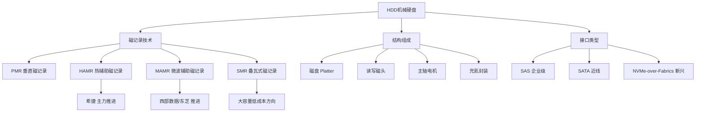
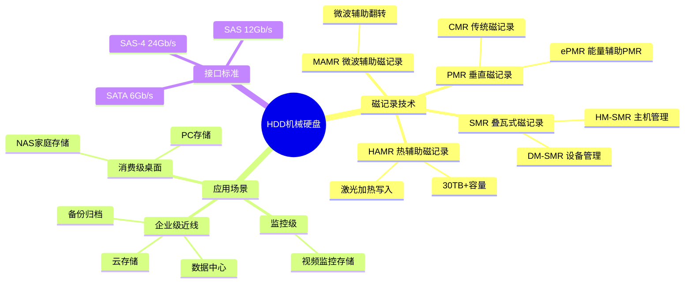
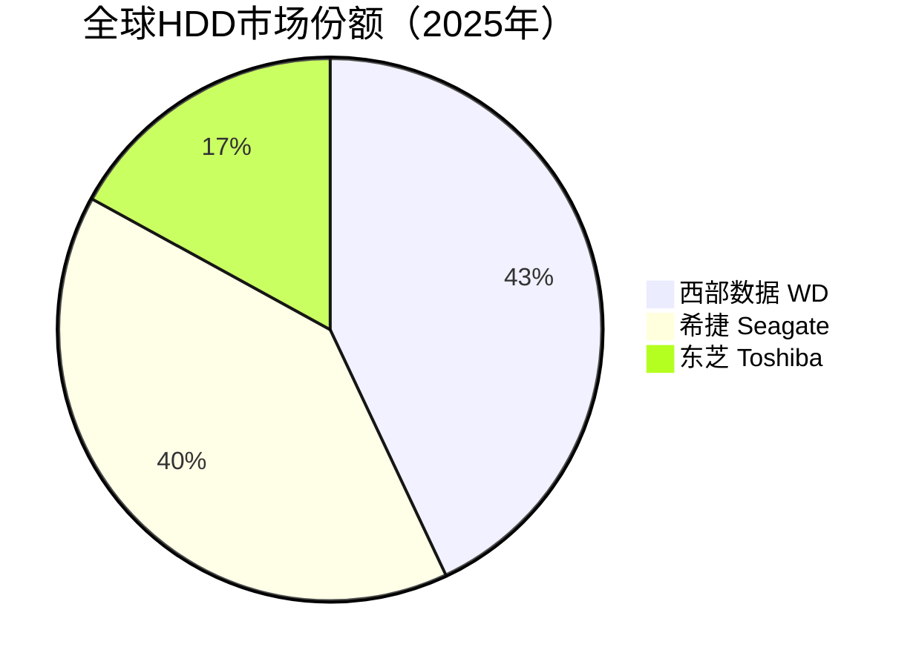

# HDD机械硬盘

> 利用磁记录技术在旋转磁盘上存储数据的非易失性存储设备，是大容量数据存储和冷数据归档的核心介质。

## 概述

HDD（Hard Disk Drive）机械硬盘是存储产业链中游的重要组成，尽管在消费端已被SSD大量替代，但在大容量数据存储、云数据中心、冷数据归档等场景中仍占据不可替代的地位。HDD的核心优势在于每TB成本远低于SSD（约1/3-1/5），且在超大容量（18TB-30TB+）领域具有显著的成本和可靠性优势。

随着云计算和大数据的发展，数据中心对存储容量的需求持续增长。虽然SSD在热数据场景中占据主导，但温数据和冷数据的存储仍以HDD为主。超大规模云服务商（如AWS、Google、Meta、微软）的数据中心每年采购数千万块企业级HDD用于对象存储、文件系统和备份归档。希捷和西部数据（Western Digital）两家企业占据全球HDD市场约80%的份额，形成双寡头格局。

HDD技术的核心发展方向是提高面密度（Areal Density），从传统的PMR（垂直磁记录）向HAMR（热辅助磁记录）和MAMR（微波辅助磁记录）演进，以突破超顺磁极限，实现30TB+乃至50TB+的单盘容量。这一技术竞赛正成为希捷和西部数据竞争的焦点。

## 技术原理

HDD的核心结构包括旋转磁盘（Platter）、磁头臂（Actuator Arm）、读写磁头（Read/Write Head）、主轴电机（Spindle Motor）和前置放大器等。磁盘表面镀有磁性材料，数据以磁化方向的变化形式存储在同心圆轨道（Track）上。写入时，磁头产生磁场改变磁盘表面的磁化方向；读取时，磁头感应磁场变化转换为电信号。

传统PMR（Perpendicular Magnetic Recording）技术将磁化方向垂直于磁盘表面，面密度极限约为1.1Tb/in²。为突破这一极限，HAMR技术使用激光局部加热磁盘表面（约400-500°C），使磁性材料在高温下更容易被写入，冷却后稳定保持数据，可将面密度提升至2-4Tb/in²乃至更高。MAMR则使用微波辅助磁场翻转磁化方向，技术原理类似但使用微波而非激光。

HDD的读写性能受限于机械寻道延迟（平均约4-10ms）和转速（5400/7200/10K/15K RPM），远低于SSD。但通过SMR（叠瓦式磁记录）技术——让磁道部分重叠以增加面密度——可以在容量上进一步突破，代价是写入性能下降和随机写入复杂度增加。企业级HDD还采用充氦技术（Helium-filled）降低空气阻力和摩擦，支持更多盘片（最多可达10-11片）实现更大容量。

## 分类与技术路线

HDD按应用场景分为**消费级桌面HDD**（3.5英寸，1-8TB，5400/7200RPM）、**企业级近线HDD**（Near-line，3.5英寸，12-30TB+，7200RPM，SAS/SATA接口，充氦）和**企业级性能HDD**（2.5英寸，10K/15K RPM，SAS接口，逐渐被SSD替代）。

按磁记录技术分为**CMR**（传统磁记录，磁道不重叠）、**SMR**（叠瓦式磁记录，磁道部分重叠）和**HAMR/MAMR**（辅助磁记录，下一代高密度技术）。CMR适合随机读写场景，SMR适合顺序写入的归档场景，HAMR/MAMR则是突破容量天花板的关键技术。

希捷坚定推进HAMR路线，已量产20TB+ HAMR硬盘并规划30TB+产品；西部数据此前主推MAMR技术但已转向ePMR（能量辅助PMR）和SMR组合方案，规划30TB+产品；东芝也在推进MAMR和SMR路线。三家厂商的容量竞赛从18TB向22TB、24TB、26TB乃至30TB+推进。

## 市场格局

全球HDD市场年出货量约1.5-2亿块，市场规模约150-200亿美元。市场高度集中，2025年份额分布为：西部数据约43%、希捷约40%、东芝约17%，形成三足鼎立格局。消费级HDD市场份额持续萎缩，企业级近线HDD成为增长主力，占整体HDD收入比重超过60%。近线HDD产能已售罄至2026年，反映出AI推理数据回流HDD带来的结构性利好。

数据中心是HDD最大的采购方，超大规模云服务商每年采购数千万块企业级HDD。随着SSD价格下降，HDD在部分温数据场景面临替代压力，但在超大容量和极低成本场景中仍具不可替代性。AI推理产生的海量数据回流至HDD存储，为大容量近线HDD带来结构性利好。长期看，HDD市场总出货量趋于稳定或小幅下降，但由于容量和单价提升，市场规模保持相对稳定。

## 代表企业

| 企业 | 国家/地区 | 主要产品/技术 | 市场地位 |
|------|----------|-------------|---------|
| 希捷 | 美国 | Exos系列企业级HDD、HAMR技术 | 全球HDD龙头，HAMR技术领先 |
| 西部数据 | 美国 | Ultrastar系列HDD、ePMR/SMR技术 | 全球HDD第二大厂商 |
| 东芝 | 日本 | MG系列企业级HDD、MAMR技术 | 全球HDD第三大厂商 |
| 群晖 | 中国台湾 | NAS存储系统（HDD应用方） | 消费/企业NAS领导品牌 |
| synology | 中国台湾 | NAS存储系统 | NAS存储知名品牌 |
| 联想 | 中国 | 服务器/存储系统集成 | 中国市场重要系统集成商 |
| 浪潮 | 中国 | 服务器/存储系统集成 | 中国AI服务器龙头 |
| 华为 | 中国 | OceanStor存储系统 | 中国企业级存储领导品牌 |

## 发展趋势

### 市场规模预测

| 年份 | 市场规模 | 同比增长 | 备注 |
|------|---------|---------|------|
| 2024 | ~170亿美元 | — | 基准年，近线HDD需求稳定 |
| 2025 | ~180亿美元 | +5.9% | 近线HDD产能售罄至2026年，AI推理数据回流 |
| 2026E | ~195亿美元 | +8.3% | 西数40TB UltraSMR推出，HAMR加速 |
| 2027E | ~210亿美元 | +7.7% | 西数HAMR量产，希捷HAMR大规模商业化 |

1. **HAMR技术量产加速**：希捷已实现HAMR硬盘量产，2025年近线硬盘平均容量达16.2TB，预计2030年达到44TB+。西部数据2026下半年推出40TB UltraSMR硬盘，2027年实现HAMR量产，2029年目标100TB。面密度突破2Tb/in²，单盘容量有望在2030年达到50TB+。

2. **充氦与多盘片技术**：充氦技术已普及，支持10-11片磁盘实现22-26TB容量，未来将向更多盘片和更薄磁盘发展。

3. **SMR标准化与主机管理**：HM-SMR（主机管理SMR）标准化推进，通过ZBC/ZAC规范让操作系统和应用程序更好地管理SMR硬盘。

4. **与SSD分层存储**：HDD在热/温/冷分层存储中定位明确，与SSD形成互补——热数据用NVMe SSD，温数据用SATA SSD/HDD，冷数据用大容量HDD和磁带。

5. **数据中心需求结构化**：超大规模数据中心对近线HDD的需求持续增长，AI训练数据集和模型检查点的长期存储推动大容量HDD需求。

## AI基建拉动分析

AI基建对HDD的拉动主要体现在训练数据集存储、模型归档和推理数据回流等方面。一个大型AI训练项目可能涉及PB级甚至EB级的训练数据，这些数据需要长期存储和反复访问，HDD是性价比最优的存储介质。2025年近线HDD产能已售罄至2026年，反映出AI推理数据回流HDD带来的结构性利好——AI推理产生的海量中间数据和日志需要大规模存储，推动数据中心HDD采购增长。希捷2025年近线硬盘平均容量达16.2TB，西数规划2026下半年推出40TB UltraSMR、2027年HAMR量产、2029年100TB目标，均为应对AI数据存储需求。虽然AI训练的热数据主要使用SSD和HBM，但温数据和冷数据的存储仍以HDD为主。预计AI基建浪潮将在2025-2030年为HDD市场带来额外5-10%的年化需求增长，特别是20TB+大容量企业级近线HDD的需求最为旺盛。

---
[← 返回总目录](../README.md)
