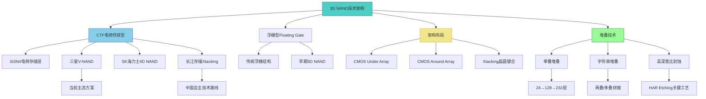
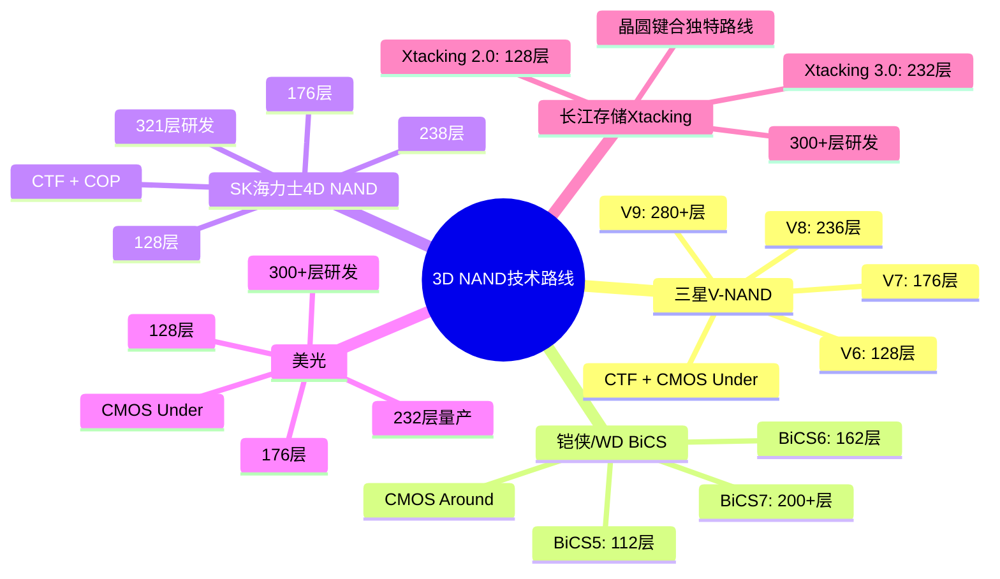
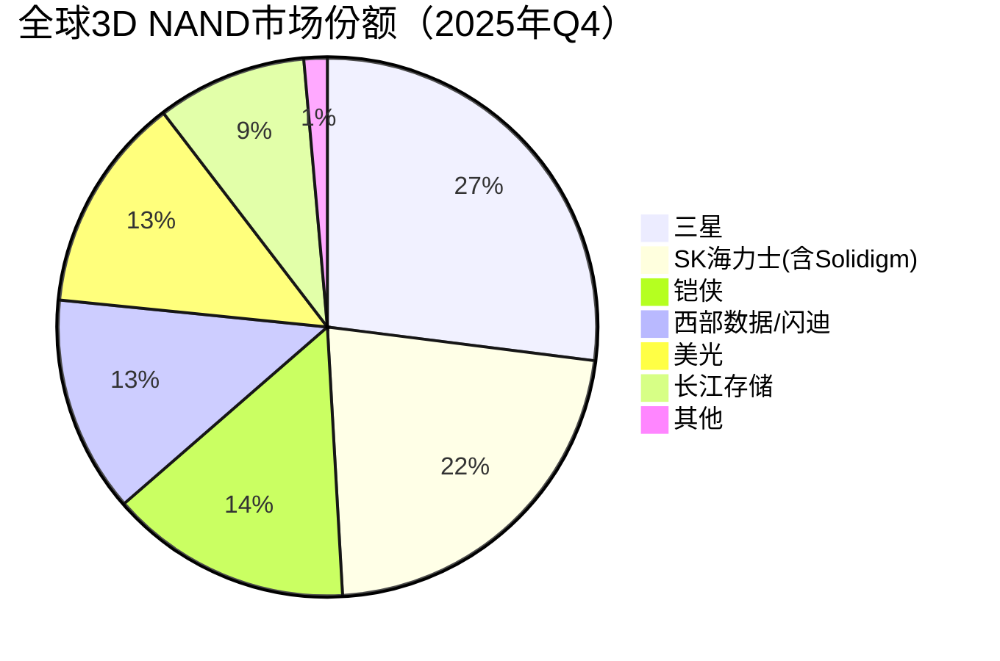

# 3D NAND Flash

> 3D NAND Flash是通过将存储单元垂直堆叠来实现高密度存储的闪存技术，是目前主流的大容量非易失性存储方案。

## 概述

3D NAND Flash是存储行业最重要的技术突破之一。传统2D NAND（平面NAND）在制程微缩到15nm后面临物理极限和可靠性挑战，3D NAND将存储单元从水平排列改为垂直堆叠，通过增加堆叠层数而非缩小制程来提升密度，成功绕过了平面微缩的物理瓶颈。

3D NAND的概念最早由东芝（现铠侠）于2007年提出，2013年三星率先量产第一代24层3D NAND（V-NAND）。此后，3D NAND堆叠层数以每年约30-40%的速度增长，从24层发展到128层、176层、232层，目前行业最先进量产水平已达232-300层，研发中的下一代产品瞄准400层以上。

3D NAND是SSD固态硬盘、手机存储和嵌入式存储的核心基础。随着AI训练数据集快速增长和企业级SSD需求爆发，3D NAND的市场需求持续旺盛。2025年全球NAND市场规模约650-925亿美元，是存储行业最大的单一产品类别。三星、铠侠、SK海力士（含Solidigm）、美光和长江存储是全球五大3D NAND厂商，技术竞争激烈。

## 技术原理

3D NAND的核心技术原理是将存储单元垂直堆叠。与2D NAND在硅片表面平面排列存储单元不同，3D NAND先在硅片上交替沉积多层ONO（氧化物-氮化物-氧化物）薄膜和牺牲层，然后通过高深宽比刻蚀（HAR Etching）打出垂直深孔，再在孔内沉积电荷存储层（Charge Trap层）和沟道层，形成垂直方向的NAND存储串。

3D NAND的主流架构有几种技术路线。**电荷俘获型（Charge Trap Flash, CTF）** 是三星V-NAND、SK海力士4D NAND和长江存储Xtacking采用的主流方案，使用氮化硅（Si3N4）作为电荷存储层。**浮栅型（Floating Gate）** 曾在早期3D NAND中使用，但逐渐被CTF取代。

垂直架构设计上，3D NAND有两种主要布局：**CMOS Under Array** 将CMOS外围电路放置在存储阵列下方（三星V-NAND方案）和**CMOS Around Array** 将外围电路放在阵列周围（铠侠/西部数据BiCS方案）。长江存储的Xtacking架构独特地将外围电路在另一片晶圆上制造后与存储阵列晶圆键合，实现独立优化。

堆叠方式上，**字符串堆叠（String Stacking）** 是突破单次堆叠层数限制的技术。当单次沉积层数难以超过200-256层时，厂商将两叠或多叠3D NAND堆叠在一起（如两叠128层=256层），但需要精确的对准和层间互连工艺。

## 分类与技术路线

3D NAND按厂商和技术路线可分为以下几个体系：

**三星V-NAND路线**：三星是3D NAND的开创者和领导者。从V6（128层）、V7（176层）到V8（236层量产）和V9（420层开发中），三星采用CTF技术，CMOS Under Array布局。三星V-NAND在产能和技术成熟度上领先。

**铠侠/西部数据BiCS路线**：BiCS（Bit Cost Scalable）是铠侠的3D NAND技术。BiCS5为112层，BiCS6为162层量产，BiCS7为200+层。采用CMOS Around Array布局，与三星路线不同。铠侠与西部数据合资运营日本三重/四日市工厂，是全球第二大3D NAND产能。

**SK海力士4D NAND路线**：SK海力士将CTF与COP（CMOS Under Array）结合称为"4D NAND"。从128层到176层到238层，SK海力士已实现321层QLC量产，是全球最先进的高层NAND之一。

**美光路线**：美光从128层到176层到232层量产，采用CMOS Under Array方案。美光在232层3D NAND上率先量产，并向更高层数推进。

**长江存储Xtacking路线**：长江存储是中国唯一的3D NAND厂商。Xtacking架构将外围电路和存储阵列分别在两片晶圆上制造，通过晶圆键合集成。从Xtacking 2.0（128层）到Xtacking 3.0（232层），长江存储已实现232层Xtacking 3.0量产，正在研发300+层产品。

## 市场格局

全球3D NAND市场由五大厂商主导。根据2025年Q4最新数据，按市场份额计算：三星约27.0%居首，SK海力士（含Solidigm）约22.1%，铠侠约14-15%，西部数据/闪迪约13%，美光约13%，长江存储从Q3的9%快速增长至Q1 2026预计的13%。2025年全球3D NAND产能折合约每月120-130万片晶圆（折合128层）。

3D NAND市场规模2025年约650-925亿美元（较2024年~680亿美元增长），随AI服务器和企业级SSD需求增长持续扩张。AI训练数据集的高速增长、SSD在数据中心渗透率提升以及手机存储容量升级共同推动3D NAND需求。2025年Q3全球NAND营收达184.22亿美元（环比+16.8%）。

长江存储是中国3D NAND自主化的唯一力量，232层Xtacking 3.0产品在技术和性能上已接近国际主流水平，产能持续扩张。长江存储份额从2024年的约5%快速增长至2025年Q3的9%，预计2026年Q1达到13%，挑战全球前三。2025年长江存储营收同比增长445%，增速惊人。

## 代表企业

| 企业 | 国家/地区 | 主要产品/技术 | 市场地位 |
|------|----------|-------------|---------|
| 三星 | 韩国 | V-NAND V8 236层量产/V9 420层开发 | 全球3D NAND龙头，2025Q4份额27.0% |
| 铠侠(Kioxia) | 日本 | BiCS6 162层量产/BiCS7 200+层 | 2025Q4份额~14-15%，与WD合资 |
| 西部数据(WD) | 美国 | 与铠侠合资运营 | 2025Q4份额~13%，BiCS合作伙伴 |
| SK海力士 | 韩国 | 4D NAND 238层/321层QLC量产 | 2025Q4份额(含Solidigm)22.1%，321层QLC量产 |
| 美光 | 美国 | 232层量产/300+层研发 | 2025Q4份额~13%，232层率先量产 |
| 长江存储(YMTC) | 中国 | Xtacking 3.0 232层 | 中国唯一3D NAND厂商，份额5%→13%，营收同比+445% |
| Solidigm | 美国 | 144层/192层 | Intel NAND业务剥离给SK |
| PHISON(群联) | 中国台湾 | 3D NAND控制器/模组 | 主控芯片和SSD方案商 |

## 发展趋势

### 市场规模预测

| 年份 | 市场规模 | 同比增长 | 备注 |
|------|---------|---------|------|
| 2024 | ~680亿美元 | — | 基准年 |
| 2025 | ~800亿美元 | +18% | 企业级SSD需求爆发，长江存储份额5%→13% |
| 2026E | ~1200亿美元+ | +50% | AI存储超级周期，QLC企业级SSD放量 |
| 2027E | ~1800亿美元+ | +50% | 300层+量产，AI推理大容量需求 |

**堆叠层数持续突破**：3D NAND堆叠层数从当前232-300层向400+层演进。三星V9（420层开发中）、SK海力士321层QLC已量产、长江存储300+层研发中。堆叠层数增长是3D NAND密度提升的核心路径。

**字符串堆叠成为关键**：单次沉积超过256-300层面临工艺极限，字符串堆叠（两叠拼接）成为突破层数限制的必由之路。双叠技术要求更高的对准精度和层间互连工艺。

**QLC渗透率提升**：4-bit/cell QLC 3D NAND在消费级SSD和大容量存储中渗透率持续提升，虽然耐久度低于TLC，但单位比特成本更低。PLC（5-bit/cell）技术也在研发中。

**高深宽比刻蚀技术升级**：随着层数增加，HAR刻蚀的深宽比要求从50:1向100:1+演进，刻蚀设备和工艺是关键瓶颈。泛林半导体和应用材料的HAR刻蚀设备持续升级。

**国产替代深化**：长江存储232层Xtacking 3.0已具备国际竞争力，份额从2024年约5%快速增长至2025年Q3的9%，预计2026年Q1达13%，挑战全球前三。2025年长江存储营收同比增长445%，增速全球第一。未来300+层产品将进一步缩小与三星差距，国内供应链自主化持续深化。

## AI基建拉动分析

AI基建浪潮对3D NAND形成强烈拉动。AI训练数据集规模从TB级向PB级甚至EB级增长，需要大量高速SSD存储训练数据和模型检查点（checkpoint）。企业级NVMe SSD是3D NAND在AI服务器中的核心应用，单台AI服务器SSD配置可达数十TB。2025年全球企业级SSD市场强劲增长，三星企业级SSD Q3份额32.3%、营收60亿美元（环比+15.4%），SK集团（含Solidigm）QLC企业级SSD受益于AI推理需求。

AI推理侧同样拉动3D NAND需求。边缘推理服务器需要大容量SSD存储AI模型和推理数据，消费级AI PC和AI手机的存储容量也在升级——旗舰手机存储已从256GB向512GB/1TB演进，AI PC标配1TB SSD。

从技术升级角度看，AI数据的高速读写需求推动3D NAND向更高层数和更高IOPS演进。企业级SSD需要TLC甚至SLC模式的高耐久度3D NAND，而大容量归档存储则可使用QLC 3D NAND降低成本。3D NAND的技术迭代方向与AI存储需求高度契合。

从投资价值看，3D NAND是AI基建中除HBM外弹性最大的存储环节。三星、SK海力士、美光等原厂受益于AI SSD需求增长，长江存储作为中国自主3D NAND力量具有战略投资价值。3D NAND产业链上的刻蚀设备（泛林、应用材料、中微公司）、存储控制器（群联、慧荣、国科微）和SSD模组（江波龙、佰维存储）等环节也值得关注。

---
[← 返回总目录](../../README.md)
