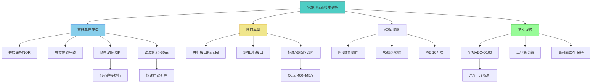
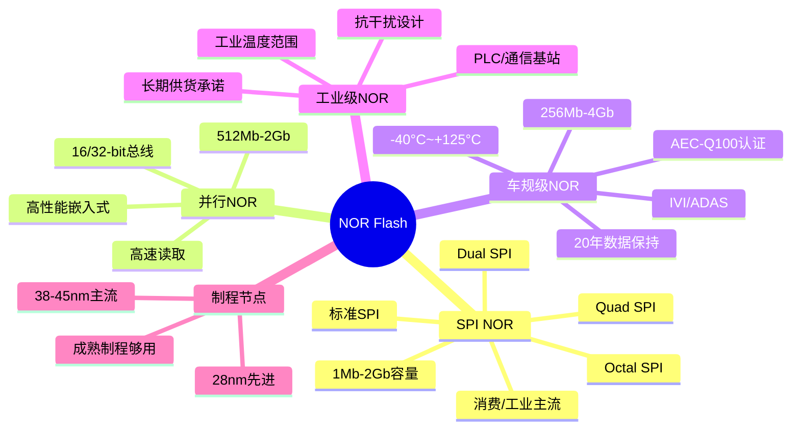
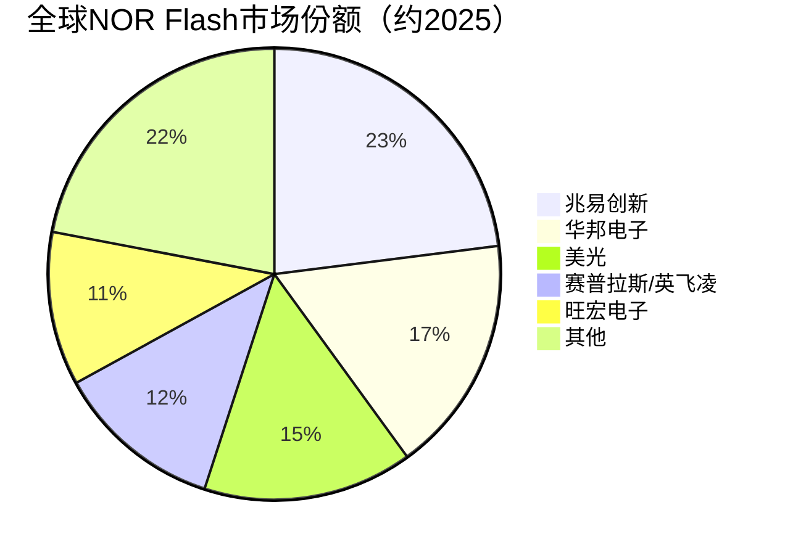

# NOR Flash

> NOR Flash是一种支持随机访问、高可靠性的非易失性闪存，广泛用于嵌入式系统和车规级存储。

## 概述

NOR Flash是NAND Flash的"兄弟"技术，两者同为非易失性闪存但架构和应用场景迥异。NOR Flash以其支持随机访问（XIP，eXecute In Place，片上执行）的能力著称，CPU可以直接从NOR Flash读取代码执行，无需先将代码拷贝到RAM。这一特性使NOR Flash成为嵌入式系统中代码存储和引导存储的首选。

NOR Flash的存储单元采用并联架构（NOR = NOT OR），每个存储单元有独立的位线和字线访问路径，支持按字节随机读取。相比之下，NAND Flash采用串联架构，只能按页/块顺序访问，密度更高但无法随机读取。NOR的并联架构牺牲了密度，换来随机访问能力和更高可靠性。

NOR Flash在存储产业链中属于中游芯片设计与制造环节，是非易失性存储的重要细分品类。虽然市场规模远不及NAND Flash（全球NOR Flash市场约25-30亿美元 vs NAND约550亿美元），但NOR Flash在嵌入式、车规和工业应用中具有不可替代的地位。随着智能汽车、5G通信和AIoT的发展，NOR Flash需求持续增长，特别是高容量和高可靠性车规级NOR Flash。

中国企业在NOR Flash领域表现突出。兆易创新（GigaDevice）是全球最大的NOR Flash供应商之一，在全球SPI NOR Flash市场份额名列前茅。兆易创新、华邦电子、赛普拉斯（已被英飞凌收购）和美光是NOR Flash市场的主要玩家。

## 技术原理

NOR Flash的存储单元与NAND Flash一样基于浮栅晶体管或电荷俘获晶体管，但阵列架构不同。NOR Flash采用并联架构，每个存储单元的源极和漏极分别连接到公共源线和位线，字线控制栅极。当字线电压施加时，只有被选中的存储单元导通，实现随机访问。这种架构支持按字节或按字读取，读取延迟可低至几十纳秒。

NOR Flash的编程和擦除机制与NAND类似，采用Fowler-Nordheim隧穿或热电子注入机制。NOR Flash的擦除以块（Block/Sector）为单位进行，编程以字/字节为单位。NOR Flash的P/E循环耐久度通常为10万次，高于NAND Flash的TLC/QLC，可靠性更好。

NOR Flash的接口类型分为并行接口（Parallel NOR）和串行接口（SPI NOR）。并行NOR支持更宽的数据总线和更高速的读取，用于高性能嵌入式应用；SPI NOR通过SPI串行总线访问，引脚少封装小，是当前主流的消费级和工业级NOR接口。SPI NOR支持多种工作模式：标准SPI、双SPI（Dual）、四SPI（Quad）和八SPI（Octal），Octal SPI数据速率可达400+ MB/s。

车规级NOR Flash在技术指标上要求更高。需通过AEC-Q100 Grade 3/2/1认证，工作温度范围-40°C至+105°C/+125°C，数据保持20年以上。车规NOR Flash还要求零缺陷质量和长期供货承诺（10-15年）。

## 分类与技术路线

NOR Flash按接口和容量可分为以下类型：

**SPI NOR Flash**：当前市场主流，引脚少封装小，适合消费电子和工业应用。按SPI模式分为标准SPI（1-bit）、Dual SPI（2-bit）、Quad SPI（4-bit）和Octal SPI（8-bit）。容量从1Mb到2Gb不等，主流容量为128Mb-1Gb。兆易创新在SPI NOR领域份额全球领先。

**并行NOR Flash（Parallel NOR）**：支持更宽数据总线（16/32-bit），读取速度更快，用于高性能嵌入式和工业控制。容量较大，可达512Mb-2Gb。并行NOR逐渐被SPI NOR取代，但在特定高性能场景仍有需求。

**车规级NOR Flash**：通过AEC-Q100认证的NOR Flash，工作温度-40°C至+105°C/+125°C，用于车载信息娱乐系统（IVI）、ADAS、仪表盘和域控制器。容量通常为256Mb-2Gb，部分高级ADAS系统需4Gb以上。美光、华邦、兆易创新是主要车规NOR供应商。

**高可靠性NOR Flash**：面向工业控制、通信基站和航天军工的高可靠性NOR Flash，需满足工业温度范围、抗辐射和长期供货要求。

按制程节点划分，NOR Flash主流制程在38-45nm，部分先进产品推进到28nm。NOR Flash对制程要求远低于NAND和DRAM，成熟制程即可满足需求。

## 市场格局

全球NOR Flash市场约25-30亿美元，2025年随汽车电子和5G需求恢复温和增长，车规级NOR需求增长是核心驱动力。市场份额方面，兆易创新是全球NOR Flash龙头，在SPI NOR市场份额约20-25%；华邦电子约15-18%；美光约15%；赛普拉斯/英飞凌约12%；旺宏电子约11%；其他厂商包括ISSI等。NOR Flash全球份额占整体存储市场不足2%，但在嵌入式和车规领域不可替代。

中国企业在NOR Flash领域的突破是存储国产替代的成功案例。兆易创新从Fabless模式起步，依托中芯国际代工，在SPI NOR市场逐步超越国际厂商，成为全球龙头。旺宏电子（Macronix）在并行NOR和车规NOR也有强势地位。

## 代表企业

| 企业 | 国家/地区 | 主要产品/技术 | 市场地位 |
|------|----------|-------------|---------|
| 兆易创新(GigaDevice) | 中国 | SPI NOR/车规NOR | 全球最大SPI NOR供应商 |
| 华邦电子(Winbond) | 中国台湾 | SPI/并行NOR/车规 | NOR Flash主要供应商 |
| 美光 | 美国 | 车规/工业级NOR | 车规NOR传统强者 |
| 英飞凌(Infineon) | 德国 | 车规/工业NOR | 收购赛普拉斯后整合 |
| 旺宏电子(Macronix) | 中国台湾 | 并行NOR/车规NOR | 并行NOR领先厂商 |
| ISSI | 美国 | 车规/工业NOR | 利基市场供应商 |
| 中芯国际(SMIC) | 中国 | NOR代工 | 兆易创新代工方 |
| 武汉新芯 | 中国 | NOR Flash制造 | 国内NOR制造力量 |

## 发展趋势

### 市场规模预测

| 年份 | 市场规模 | 同比增长 | 备注 |
|------|---------|---------|------|
| 2024 | ~28亿美元 | — | 基准年 |
| 2025 | ~30亿美元 | +7% | 车规级NOR需求增长 |
| 2026E | ~33亿美元 | +10% | 智能汽车ADAS放量 |
| 2027E | ~36亿美元 | +9% | L3+自动驾驶单车NOR用量提升 |

**车规NOR需求爆发**：智能汽车ADAS、座舱域控和车载以太网对NOR Flash需求快速增长。L2+以上ADAS单系统NOR用量可达1-4Gb，车规NOR是NOR市场增长最快的细分。

**容量持续提升**：NOR Flash容量从主流256Mb-1Gb向2Gb-4Gb演进，以满足智能汽车和5G基站对大容量代码存储的需求。兆易创新已推出2Gb SPI NOR产品。

**Octal SPI高速接口普及**：Octal SPI接口将NOR读取速率提升至400+ MB/s，缩小与并行NOR的差距，逐渐成为高性能嵌入式的新标准。

**高可靠性持续优化**：车规和工业级NOR在数据保持和耐久度上持续优化，部分产品支持20年数据保持和更高P/E循环。

**国产替代深化**：兆易创新等中国企业在NOR Flash领域已建立全球竞争力，未来在车规NOR和高容量NOR上将进一步突破，国产化率持续提升。

## AI基建拉动分析

NOR Flash在AI基建中的直接拉动相对间接，但在边缘AI和智能汽车AI应用中受益明显。

**智能汽车AI拉动车规NOR**：自动驾驶是AI在边缘端的核心应用，ADAS域控制器需要NOR Flash存储引导代码和AI模型参数。L3+自动驾驶对NOR Flash的容量和可靠性要求显著提升，单车NOR用量从128-256Mb向1-4Gb演进，2025年车规级NOR需求持续增长，车规NOR市场规模随智能汽车普及快速增长。

**AIoT设备拉动消费NOR**：AI摄像头、智能音箱和工业AI网关等边缘AI设备需要NOR Flash存储固件和启动代码。这类设备出货量巨大，虽然单价较低，但总量对NOR市场形成稳定需求支撑。

**5G/6G通信基础设施**：AI数据中心和边缘计算节点的通信基础设施需要大量NOR Flash存储基站固件和配置参数。5G基站的大规模建设间接拉动NOR Flash需求。

从投资角度看，NOR Flash的AI弹性虽然不如HBM和3D NAND显著，但其稳定增长和高毛利率特性使其具有防御价值。兆易创新作为中国NOR Flash龙头，在车规NOR和高容量NOR上的突破具有长期投资价值。NOR Flash产业链的成熟制程代工（中芯国际）也受益于NOR需求增长。

---
[← 返回总目录](../../README.md)
