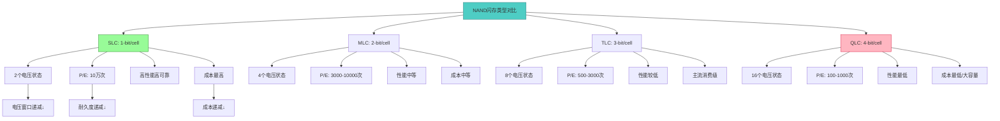
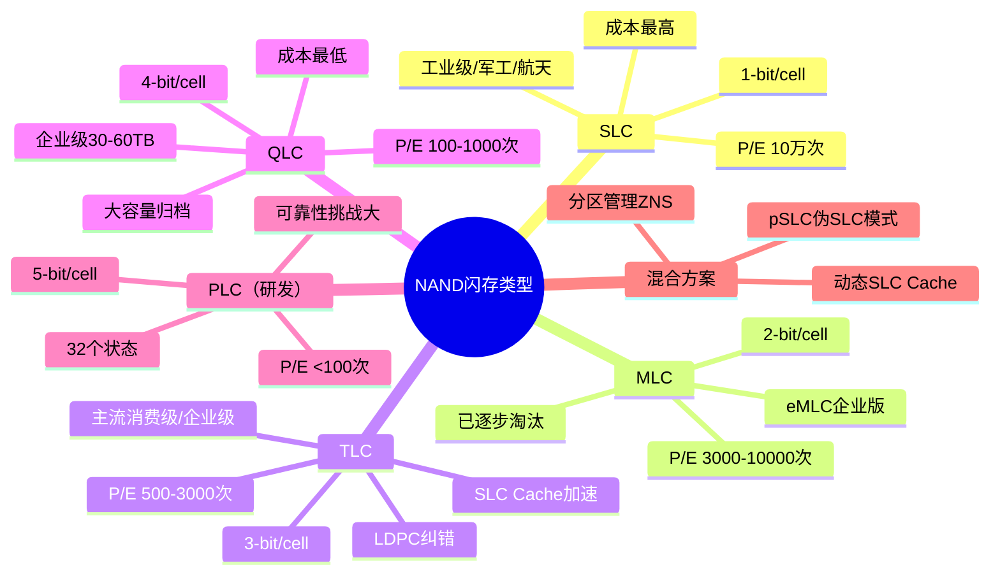
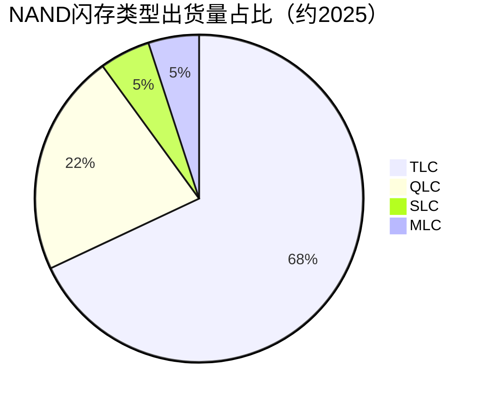

# 闪存类型SLC/MLC/TLC/QLC

> SLC/MLC/TLC/QLC是NAND闪存按每个存储单元存储比特数划分的四种类型，代表了存储密度与耐久度之间的核心权衡。

## 概述

NAND闪存按每个存储单元（Cell）能存储的数据位数分为SLC（1-bit/cell）、MLC（2-bit/cell）、TLC（3-bit/cell）和QLC（4-bit/cell）四种主要类型。这一分类直接决定了闪存的存储密度、写入耐久度、读取性能和成本等核心指标。理解SLC/MLC/TLC/QLC的权衡关系是把握NAND闪存产品定位和应用场景的基础。

随着3D NAND堆叠层数增加，存储密度的压力推动闪存从SLC向MLC、TLC和QLC演进。当前主流消费级SSD已全面转向TLC，QLC在企业级大容量存储和消费级入门SSD中渗透率持续提升。SLC虽然在消费市场几乎消失，但在工业级和车规级高可靠性场景中仍不可替代。

在AI基建背景下，企业级SSD对3D TLC和QLC的需求分化明显：高性能训练场景使用TLC甚至SLC模式保证耐久度和性能，大容量数据归档场景则倾向QLC降低成本。这种分化使得SLC到QLC的全谱系产品在AI存储中各有定位。

## 技术原理

NAND闪存的基本存储单元是一个浮栅晶体管或电荷俘获晶体管。存储单元通过在浮栅或电荷俘获层中存储不同数量的电荷来表示不同的数据状态。SLC只有两个状态（"0"和"1"），MLC有四个状态（00/01/10/11），TLC有八个状态，QLC有十六个状态。

存储比特数增加的核心挑战是状态之间的电压窗口缩小。SLC的电压窗口约3-5V，区分两个状态相对容易；TLC的电压窗口需分成8个区间，每个区间仅约0.5-0.8V；QLC则需区分16个状态，每个区间更窄。电压窗口越窄，数据保持和读取的可靠性越差，需要更强的ECC纠错（TLC/QLC需LDPC码）和更精细的电压编程算法。

P/E（Program/Erase）循环次数是衡量闪存耐久度的关键指标。SLC可承受约10万次P/E循环，MLC约3000-10000次，TLC约500-3000次，QLC仅约100-1000次。P/E循环次数随比特数增加而急剧下降，这是存储密度与耐久度权衡的核心体现。

写入性能也随比特数增加而下降。SLC的编程速度快，因为只需设定一个阈值电压；TLC需要8步精细编程，QLC需要16步，编程时间显著增加。为弥补性能差距，现代SSD采用SLC Cache（将部分TLC/QLC区块临时以SLC模式运行）和写入加速技术。

## 分类与技术路线

NAND闪存按比特数和可靠性等级可分为以下类型：

**SLC（Single-Level Cell）**：1-bit/cell，最高耐久度和可靠性，P/E循环10万次。SLC主要用于工业控制、军事航天和关键数据存储等高可靠性场景。由于密度最低成本最高，消费市场已极少使用。

**MLC（Multi-Level Cell）**：2-bit/cell，耐久度中等，P/E循环3000-10000次。MLC曾是消费级SSD的主流，现已被TLC取代。eMLC（Enterprise MLC）是面向企业优化的版本，通过牺牲性能换取更高耐久度。

**TLC（Triple-Level Cell）**：3-bit/cell，P/E循环500-3000次，是当前消费级和企业级SSD的主流。3D TLC在密度和耐久度之间取得良好平衡，配合LDPC ECC和磨损均衡算法可满足大多数应用需求。

**QLC（Quad-Level Cell）**：4-bit/cell，P/E循环100-1000次，密度最高成本最低。QLC适合大容量读取密集型应用，如数据归档和冷存储。企业级QLC SSD容量可达30-60TB。

**PLC（Penta-Level Cell，研发中）**：5-bit/cell，32个电压状态，P/E循环可能低于100次。PLC尚在研发阶段，面临巨大可靠性挑战，但单位比特成本有望进一步降低。

此外，pSLC（Pseudo-SLC）是将TLC/QLC芯片以SLC模式运行的混合方案，以牺牲容量换取耐久度，在企业级SSD中广泛应用。

## 市场格局

NAND闪存市场按类型呈现分层竞争格局。TLC占据主流，2025年约70%的NAND比特出货量为TLC；QLC快速增长，占比约20-25%（较2024年15-20%进一步提升），AI推理大容量需求推动QLC企业级SSD放量；SLC和MLC合计约5-10%，主要面向特殊应用。

从厂商角度看，三星、铠侠、SK海力士、美光和长江存储五大原厂均以TLC为主力产品，同时推进QLC量产。三星在QLC上较为积极，铠侠和西部数据也在推进BiCS QLC。长江存储232层TLC和QLC产品均已量产。Solidigm在QLC企业级SSD领域表现强势，AI推理大容量需求是核心驱动力。

## 代表企业

| 企业 | 国家/地区 | 主要产品/技术 | 市场地位 |
|------|----------|-------------|---------|
| 三星 | 韩国 | V-NAND TLC/QLC | TLC/QLC技术领先，率先量产 |
| 铠侠(Kioxia) | 日本 | BiCS TLC/QLC | TLC/QLC主要供应商 |
| SK海力士 | 韩国 | 4D TLC/QLC | TLC产能持续扩张 |
| 美光 | 美国 | 232层TLC/QLC | QLC企业级SSD供应商 |
| 长江存储(YMTC) | 中国 | Xtacking TLC/QLC | TLC/QLC自主量产 |
| 群联(PHISON) | 中国台湾 | SSD主控+TLC/QLC方案 | 主控和方案商龙头 |
| 慧荣科技(SMI) | 中国台湾 | SSD主控芯片 | 消费级SSD主控供应商 |
| 江波龙 | 中国 | SSD模组/嵌入式存储 | 存储模组厂商 |

## 发展趋势

### 市场规模预测

| 年份 | 市场规模 | 同比增长 | 备注 |
|------|---------|---------|------|
| 2024 | ~680亿美元 | — | 基准年，TLC为主力 |
| 2025 | ~800亿美元 | +18% | QLC企业级SSD放量，AI推理大容量需求 |
| 2026E | ~1200亿美元+ | +50% | QLC渗透率超30%，AI存储超级周期 |
| 2027E | ~1800亿美元+ | +50% | PLC技术预研推进，300层+量产 |

**QLC渗透率持续提升**：随着3D NAND堆叠层数增加和LDPC纠错算法优化，QLC的可靠性和性能持续改善。2025年QLC在企业级大容量SSD和消费级入门SSD中的渗透率从约18%提升至22%+，AI推理大容量需求推动QLC企业级SSD强势放量，Solidigm QLC企业级SSD表现突出。未来QLC渗透率将向30%+发展。

**PLC技术预研**：5-bit/cell PLC是NAND密度提升的下一步方向，但面临巨大可靠性挑战。PLC可能需要更强大的ECC和全新的管理架构，量产时间预计在2027年后。

**pSLC模式广泛应用**：将TLC/QLC以SLC模式运行的pSLC方案在企业级SSD中广泛应用，可根据工作负载动态切换SLC/TLC/QLC模式，兼顾性能和容量。

**写入加速技术创新**：SLC Cache、ZNS（Zoned Namespace）分区命名空间和持久性内存模式等创新技术持续改善TLC/QLC的写入性能瓶颈。

**ECC纠错能力升级**：随比特数增加，QLC/PLC需要更强的LDPC甚至OFEC（Outer Forward Error Correction）纠错，主控芯片的纠错能力持续升级。

## AI基建拉动分析

AI基建浪潮对不同类型NAND闪存的拉动效应呈现分化特征。

**企业级TLC是最大受益者**：AI训练场景对SSD的写入性能和耐久度要求极高。训练数据的高速写入、模型检查点的频繁保存需要高耐久度TLC 3D NAND。企业级NVMe SSD以TLC为主力，单台AI服务器SSD配置可达30-100TB，是TLC 3D NAND的高价值应用场景。2025年全球企业级SSD市场强劲增长，三星企业级SSD Q3营收60亿美元（份额32.3%）。

**QLC面向AI数据归档**：AI训练和推理产生的大量中间数据和日志需要大容量低成本存储归档。QLC企业级SSD（如三星BM1740 60TB、Solidigm D5-P5336 61TB）以QLC为基础，为大容量数据归档和冷数据存储提供极具成本优势的方案。2025年Solidigm QLC企业级SSD在AI推理大容量需求拉动下表现强势，SK集团（含Solidigm）企业级SSD Q3营收35.3亿美元。

**SLC/pSLC用于关键缓存**：AI训练系统中的热数据缓存和元数据存储需要极高耐久度，SLC或pSLC模式TLC承担这一角色。虽然量不大但单价高，是高利润细分。

从整体看，AI数据生命周期（热→温→冷）的不同阶段需要不同类型NAND：热数据用TLC、温数据用QLC、冷数据用QLC或QLC+磁带。这一分层存储架构确保各类NAND在AI生态中都有不可替代的定位，推动NAND全谱系需求增长。

---
[← 返回总目录](../../README.md)
