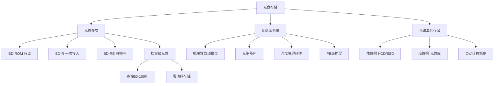
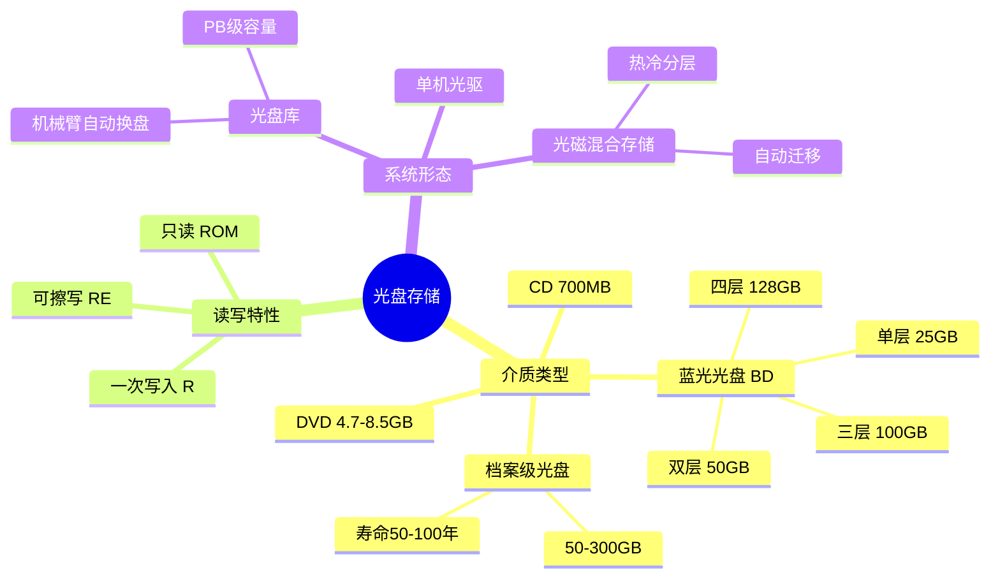
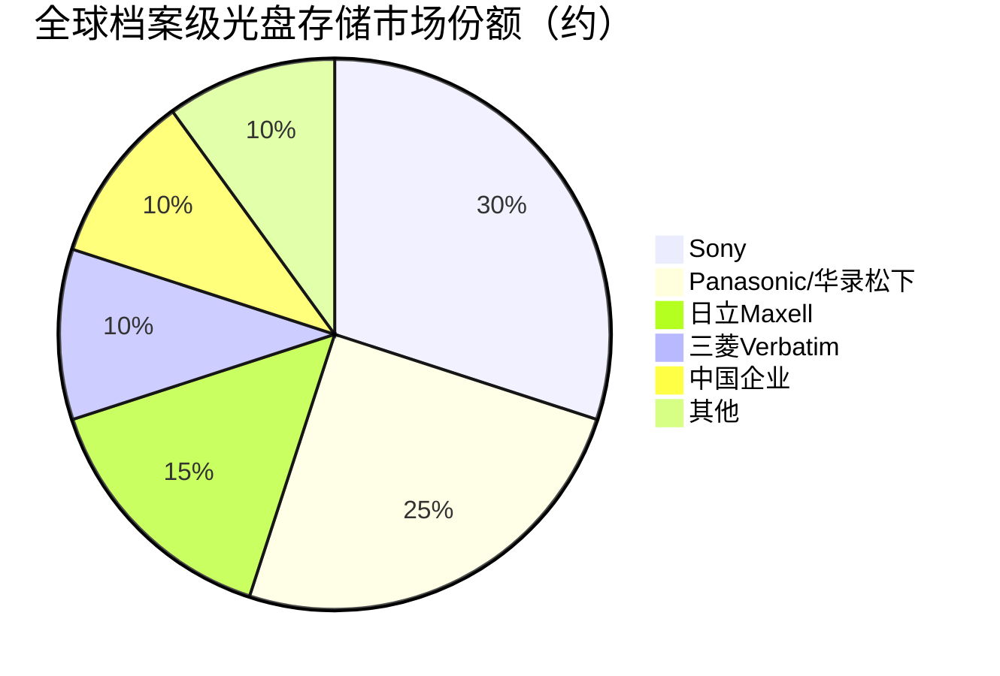

# 光盘存储

> 利用激光在光盘介质上读写数据的非易失性存储技术，是冷数据归档和长期保存的重要介质。

## 概述

光盘存储是存储产业链中游一个独特的细分领域，以其超长数据保存寿命（50-100年）、低介质成本和无需电力维护的特性，在冷数据归档和长期数据保存场景中具有不可替代的价值。与HDD和SSD不同，光盘存储采用激光读写方式，没有机械磨损部件，介质寿命可达50-100年，且在存储状态下无需消耗电力，是真正的"零功耗"存储介质。

蓝光光盘（Blu-ray Disc）是目前主流的光盘存储介质，单层容量为25GB，双层为50GB，三层为100GB，四层为128GB。档案级蓝光光盘（Archive Grade）专为长期保存设计，采用特殊记录层材料和保护层，寿命可达50年以上。在数据中心场景中，光盘库（Optical Library/Jukebox）通过机械臂自动管理数百到数千张光盘，实现PB级冷数据存储。

光磁混合存储是将光盘的长期保存特性与HDD的在线访问能力相结合的架构方案。在日本，Sony和Panasonic联合推出的Everspin光盘归档系统已在多家企业部署。中国也在积极发展档案级光盘存储产业，包括华录松下、紫晶存储等企业。随着数据合规保存要求日趋严格和冷数据规模爆发式增长，光盘存储迎来新的发展机遇。

## 技术原理

光盘存储利用激光在光盘记录层上创建微小的物理标记（凹坑/相变区域）来存储数据。**BD-ROM/BD-R**采用预刻录或一次写入方式，激光在记录层上烧录凹坑，凹坑与平面之间的反射率差异表示数据0和1。**BD-RE**（可擦写）采用相变材料（如Ge-Sb-Te合金），激光加热使材料在晶态（高反射率）和非晶态（低反射率）之间转换，实现反复擦写。

蓝光光盘使用405nm波长蓝色激光（CD为780nm红外、DVD为650nm红色），更短的波长允许更小的光斑直径，从而实现更高的面密度。光盘的轨道间距约为0.32μm（BD），最小凹坑长度约为0.149μm。为提高容量，多层技术通过在光盘内部堆叠多个透明记录层实现，读取时通过调整激光焦距在不同层间切换。

档案级光盘在材料工艺上做了特殊优化：记录层采用更稳定的相变材料或染料，保护层增加抗氧化和防紫外线涂层，基板采用更高精度的工程塑料以减少长期形变。光盘库系统由机械臂、光驱阵列、光盘架和控制系统组成，通过自动换盘实现大规模数据的自动化存取。

## 分类与技术路线

光盘存储按介质类型分为**CD**（700MB）、**DVD**（4.7-8.5GB）、**蓝光光盘BD**（25-128GB）和**档案级蓝光光盘**（50-300GB）。按读写特性分为只读（ROM）、一次写入（R）和可擦写（RE）。档案级光盘是冷数据归档的核心介质，专为50年以上长期保存设计。

按系统形态分为**单机光驱**（消费级）、**光盘库/光盘柜**（企业级，包含自动换盘机械臂，支持数百至数千张光盘，存储容量可达PB级）和**光磁混合存储系统**（结合HDD在线存储和光盘离线归档）。

光盘存储的技术发展方向包括：增加光盘层数（从4层向8-16层发展）、提高单层容量（从33GB向50-100GB发展）、提升读写速度（通过多光驱并行和更高倍速）、以及开发新型记录材料（如全息存储、超分辨率近场光存储）。

## 市场格局

光盘存储市场规模约15-25亿美元，主要集中在档案存储、政府/金融数据归档、医疗影像存储和广播媒体存档等领域。全球主要供应商包括Sony、Panasonic（华录松下合资公司）、日立Maxell、三菱（Verbatim）等日本企业主导。中国方面，华录集团（华录松下）是国内档案级光盘的龙头企业，紫晶存储曾一度发展但后续遇到经营困难。

光盘库系统方面，Sony的ODA（Optical Disc Archive）系统和Panasonic的Freeze-Ray系统是企业级光盘存储的代表性产品。在中国，华录松下、同有科技、清华同方等企业也在推广光盘归档解决方案。政府、金融、医疗和档案管理是光盘存储的主要应用领域，这些领域对数据合规保存有严格要求（如金融数据需保存15年以上，电子档案需永久保存）。

## 代表企业

| 企业 | 国家/地区 | 主要产品/技术 | 市场地位 |
|------|----------|-------------|---------|
| Sony | 日本 | ODA光盘归档系统、档案级光盘 | 光盘存储全球技术领导者 |
| Panasonic | 日本 | Freeze-Ray光盘库、档案级蓝光 | 光盘存储系统领先厂商 |
| 华录松下 | 中国 | 档案级蓝光光盘、光盘库 | 中国档案级光盘龙头 |
| 日立Maxell | 日本 | 档案级光盘介质 | 光盘介质知名供应商 |
| 三菱化学 | 日本 | Verbatim品牌光盘 | 光盘介质老牌厂商 |
| 同有科技 | 中国 | 光盘归档存储系统 | 国产光存储系统集成商 |
| 清华同方 | 中国 | 光盘库系统、归档方案 | 国产光存储解决方案商 |
| 紫晶存储 | 中国 | 档案级光盘、存储系统 | 曾为国内光存储代表企业 |

## 发展趋势

1. **多层高容量化**：光盘技术从4层128GB向8层300GB+发展，Sony的第三代ODA光盘单盘容量已达5.5TB（通过多光盘盒组合）。

2. **冷数据归档需求增长**：数据量爆发式增长和合规保存要求趋严推动冷数据归档需求，光盘存储凭借50-100年寿命和零功耗优势获得青睐。

3. **光磁混合架构标准化**：将光盘库作为冷存储层与HDD/SSD热存储层结合的混合架构正成为企业归档方案的主流模式。

4. **国产化替代推进**：中国推进档案级光盘和光盘库的国产化，华录松下等企业在政府和金融领域加速替代进口产品。

5. **与云存储融合**：光盘存储作为云端冷存储的后端介质，与S3 Glacier等对象存储冷层结合，提供超低成本长期保存。

## AI基建拉动分析

AI训练和使用产生海量数据——训练数据集、模型快照、推理日志、用户交互数据等需要长期保存和回溯。这些冷数据的存储成本在AI总成本中占比不断上升，推动对低成本冷存储方案的需求。光盘存储凭借极低的介质成本和零功耗维护特性，是AI冷数据归档的优选方案。虽然AI基建对光盘存储的拉动不如对HBM和SSD直接，但在长期数据保存和合规存储场景中，光盘存储受益于AI数据量的整体增长。预计AI时代数据量的指数级增长将为光盘存储市场带来5-8%的年化额外增长，特别是在政府、金融和科研领域的AI数据归档需求。

---
[← 返回总目录](../README.md)
