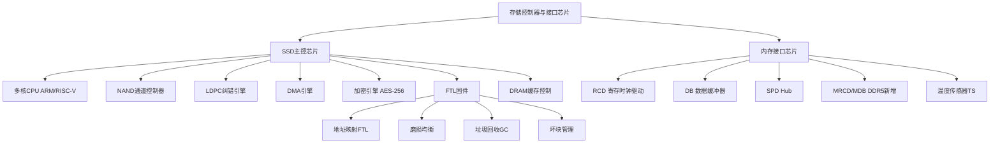
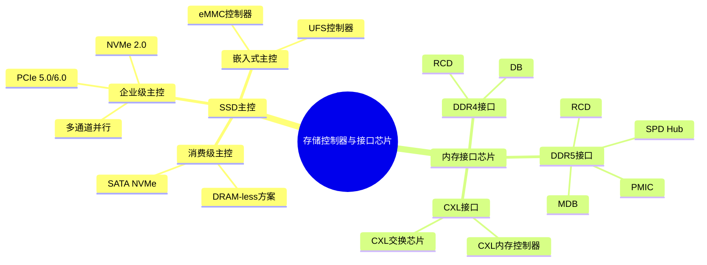
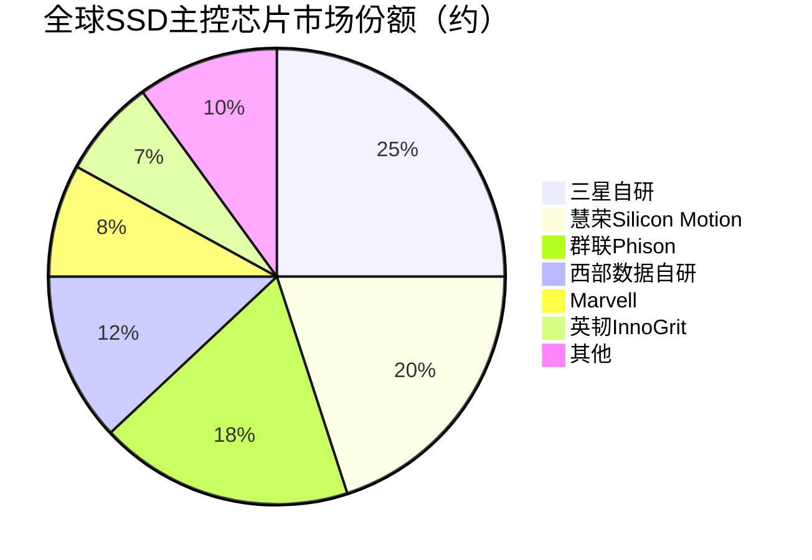

# 存储控制器与接口芯片

> 负责管理存储介质数据读写、纠错、磨损均衡等核心功能，以及连接存储芯片与主机系统的关键桥接芯片。

## 概述

存储控制器与接口芯片是存储产业链中游的关键环节，位于存储介质和主机系统之间，承担数据传输协议转换、信号调理、纠错编码、磨损均衡、垃圾回收等核心功能。存储控制器决定了存储设备的性能、可靠性和寿命，是SSD固态硬盘、内存模组等存储产品的"大脑"。

在SSD领域，主控芯片需要管理NAND闪存的复杂特性——包括坏块管理、磨损均衡、GC（垃圾回收）、TRIM、LDPC纠错等，其固件算法直接影响SSD的随机读写性能和QoS。在内存领域，接口芯片（如RCD、DB、SPD Hub、MRCD/MDB等）是服务器内存模组（RDIMM/LRDIMM）的关键组成，负责地址/命令/数据的缓冲与重驱动，确保高速DDR信号在多Rank、大容量内存模组中的信号完整性。

随着DDR5、PCIe 5.0/6.0、CXL等新一代标准的推进，存储控制器和接口芯片的复杂度持续提升。澜起科技在DDR5内存接口芯片领域已建立全球领先地位，与瑞萨（原IDT）、瑞萨（原Rambus）形成三足鼎立格局。在SSD主控领域，慧荣、群联、Marvell、英韧等企业竞争激烈，同时三星、西部数据等IDM厂商自研主控。

## 技术原理

**SSD主控芯片**内部集成了多核处理器（通常为ARM或RISC-V架构）、NAND通道控制器、DMA引擎、LDPC纠错编解码器、加密引擎、DRAM缓存控制器等模块。主控通过多个NAND通道并行访问闪存颗粒，利用ONFI或Toggle协议与NAND通信。固件（FW）运行在主控内部处理器上，实现FTL（Flash Translation Layer）地址映射、磨损均衡算法、垃圾回收策略、坏块管理和纠错处理。对于QLC/TLC NAND，LDPC纠错和软判决技术至关重要，直接影响数据保持和读取可靠性。

**内存接口芯片**工作在DDR5内存总线上。RCD（Register Clock Driver）负责缓冲和重驱动地址/命令/时钟信号，减轻内存控制器的负载；DB（Data Buffer）负责缓冲数据信号，在LRDIMM中用于支持更大容量；SPD Hub集中管理SPD EEPROM和TS温度传感器，通过I2C/I3C总线与主机通信。DDR5 LRDIMM需要1颗RCD、2颗MDB（Multiplexed Data Buffer）和1颗SPD Hub，以及多颗DB芯片。随着DDR5速率提升至6400MT/s及以上，接口芯片的信号完整性管理变得极其关键。

## 分类与技术路线

存储控制器按应用场景可分为**消费级SSD主控**、**企业级SSD主控**和**嵌入式存储主控**（eMMC/UFS）。消费级主控追求性价比，通常采用无外置DRAM缓存的DRAM-less方案或小容量DRAM方案；企业级主控要求高IOPS、低延迟、高可靠性和QoS保障，通常支持多通道NAND、大容量DRAM缓存、端到端数据保护和NVMe协议；嵌入式主控则专注于低功耗和小封装。

内存接口芯片按DDR代际划分，DDR4时代需要1RCD+1DB（LRDIMM）或仅1RCD（RDIMM），DDR5时代架构升级为1RCD+多颗MDB+1SPD Hub。DDR5引入了DFI 5.0接口、PMIC（电源管理芯片）上移到模组等新特性，接口芯片种类和数量增加。CXL内存扩展协议的兴起也催生了CXL内存控制器和CXL交换芯片等新品类。

从技术路线看，SSD主控正从PCIe 4.0向PCIe 5.0/6.0演进，支持NVMe 2.0协议，引入ZNS（Zoned Namespace）等新特性。NAND管理从SLC/MLC向TLC/QLC甚至PLC演进，对纠错能力要求大幅提升，LDPC软判决和AI辅助纠错成为趋势。

## 市场格局

SSD主控芯片市场规模约40-60亿美元，主要由独立主控厂商和IDM自研两部分构成。独立主控市场中，慧荣（Silicon Motion）、群联（Phison）、Marvell、英韧科技（InnoGrit）是主要玩家。IDM厂商三星、西部数据/SanDisk、SK海力士/Solidigm均自研主控。中国企业中，英韧科技、得一微（YEESTOR）、国科微、华澜微等正在快速成长。

内存接口芯片市场规模约15-25亿美元，高度集中于三家供应商：澜起科技、瑞萨（原IDT/Rambus）、瑞萨。澜起科技在DDR5 RCD领域全球领先，与JEDEC标准制定深度绑定，DDR5时代市场份额显著提升。随着DDR5渗透率提升和CXL生态发展，内存接口芯片市场有望持续增长。

## 代表企业

| 企业 | 国家/地区 | 主要产品/技术 | 市场地位 |
|------|----------|-------------|---------|
| 澜起科技 | 中国 | DDR5 RCD/DB/SPD Hub/MRCD | 全球DDR5内存接口芯片龙头之一 |
| 慧荣科技 | 中国台湾 | SSD主控、eMMC/UFS主控 | 全球消费级SSD主控龙头 |
| 群联电子 | 中国台湾 | SSD主控、嵌入式存储主控 | 全球SSD主控领先企业 |
| Marvell | 美国 | 企业级SSD主控、数据中心主控 | 企业级SSD主控老牌厂商 |
| 英韧科技 | 中国 | PCIe SSD主控、存储解决方案 | 国产SSD主控创新企业 |
| 瑞萨电子 | 日本 | DDR5 RCD/DB/PMIC | 全球内存接口芯片三强之一 |
| 得一微 | 中国 | SSD主控、嵌入式存储主控 | 国产存储主控重要厂商 |
| 三星电子 | 韩国 | 自研SSD主控、内存接口 | IDM全栈自研模式 |

## 发展趋势

1. **PCIe 5.0/6.0主控升级**：SSD主控正全面向PCIe 5.0过渡，PCIe 6.0主控研发已启动，带宽翻倍带来信号完整性和功耗管理新挑战。

2. **DDR5/CXL接口生态扩展**：DDR5渗透率快速提升带动接口芯片需求，CXL内存扩展协议催生新接口芯片品类，澜起科技等已推出CXL内存扩展芯片。

3. **QLC/PLC NAND管理**：NAND向QLC/PLC演进对主控纠错能力提出更高要求，AI辅助LDPC纠错、自适应编码技术成为研发重点。

4. **国产化替代加速**：在中美科技竞争背景下，国产SSD主控和内存接口芯片替代进程加速，得一微、英韧、澜起等企业受益。

5. **存算与安全融合**：主控芯片集成存算一体和安全加密功能（如国密SM2/SM4），满足数据中心安全合规需求。

## AI基建拉动分析

AI服务器对内存容量和带宽的需求远超传统服务器——一台AI训练服务器（如NVIDIA DGX H100）配备超过1TB的HBM和DDR5内存，内存接口芯片用量是普通服务器的3-5倍。AI训练和推理集群的大规模部署直接拉动内存接口芯片需求，澜起科技等企业显著受益。SSD方面，AI训练数据集和检查点的存储需求推动企业级NVMe SSD放量，带动高性能SSD主控需求。CXL内存扩展技术在AI推理池化场景中前景广阔，有望成为下一个增长点。整体而言，AI基建浪潮从量和价两个维度拉动存储控制器与接口芯片市场，是该环节最确定的需求增长驱动力。

---
[← 返回总目录](../README.md)
