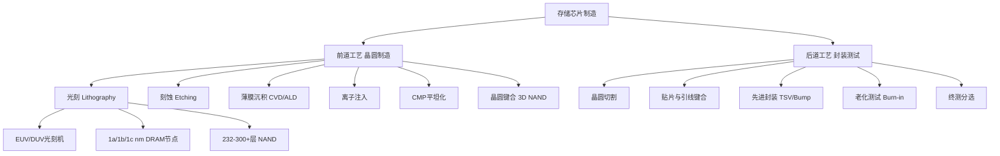
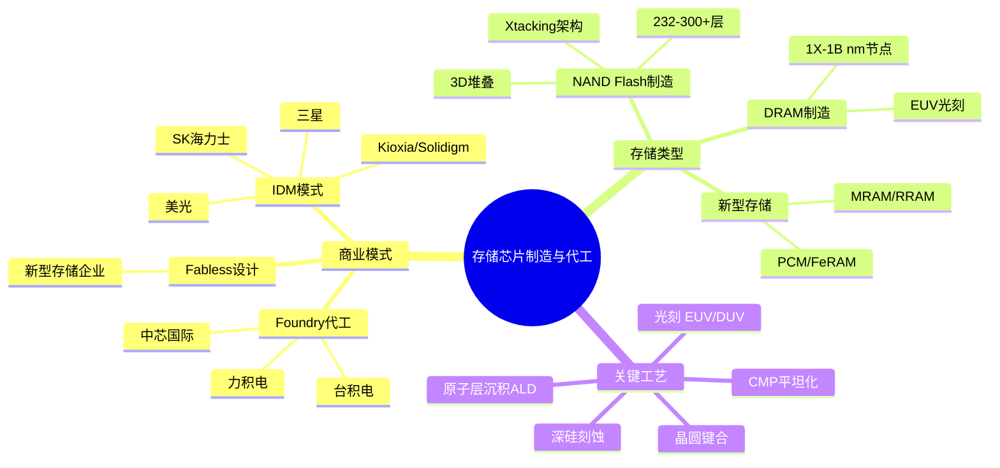
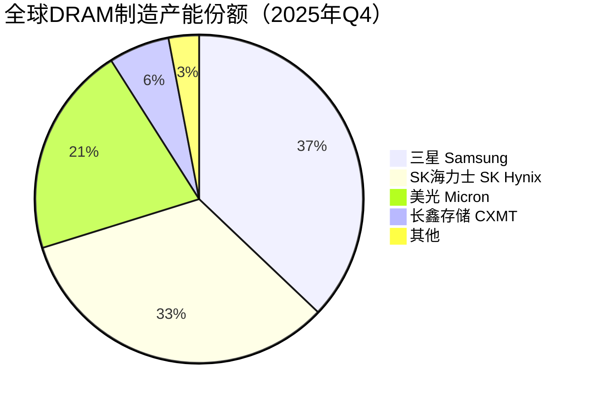

# 存储芯片制造与代工

> 存储芯片从设计到晶圆制造、封装测试的全产业链环节，涵盖IDM与Foundry两种核心商业模式。

## 概述

存储芯片制造与代工是存储产业链中游的核心环节，决定了存储芯片的产能、成本和技术水平。存储芯片制造具有投资强度极大（一座先进DRAM/NAND工厂投资达100-200亿美元）、技术壁垒极高（涉及光刻、刻蚀、薄膜沉积、化学机械抛光等数百道工序）、规模效应显著（产能利用率直接决定盈利能力）的特点，是全球半导体产业中最具挑战性的领域之一。

存储芯片制造存在两种主要商业模式：**IDM（Integrated Device Manufacturer）模式**——企业自有设计、制造、封测全链条，如三星、SK海力士、美光；**Foundry（代工）模式**——设计企业（Fabless）委托代工厂制造，如长江存储、长鑫存储在发展初期依赖外部代工或自建产线。由于存储芯片对工艺和产能的高度要求，IDM模式在DRAM和NAND领域占主导地位，全球仅三星、SK海力士、美光三家具备先进DRAM制造能力。

在NAND Flash领域，长江存储（YMTC）通过Xtacking架构实现了技术追赶，已具备128层/232层/300+层NAND量产能力。在DRAM领域，长鑫存储（CXMT）正在推进19nm/17nm DDR4/DDR5工艺。中国存储芯片制造的崛起是全球存储产业格局中最重要变量之一，但也面临美国出口管制对先进设备（EUV光刻机等）的限制。

## 技术原理

存储芯片制造流程包括**晶圆制造（前道工艺）**和**封装测试（后道工艺）**两大环节。前道工艺在硅晶圆上构建存储单元阵列和外围电路，涉及以下关键步骤：

**光刻（Photolithography）**：使用光刻机（如ASML EUV/DUV）将电路图案从掩膜版转移到光刻胶上，决定芯片的最小特征尺寸。DRAM的活跃半节距已缩小至10nm级（1a/1b/1c nm节点），NAND层数已达232-300+层。EUV光刻技术在1a nm及以下DRAM节点和高层NAND中日益重要。

**刻蚀（Etching）**：通过等离子体或湿法化学方法去除曝光后的材料，形成电路图案。在3D NAND制造中，深硅刻蚀（高达10:1以上深宽比）是核心技术瓶颈。

**薄膜沉积（CVD/ALD/PVD）**：通过化学气相沉积、原子层沉积等方法在晶圆上生长各种功能薄膜，如NAND的电荷俘获层、DRAM的电容介质层。ALD在先进节点中不可或缺。

**化学机械抛光（CMP）**：通过化学腐蚀和机械研磨实现晶圆表面的全局平坦化，是多层互连和3D NAND堆叠的关键工艺。

**3D NAND的Xtacking架构**（长江存储）：将存储阵列和外围电路分别在两片晶圆上制造，然后通过键合（Bonding）技术合二为一，实现更高的存储密度和更快的I/O速度。

## 分类与技术路线

存储芯片制造按商业模式分为**IDM模式**和**Foundry/Fabless模式**。IDM模式代表企业有三星、SK海力士、美光（DRAM+NAND）、Kioxia/Solidigm（NAND）、Micron（DRAM+NAND），这些企业自主完成从设计到制造的全流程。Foundry模式下，Fabless设计企业（如部分新型存储芯片公司）委托台积电、中芯国际等代工厂制造。

按存储类型分为**DRAM制造**、**NAND Flash制造**和**新型存储制造**（RRAM/MRAM/PCM等）。DRAM制造以1X/1Y/1Z/1A/1B nm节点迭代，目前最先进为1b nm（约10-12nm），需要EUV光刻。NAND制造从2D平面转向3D堆叠，当前主流为176-232层，向300+层演进，关键工艺为深硅刻蚀和多层薄膜沉积。新型存储制造（如MRAM、RRAM）通常采用成熟CMOS工艺或后端集成工艺（BEOL），制造难度相对较低。

按制程节点看，DRAM从1X nm（16-19nm）→1Y nm（14-16nm）→1Z nm（12-14nm）→1A nm（10-12nm）→1B nm迭代；3D NAND从64层→128层→176层→232层→300+层迭代。中国方面，长鑫存储DRAM从19nm向17nm推进，长江存储NAND从128层向232层及更先进节点推进。

## 市场格局

全球存储芯片制造市场规模约1200-1500亿美元，其中DRAM约700-800亿美元，NAND约500-700亿美元。2025年全球存储市场（DRAM+NAND）规模达2215.91亿美元，同比增长32.7%，创历史新高。制造环节高度集中——DRAM制造100%由三星、SK海力士、美光三家IDM把控；NAND制造由三星、SK海力士/Solidigm、Kioxia/西部数据、美光、长江存储等主导。

三星在DRAM和NAND两个领域均处于技术领先地位，率先量产1b nm DRAM和236层V-NAND。SK海力士在HBM领域领先，4/8层HBM3E量产。美光注重成本效率和产品多元化。Kioxia和西部数据的NAND合资制造体是NAND市场重要力量。长江存储通过Xtacking架构实现了NAND技术追赶，232层TLC/QLC产品已量产。

中国存储芯片制造正处于关键发展期。长鑫存储DRAM产能持续扩充，从19nm向17nm/更先进节点推进；长江存储NAND在受美国出口管制影响后调整策略，聚焦成熟节点产能扩充。中芯国际等代工厂也在支持部分存储相关芯片的制造。

## 代表企业

| 企业 | 国家/地区 | 主要产品/技术 | 市场地位 |
|------|----------|-------------|---------|
| 三星电子 | 韩国 | DRAM 1b nm、V-NAND 236层、HBM | 全球存储芯片制造龙头 |
| SK海力士 | 韩国 | DRAM 1b nm、NAND、HBM3E | 全球第二大存储IDM，HBM领先 |
| 美光科技 | 美国 | DRAM 1β nm、NAND 232层、HBM3E | 全球第三大存储IDM |
| Kioxia | 日本 | 3D NAND BiCS技术 | 全球NAND Flash技术先驱 |
| 西部数据/Solidigm | 美国 | 3D NAND制造 | 与Kioxia合资制造NAND |
| 长江存储 YMTC | 中国 | Xtacking 3D NAND 232层 | 中国NAND制造龙头 |
| 长鑫存储 CXMT | 中国 | DRAM 19nm/17nm | 中国DRAM制造主力 |
| 中芯国际 SMIC | 中国 | 代工服务，支持存储相关芯片 | 中国最大晶圆代工厂 |

## 发展趋势

### 市场规模预测

| 年份 | 市场规模 | 同比增长 | 备注 |
|------|---------|---------|------|
| 2024 | ~1700亿美元 | — | 基准年，DRAM+NAND合计 |
| 2025 | 2215.91亿美元 | +32.7% | AI驱动超级周期，HBM需求爆发 |
| 2026E | 5516亿美元 | +134% | AI算力需求持续爆发，存储价格大幅上涨 |
| 2027E | 8427亿美元 | +53% | 2027下半年产能释放为关键节点 |

1. **DRAM进入EUV时代**：1a nm及以下节点必须使用EUV光刻，三星和SK海力士已量产EUV DRAM，美光也在推进EUV导入，技术门槛和投资强度进一步升高。

2. **3D NAND向300+层进军**：三星、SK海力士、长江存储等均在推进300+层NAND研发，深硅刻蚀和多层堆叠工艺挑战巨大，预计2025-2026年量产。

3. **HBM制造成新增长极**：AI对HBM需求爆发，三星、SK海力士、美光三大DRAM厂商加码HBM产能，HBM制造采用TSV堆叠和混合键合等先进封装技术。

4. **中国存储制造自主化**：在出口管制背景下，中国存储芯片制造加速国产设备和材料替代，长江存储和长鑫存储推进成熟节点产能扩充和技术迭代。

5. **先进封装融合**：存储制造与封装的边界模糊，HBM的3D堆叠、CXL内存池化、Chiplet等趋势推动先进封装技术在存储制造中的重要性提升。

## AI基建拉动分析

AI基建对存储芯片制造的拉动是全方位和决定性的。2025年全球存储市场（DRAM+NAND）规模达2215.91亿美元，同比增长32.7%，创历史新高。AI训练服务器需要大量HBM（每颗GPU配4-8颗HBM3E），直接拉动先进DRAM制造需求——单台H100服务器含约640GB HBM，而HBM的制造占用先进DRAM产能远超普通DRAM。AI服务器还需要大量DDR5 RDIMM，推动1a/1b nm DRAM产能向DDR5倾斜。NAND方面，AI训练数据和检查点存储推动企业级SSD需求，带动3D NAND产能增长。长江存储NAND份额从2024年的9%提升至2025年Q3的9%，预计2026年Q1达到13%，挑战全球前三。CXMT（长鑫存储）逐步进入DRAM市场，份额从4%提升至6%。

从产能角度看，AI对HBM的旺盛需求导致三星、SK海力士将部分普通DRAM产能转向HBM，影响全球DRAM供需平衡。2026年存储市场预计增长134%，2027年继续增长53%。HBM的高价值特性（单价是普通DRAM的3-5倍）使存储IDM利润大幅提升。对于中国存储制造而言，AI基建浪潮既是机遇（国内AI需求旺盛）也是挑战（出口管制限制先进设备和工艺获取）。整体而言，AI基建是当前存储芯片制造产业最核心的需求驱动力和技术推动力。

---
[← 返回总目录](../README.md)
