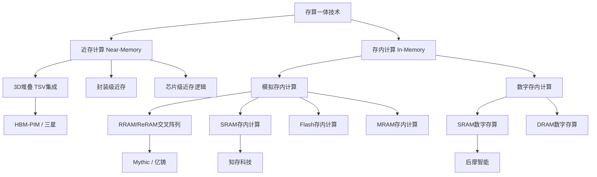
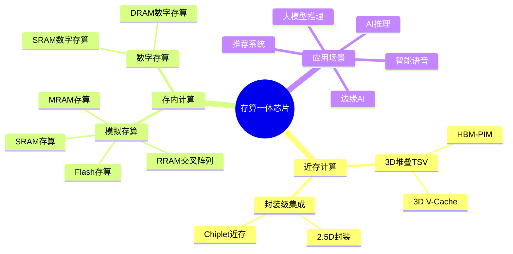
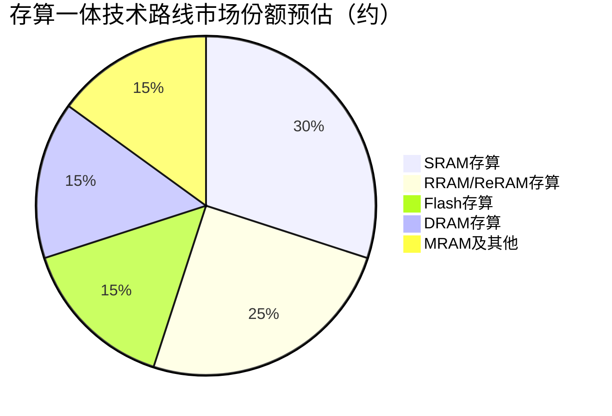

# 存算一体芯片

> 将计算功能集成在存储单元内部或附近，打破冯·诺依曼架构瓶颈的新型芯片技术。

## 概述

存算一体（Processing-In-Memory, PIM / Compute-In-Memory, CIM）是存储产业链中游一项革命性的技术方向。在传统冯·诺依曼架构中，数据需要在存储器和处理器之间反复搬运，随着AI大模型训练和推理对算力需求的指数级增长，"存储墙"和"功耗墙"问题日益突出——数据搬运的能耗和延迟远超计算本身。存算一体技术通过将计算操作直接嵌入存储阵列内部或紧邻存储单元，从根本上消除数据搬运开销，实现能效和带宽的量级提升。

存算一体芯片在AI推理场景中展现出巨大潜力，特别是在边缘AI、大模型推理、推荐系统等访存密集型应用中。根据SRAM、DRAM、Flash、RRAM/ReRAM、MRAM等不同存储介质，存算一体技术路线可分为近存计算（Near-Memory Computing）和存内计算（In-Memory Computing）两大方向，并进一步细分为数字存算和模拟存算两种实现方式。

当前，全球存算一体赛道汇聚了知存科技、后摩智能、亿铸科技、Mythic、Syntiant、d-Matrix等创新企业，同时三星、台积电、Intel等巨头也在积极布局。中国在存算一体领域与国际前沿差距较小，是少数有望实现弯道超车的半导体细分赛道之一。

## 技术原理

存算一体芯片的核心原理是利用存储单元的物理特性直接执行矩阵-向量乘法（MAC）运算，这是神经网络计算中最基本的操作。在模拟存算架构中，存储阵列（如RRAM交叉阵列、SRAM位单元阵列）被用作权重存储器，输入向量以电压形式施加在字线上，通过基尔霍夫电流定律在位线上自然完成乘加运算，实现单步完成大规模并行MAC计算。

近存计算（Near-Memory Computing）不改变存储单元本身，而是在存储芯片内部或封装层级（如3D堆叠TSV）集成计算逻辑单元，通过缩短数据路径降低延迟和功耗。典型代表包括三星的HBM-PIM和AMD的3D V-Cache。存内计算（In-Memory Computing）则直接利用存储单元的模拟特性进行计算，如基于RRAM、SRAM、Flash的模拟存内计算，以及基于数字逻辑的数字存内计算。

模拟存算的优势在于极高的能效比（可达TOPS/W级别提升）和并行度，但面临精度有限、ADC/DAC转换开销、工艺变异等挑战。数字存算则保留了数字计算的精度优势，但能效提升相对有限。存算一体芯片的设计需要在精度、能效、面积、可靠性之间进行复杂权衡。

## 分类与技术路线

存算一体芯片按存储介质和计算方式可分为多条技术路线。**基于SRAM的存算**是最成熟的方案，利用SRAM位单元阵列做模拟域乘加运算，代表企业有知存科技、后摩智能（数字存算方向）。SRAM存算速度快、与CMOS工艺兼容性好，但存储密度较低，适合中小规模AI推理。

**基于RRAM/ReRAM的存算**利用阻变器件的非易失性和多值特性，在交叉阵列中实现高密度模拟存算，代表企业有Mythic、亿铸科技。RRAM存算密度高、能效好，但器件一致性、耐久性和写入速度仍有挑战。**基于Flash的存算**利用浮栅晶体管的多值存储特性，代表有Mythic的Analog Matrix Processor，利用成熟的Flash工艺实现低成本AI推理。

**基于DRAM的存算**利用DRAM的高密度优势，在DRAM芯片内集成计算逻辑，代表有三星HBM-PIM、UPMEM。**基于MRAM的存算**利用自旋电子器件的非易失性和高速特性，目前处于研发早期阶段。此外，基于新兴介质如铁电晶体管（FeFET）、相变存储（PCM）的存算方案也在积极探索中。

## 市场格局

存算一体芯片市场目前处于早期发展阶段，尚未形成稳定的竞争格局。全球存算一体市场规模预计在2030年达到百亿美元级别，年复合增长率超过50%。AI大模型的爆发极大刺激了存算一体技术的商业化进程，特别是在推理侧，存算一体芯片有望在能效比上实现对GPU的10-100倍提升。

中国存算一体赛道吸引了大量资本和人才，知存科技、后摩智能、亿铸科技、千寻智能等企业已完成多轮融资。国际上，Mythic、Syntiant、d-Matrix、Rain AI等公司也在积极推进产品化。三星、SK海力士等存储巨头通过HBM-PIM等产品切入存算赛道，Intel、台积电等也在通过工艺和封装技术支持存算一体创新。

当前存算一体芯片的产业化挑战包括：工艺成熟度不足、EDA工具链缺失、软件生态薄弱、应用场景验证等。但随着AI推理需求的爆发和工艺的持续改进，存算一体有望在2025-2030年实现规模化商用。

## 代表企业

| 企业 | 国家/地区 | 主要产品/技术 | 市场地位 |
|------|----------|-------------|---------|
| 知存科技 | 中国 | 基于Flash的存算一体芯片 | 国内存算一体先行者，WTM系列芯片已量产 |
| 后摩智能 | 中国 | 基于SRAM的数字存算一体 | 国内数字存算领先，鸿微系列智能芯片 |
| 亿铸科技 | 中国 | 基于RRAM的模拟存算 | 大模型推理存算芯片创新企业 |
| Mythic | 美国 | 基于Flash的模拟存算AI芯片 | 模拟存算先驱，M1108推理芯片 |
| d-Matrix | 美国 | 基于SRAM的存算AI芯片 | 面向大模型推理的Chiplet存算方案 |
| Syntiant | 美国 | 基于Flash的边缘AI存算 | 边缘语音AI存算芯片领先者 |
| 三星电子 | 韩国 | HBM-PIM存算内存 | 存储巨头布局HBM内存存算 |
| Rain AI | 美国 | 基于RRAM的类脑存算 | 获微软投资的新兴存算企业 |

## 发展趋势

1. **大模型推理专用化**：存算一体芯片正从边缘AI向大模型推理场景扩展，d-Matrix、亿铸等企业推出面向Transformer架构的存算加速方案，在KV Cache等访存瓶颈场景中优势明显。

2. **Chiplet与异构集成**：通过Chiplet和2.5D/3D封装技术组合多个存算单元，解决单片存算芯片规模受限问题，提升系统级算力和灵活性。

3. **工艺与EDA工具链成熟**：台积电、三星等代工厂正建立存算一体专用工艺平台，同时EDA厂商开发存算专用设计工具，降低开发门槛。

4. **软件生态建设**：存算一体芯片的编译器、运行时、模型量化工具等软件栈正在完善，与PyTorch/TensorFlow等主流框架的对接是关键。

5. **多介质融合**：未来存算一体芯片可能融合SRAM、RRAM、MRAM等多种介质，在不同计算层级发挥各自优势。

## AI基建拉动分析

AI大模型训练和推理的爆发式增长对存算一体芯片构成了巨大的需求拉动。大模型推理中，KV Cache的访存带宽成为主要瓶颈，传统GPU的HBM带宽已接近物理极限，而存算一体芯片可将访存能耗降低1-2个数量级，是解决AI推理"存储墙"问题的关键技术路径。在AI推理侧，存算一体芯片有望实现10-100TOPS/W的能效，远超当前GPU的1-5 TOPS/W水平。

随着AI从云端向边缘扩展，边缘推理对低功耗、高能效AI芯片的需求急剧增长，存算一体在智能摄像头、AR/VR设备、自动驾驶、智能语音等场景具有广阔应用前景。AI基建浪潮不仅直接拉动了存算一体芯片的市场需求，也加速了该领域的技术迭代和产业化进程。从投资角度看，存算一体是中国半导体领域少数有望实现技术领先的赛道，具有长期投资价值，但需关注工艺成熟度、软件生态和应用场景验证等产业化风险。

---
[← 返回总目录](../README.md)
