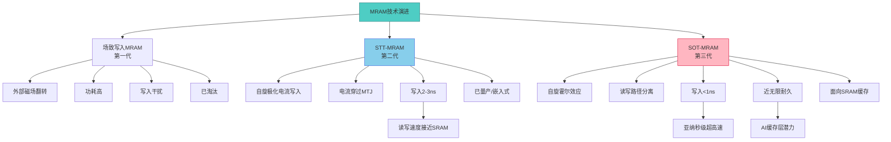
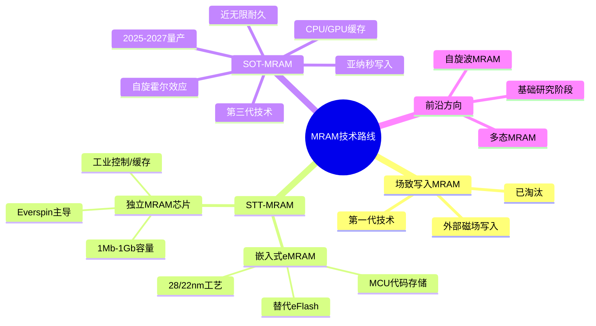
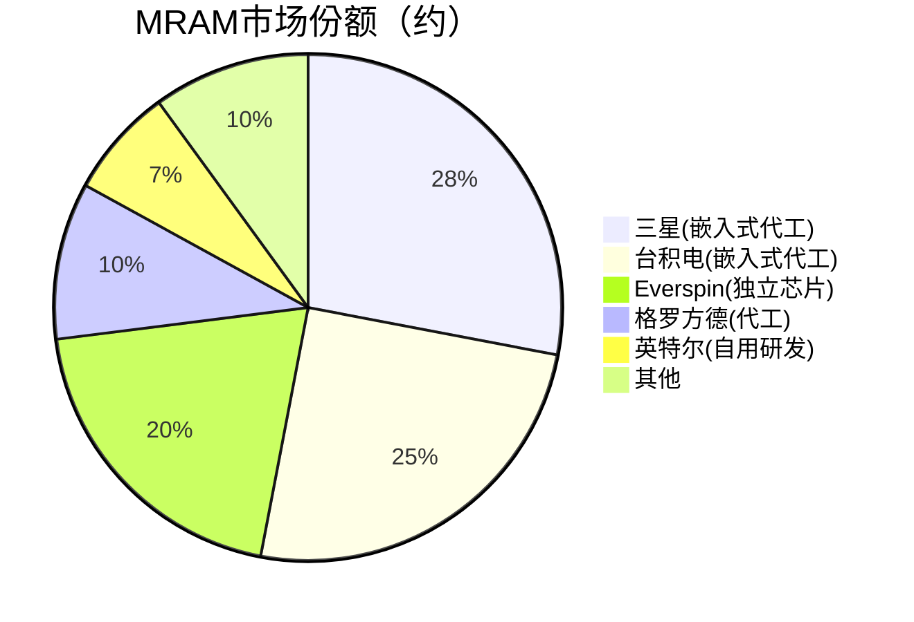

# MRAM磁阻存储

> MRAM（磁阻随机存取存储器）是利用磁阻效应实现非易失性存储的新型存储技术，兼具SRAM速度与Flash非易失性。

## 概述

MRAM（Magnetoresistive Random-Access Memory）是存储行业最具前景的新型存储技术之一。MRAM利用磁性材料的磁阻效应（Magnetoresistance Effect）来存储数据，而非传统DRAM/NAND所依赖的电荷存储。这一根本性差异赋予MRAM独特的优势：非易失性（掉电不丢数据）、接近SRAM的读写速度、接近无限次的写入耐久度，以及低功耗。

MRAM的存储单元核心是磁性隧道结（MTJ，Magnetic Tunnel Junction），由两层铁磁层和一层绝缘势垒层组成。数据的"0"和"1"由两层铁磁层的磁化方向平行或反平行来表示。读取时通过测量MTJ的电阻差异来判断状态；写入时通过施加磁场或自旋极化电流来翻转磁化方向。

MRAM在存储产业链中属于中游新型存储芯片设计与制造环节，被视为"通用存储器"（Universal Memory）的有力候选——即一种能同时满足速度、密度、耐久度和非易失性的理想存储技术。虽然MRAM目前尚未大规模商用，但STT-MRAM已在嵌入式应用中量产，SOT-MRAM作为下一代技术正在快速发展。

在AI基建背景下，MRAM的高速度和非易失性使其在存算一体（PIM）架构、边缘AI推理和AI缓存层级中具有独特潜力。MRAM可能成为解决AI存储墙问题的关键技术之一。

## 技术原理

MRAM的核心是磁性隧道结（MTJ）器件。MTJ由三层结构组成：自由层（Free Layer，磁化方向可变）、势垒层（Barrier Layer，通常为MgO氧化镁绝缘层）和参考层（Reference Layer/Pinned Layer，磁化方向固定）。当自由层与参考层的磁化方向平行时，MTJ呈现低电阻状态（表示"0"）；反平行时呈现高电阻状态（表示"1"）。这种电阻差异称为隧穿磁阻（TMR）效应，现代MTJ的TMR比可达200%以上。

MRAM的写入技术经历了从场致写入到自旋转移矩（STT）再到自旋轨道矩（SOT）的演进。

**场致写入MRAM（第一代）**：通过外部磁场翻转自由层磁化，功耗高且存在写入干扰问题，已淘汰。

**STT-MRAM（第二代）**：利用自旋极化电流直接穿过MTJ来翻转自由层磁化方向。自旋极化电子的角动量传递给自由层磁矩，实现写入。STT-MRAM写入电流可低至几十微安，功耗显著降低，写入速度可达2-3ns。STT-MRAM已量产，用于嵌入式MCU和IoT存储。

**SOT-MRAM（第三代）**：自旋轨道矩MRAM通过自旋轨道耦合效应（如Rashba效应或自旋霍尔效应）在重金属层中产生自旋极化电流，再通过自旋力矩翻转MTJ自由层。SOT-MRAM的读写路径分离——读取通过MTJ，写入通过SOT通道，避免读取干扰。SOT-MRAM写入速度可达亚纳秒级（<1ns），耐久度接近无限，功耗更低，是面向SRAM级缓存的下一代技术。

## 分类与技术路线

MRAM按技术世代和应用场景可分为以下路线：

**嵌入式STT-MRAM（eMRAM）**：将STT-MRAM集成在逻辑芯片中，替代嵌入式闪存（eFlash）用于MCU的代码存储。eMRAM在28nm/22nm先进节点优于eFlash，因为eFlash在先进节点面临可靠性挑战。三星、台积电、格罗方德等代工厂已提供eMRAM工艺。应用场景包括汽车MCU、IoT芯片和智能卡。

**独立STT-MRAM芯片**：作为独立存储芯片，面向需要非易失性高速存储的应用。Everspin是独立MRAM的主要供应商，产品覆盖1Mb-1Gb容量。独立MRAM用于工业控制、通信基站和企业级存储的写入缓存。

**SOT-MRAM（研发/早期量产）**：下一代MRAM技术，写入速度和耐久度优于STT-MRAM，面向CPU/GPU的L2/L3缓存和AI加速器缓存。三星、英特尔、台积电等均在研发SOT-MRAM，预计2025-2027年开始嵌入式量产。

**自旋波MRAM和其他前沿方向**：利用磁振子（自旋波）进行信息处理的实验性技术，处于基础研究阶段。

## 市场格局

MRAM市场目前规模较小，2024年全球MRAM市场约5-8亿美元，但增长潜力巨大。主要厂商包括三星、台积电、英特尔、格罗方德等代工/IDM厂商，以及Everspin、Avalanche Technology等专业MRAM公司。

Everspin是独立MRAM芯片市场的开创者和领导者，提供1Mb-1Gb的独立STT-MRAM产品。三星在嵌入式eMRAM代工服务上处于领先地位，已量产28nm eMRAM。台积电和格罗方德也提供eMRAM工艺平台。中国在MRAM领域尚处于早期阶段，国内中芯国际和部分初创企业在探索MRAM技术。

## 代表企业

| 企业 | 国家/地区 | 主要产品/技术 | 市场地位 |
|------|----------|-------------|---------|
| 三星 | 韩国 | eMRAM/SOT-MRAM研发 | 嵌入式MRAM代工领先，28nm eMRAM量产 |
| 台积电 | 中国台湾 | eMRAM代工 | 22nm eMRAM工艺平台 |
| Everspin | 美国 | 独立STT-MRAM芯片 | 独立MRAM芯片全球龙头 |
| 格罗方德(GlobalFoundries) | 美国 | eMRAM代工 | 22FDX eMRAM工艺 |
| 英特尔 | 美国 | SOT-MRAM研发 | 面向CPU缓存的SOT-MRAM |
| Avalanche Technology | 美国 | 独立MRAM | 军工/航天MRAM供应商 |
| 中芯国际(SMIC) | 中国 | MRAM工艺研发 | 国内MRAM代工探索 |
| 西安交大/北航 | 中国 | MRAM学术研究 | 基础研究和技术积累 |

## 发展趋势

**SOT-MRAM量产临近**：SOT-MRAM作为下一代技术，预计2025-2027年进入嵌入式量产。SOT-MRAM的亚纳秒写入和无限耐久度使其成为替代SRAM L2/L3缓存的理想方案。

**嵌入式eMRAM加速渗透**：随着MCU制程向22nm/14nm演进，eFlash面临可靠性瓶颈，eMRAM成为嵌入式代码存储的最佳替代。汽车MCU和IoT芯片将率先采用。

**容量密度提升**：MRAM容量从当前1Gb向4Gb-16Gb演进，主要突破方向是MTJ尺寸缩小和3D堆叠。MRAM密度虽然仍不及DRAM/NAND，但在缓存和嵌入式应用中已足够。

**AI缓存应用探索**：SOT-MRAM的高速度和非易失性非常适合AI加速器的缓存层级，可实现断电恢复和降低功耗。Intel、三星等在探索AI专用MRAM缓存方案。

**存算一体结合**：MRAM的非易失性和高速度使其成为存算一体芯片的候选存储介质，可同时存储权重和执行计算。

## AI基建拉动分析

MRAM在AI基建中的拉动效应目前主要体现在技术布局和未来潜力方面。

**AI加速器缓存**：AI训练和推理加速器需要大量片上SRAM缓存，功耗和面积占比极高。SOT-MRAM的功耗仅为SRAM的1/3-1/4，面积更小且非易失性，可显著降低AI芯片功耗并实现断电恢复。MRAM替代SRAM缓存的潜力使其成为AI芯片设计的前沿方向。

**存算一体（PIM）关键介质**：存算一体架构需要非易失性高速存储介质来存储AI权重。MRAM的非易失性避免加载权重的时间延迟，高速度支持快速计算，是PIM的理想存储介质。多家AI芯片初创公司在探索MRAM-based PIM架构。

**边缘AI低功耗**：边缘AI设备需要极低功耗的存储方案。MRAM的非易失性使其在待机时功耗为零，配合快速唤醒能力，非常适合电池供电的AI终端。

**断电恢复能力**：AI训练中断后需要快速恢复到断电前状态。MRAM的非易失性可实现计算状态的即时保存和恢复，减少训练中断损失。

从投资角度看，MRAM目前处于技术发展期，商业化程度低于HBM和3D NAND。但MRAM的战略意义在于其"通用存储器"潜力——一旦SOT-MRAM在先进节点缓存中替代SRAM，市场规模将呈指数级增长。MRAM产业链上的代工厂（三星、台积电、格罗方德）、专业公司（Everspin）和设备厂商值得关注。中国在MRAM领域的基础较弱，但在学术研究和产业布局上正在追赶。

---
[← 返回总目录](../../README.md)
