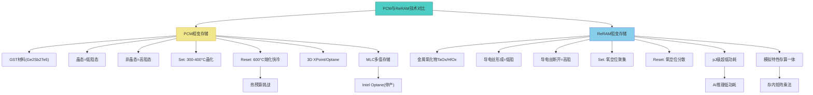
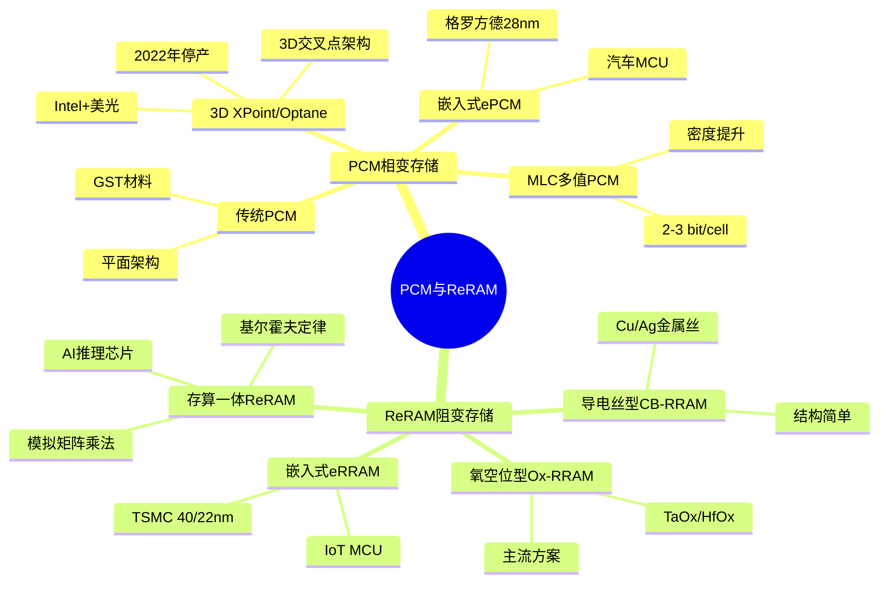
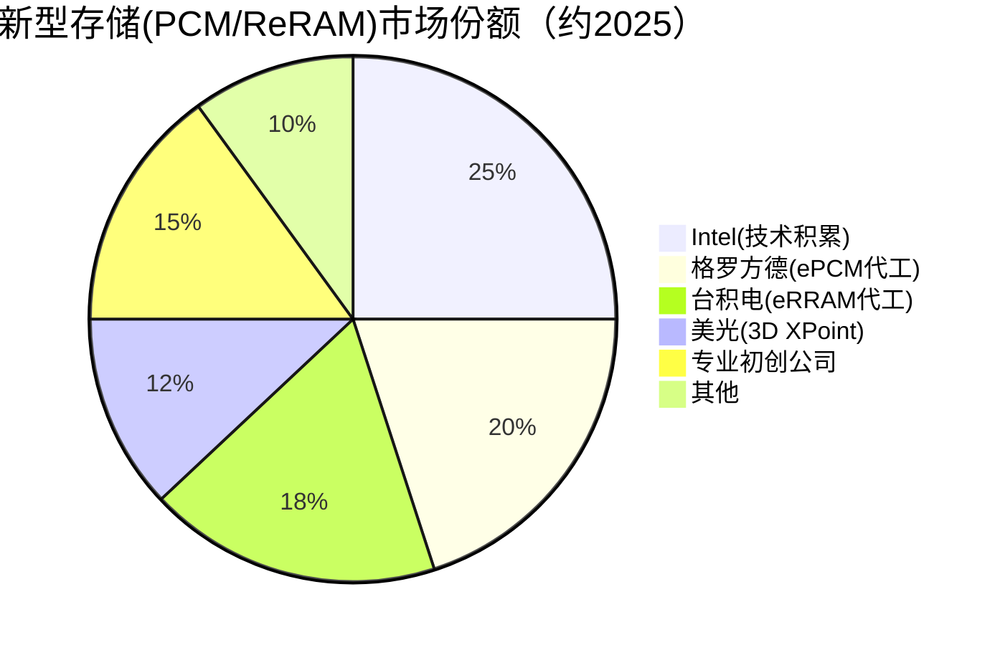

# PCM与ReRAM

> PCM（相变存储器）和ReRAM（阻变存储器）是基于材料相变和电阻变化的新型非易失性存储技术，是存算一体的基础介质。

## 概述

PCM（Phase Change Memory，相变存储器）和ReRAM（Resistive Random-Access Memory，阻变存储器）是新型存储技术中两大重要方向。两者均通过材料状态的物理变化来存储数据——PCM利用硫系玻璃材料在晶态和非晶态之间的相变，ReRAM利用金属氧化物薄膜在高低阻态之间的电阻变化。这些技术有望突破传统DRAM和NAND面临的物理极限，为存储行业提供新一代存储介质。

PCM的发展历史可追溯至20世纪60年代的理论构想，但直到2000年代才由Intel、STMicroelectronics等推动技术成熟。Intel与美光合资开发的3D XPoint技术（商业化品牌为Optane）是PCM/相变类存储最接近大规模商用的产品。虽然Intel于2022年宣布停产Optane，但PCM技术基础和积累仍对存储行业有深远影响。

ReRAM是另一条新型存储技术路线，利用金属氧化物（如TaOx、HfOx）的电阻变化效应。ReRAM结构简单、功耗低、可微缩性好，被视为存算一体（PIM）架构的理想介质。多家学术机构和初创企业在推进ReRAM研发。

在AI基建背景下，PCM和ReRAM的核心价值在于存算一体应用。传统冯·诺依曼架构中数据在CPU和内存之间搬运的"存储墙"问题在AI大模型时代愈发严重。PCM和ReRAM可直接在存储单元中执行矩阵乘法运算，实现存内计算，大幅降低AI推理的功耗和延迟，是解决AI存储墙问题的关键技术路径。

## 技术原理

**PCM技术原理**：PCM使用硫系玻璃材料（典型为Ge2Sb2Te5，简称GST）作为存储介质。GST材料有两种稳定状态：晶态（Crystalline，低电阻）和非晶态（Amorphous，高电阻）。通过施加不同强度和持续时间的电脉冲来控制GST的相变状态。

PCM的写入过程：**Set操作**（晶化）施加中等强度长时间脉冲，将材料加热至结晶温度（约300-400°C）并保持足够时间使其晶化，形成低阻态；**Reset操作**（非晶化）施加高强度短时间脉冲，将材料快速加热至熔点（约600°C）后快速冷却，使其进入非晶态高阻态。读取时施加不引起相变的小电压，测量电阻差异来判断状态。

PCM的多值存储（MLC PCM）利用部分晶化技术实现中间电阻态，每个单元可存储2-bit甚至3-bit数据。3D XPoint/Optane即采用类似PCM的多值技术实现高密度。

**ReRAM技术原理**：ReRAM利用金属-绝缘体-金属（MIM）结构中的电阻变化效应。典型结构为上下电极之间夹一层金属氧化物（如TaOx、HfOx、TiOx）。在电场作用下，氧化物中形成导电丝（Conductive Filament），由氧空位或金属离子聚集形成。导电丝的形成（Forming）/断开（Reset）对应低阻态（LRS）和高阻态（HRS），实现数据存储。

ReRAM的写入操作：**Set操作**施加正向电压，驱动氧空位迁移形成导电丝，进入低阻态；**Reset操作**施加反向电压，驱动氧空位分散，断开导电丝，回到高阻态。ReRAM的写入功耗极低（pJ级别），速度可达纳秒级，且具备良好的微缩性。

ReRAM的模拟特性是其存算一体的关键优势：ReRAM的电阻可在连续范围内调节，天然适合表示神经网络权重。通过在ReRAM阵列上施加输入电压，利用基尔霍夫定律自然实现矩阵乘法运算，无需数据搬运。

## 分类与技术路线

**PCM技术路线**：
- **传统PCM**：基于GST材料，平面架构，曾由三星、美光等推进但未大规模商用。
- **3D XPoint/Optane**：Intel与美光联合开发的3D交叉点存储技术，使用类似PCM的材料。Optane DC持久性内存曾大规模部署于数据中心，2022年停产。
- **嵌入式PCM（ePCM）**：将PCM集成在MCU中替代eFlash，格罗方德28nm ePCM已量产，用于汽车MCU。
- **MLC PCM**：多值PCM，每单元存储2-3 bit，提升密度。

**ReRAM技术路线**：
- **导电丝型ReRAM（CB-RRAM）**：基于金属导电丝（如Cu、Ag）形成和断开，结构简单但稳定性有挑战。
- **氧空位型ReRAM（Ox-RRAM）**：基于氧空位迁移形成导电通道，如TaOx、HfOx，稳定性和耐久度更好，是主流方案。
- **嵌入式ReRAM（eRRAM）**：TSMC 40nm/22nm eRRAM工艺，用于IoT MCU代码存储。
- **存算一体ReRAM**：利用ReRAM的模拟特性在存储阵列中执行矩阵乘法，是AI存算一体芯片的核心技术。

## 市场格局

PCM和ReRAM市场规模目前较小，2025年全球新兴存储市场约94亿美元（CAGR 18.6%），其中PCM/ReRAM是重要组成部分，主要来自嵌入式应用和特殊存储。Intel Optane停产后PCM独立芯片市场大幅萎缩，但嵌入式PCM和存算一体ReRAM是新兴增长点，存算一体需求成为新型存储发展的催化剂。

主要厂商包括：Intel（Optane/PCM已停产，但技术积累深厚）、美光（3D XPoint合作方）、格罗方德（ePCM代工）、台积电（eRRAM代工）、Crossbar（ReRAM初创公司）、Weebit Nano（ReRAM）、Tetramem（ReRAM存算一体）等。中国在ReRAM存算一体领域有知存科技、亿铸科技等初创公司布局。

## 代表企业

| 企业 | 国家/地区 | 主要产品/技术 | 市场地位 |
|------|----------|-------------|---------|
| Intel | 美国 | Optane/PCM(已停产) | PCM技术积累最深，Optane曾大规模商用，技术遗产持续推动新型存储创新 |
| 美光 | 美国 | 3D XPoint(PCM类) | 与Intel合资开发3D XPoint |
| 格罗方德(GlobalFoundries) | 美国 | 28nm ePCM代工 | 嵌入式PCM代工领先 |
| 台积电(TSMC) | 中国台湾 | 40nm/22nm eRRAM | 嵌入式ReRAM代工 |
| Crossbar | 美国 | ReRAM技术 | ReRAM专业公司 |
| Weebit Nano | 澳大利亚 | ReRAM IP | ReRAM IP授权 |
| 知存科技 | 中国 | ReRAM存算一体 | 国内存算一体ReRAM领先 |
| 亿铸科技 | 中国 | ReRAM AI芯片 | 存算一体AI加速器 |

## 发展趋势

### 市场规模预测

| 年份 | 市场规模 | 同比增长 | 备注 |
|------|---------|---------|------|
| 2024 | ~80亿美元 | — | 基准年（新兴存储整体） |
| 2025 | ~94亿美元 | +17.5% | CAGR 18.6%，存算一体需求兴起 |
| 2026E | ~112亿美元 | +19% | ReRAM存算一体芯片商业化推进 |
| 2027E | ~133亿美元 | +19% | 混合精度架构成熟，AI推理落地 |

**存算一体是核心方向**：PCM和ReRAM的模拟特性使其天然适合存内计算，利用基尔霍夫电流定律在存储阵列中执行矩阵乘法，避免冯·诺依曼瓶颈。ReRAM存算一体芯片已在AI推理场景验证可行，功耗可降低10-100倍。

**嵌入式应用先行**：ePCM和eRRAM在MCU中替代eFlash/eMRAM，格罗方德和台积电已提供代工工艺。嵌入式应用是新型存储最先商业化的路径。

**模拟计算精度提升**：ReRAM存算一体面临的主要挑战是模拟计算的精度限制（通常8-bit以下），影响大模型推理精度。新型多级ReRAM和混合精度架构在改善这一问题。

**3D堆叠技术引入**：将PCM/ReRAM进行3D堆叠提升密度，类似3D NAND的思路。3D交叉点架构是PCM 3D堆叠的成功案例。

**Optane遗产与教训**：Intel Optane停产揭示了新型存储大规模商用的挑战：成本高、耐久度不足、技术成熟度不够。但Optane积累的技术和产业经验为下一代新型存储发展奠定基础。

## AI基建拉动分析

PCM和ReRAM在AI基建中的拉动主要来自存算一体需求。

**存算一体解决AI存储墙**：AI大模型的参数量和计算量呈指数增长，传统冯·诺依曼架构中数据搬运的功耗和延迟成为瓶颈。ReRAM存算一体可在存储阵列中直接执行矩阵乘法，功耗降低1-2个数量级，延迟降低数十倍。这对AI推理的边缘部署至关重要。

**边缘AI推理芯片**：ReRAM存算一体芯片特别适合边缘AI推理场景。知存科技、亿铸科技等国内初创公司正在开发基于ReRAM的AI推理芯片，瞄准物联网、可穿戴设备和边缘服务器等低功耗场景。ReRAM存算一体有望将AI推理功耗从瓦级降至毫瓦级。

**混合精度架构**：新型ReRAM芯片采用混合精度架构——高精度部分使用数字计算，低精度部分使用ReRAM模拟计算，兼顾精度和能效。这一架构在AI推理中已验证可行。

**长期潜力巨大**：PCM和ReRAM作为"通用存储"的候选技术，长期潜力在于同时满足非易失性、高速度、高密度和存算一体能力。虽然目前商业化程度有限，但在AI推动下，存算一体需求可能成为PCM/ReRAM大规模商用的催化剂。

从投资角度看，PCM和ReRAM目前处于早期阶段，投资风险较高但潜在回报巨大。存算一体ReRAM芯片公司（知存科技、Tetramem等）、代工厂（台积电、格罗方德）和材料设备供应链值得关注。Intel Optane停产虽是挫折，但其技术遗产将持续推动新型存储创新。

---
[← 返回总目录](../../README.md)
