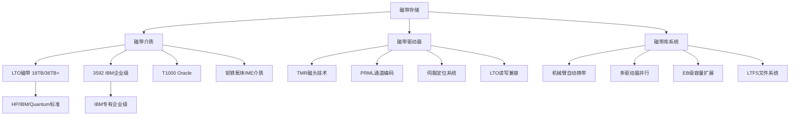
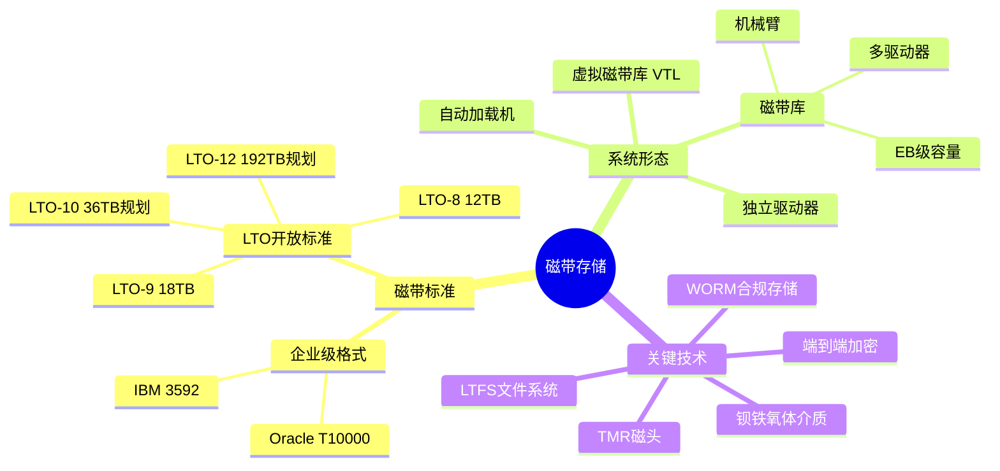
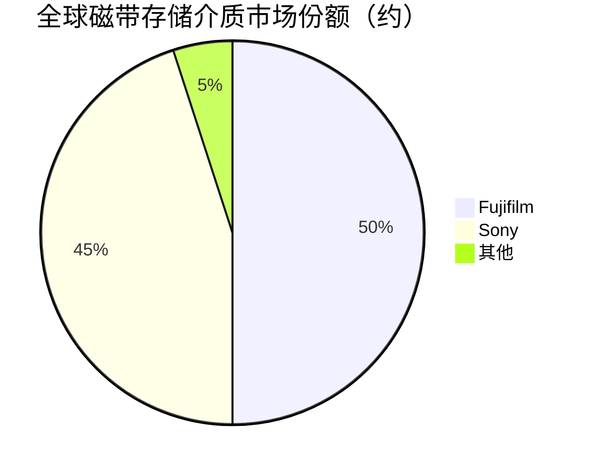

# 磁带存储

> 利用磁性记录在磁带介质上存储数据的顺序存取存储技术，是最低成本的超大规模长期归档存储方案。

## 概述

磁带存储是存储产业链中游历史最悠久的存储技术之一，自1950年代以来一直用于大规模数据存储。尽管在随机访问场景中被HDD和SSD替代，但磁带凭借最低的单位存储成本（约$0.005-0.01/GB，远低于HDD的$0.02-0.03/GB和SSD的$0.05-0.10/GB）和超长介质寿命（30年以上），在超大规模冷数据归档、灾难恢复备份和合规数据保存领域保持着不可替代的地位。

LTO（Linear Tape-Open）是当前最主流的磁带格式标准，由HP、IBM和Quantum三家企业联合制定，保持了开放标准和良好的兼容性。LTO技术按代际迭代，每代容量翻倍。当前LTO-9单盘容量为18TB（未压缩），LTO-10规划为36TB，LTO-12有望达到192TB。磁带库系统通过机械臂管理数千盘磁带，可实现EB级存储。

IBM和Fujifilm是磁带存储介质和驱动器的技术引领者。2017年，IBM和Sony联合实现了330TB/in²的面密度记录；2020年，IBM和Fujifilm实现了580TB单盘容量的技术验证。磁带技术的潜力远未耗尽，理论上可支持PB级单盘容量。在"冷数据"存储需求随AI和大数据爆发增长的背景下，磁带存储迎来新的发展机遇。

## 技术原理

磁带存储使用涂覆磁性材料的柔性带状介质（通常为聚酯薄膜基带），通过磁头在磁带移动时改变磁性颗粒的磁化方向来记录数据。LTO磁带采用线性螺旋扫描（Linear Serpentine）方式，磁头沿磁带长度方向写入多条平行轨道，然后反向写入下一组轨道，交替使用磁带正反面，实现高密度记录。

LTO磁带采用TMR（隧道磁阻）磁头技术提高读写灵敏度，磁带介质采用钡铁氧体（BaFe）或金属蒸发（ME）磁性颗粒。数据通过PRML（部分响应最大似然）通道编码进行处理，确保高密度下的数据可靠性。LTO磁带还包含伺服轨道（Servo Track）用于磁头精确定位，以及CAR（Cartridge Memory）芯片存储磁带元数据。

磁带库系统由磁带驱动器、机械臂、磁带槽位和控制软件组成。大型磁带库（如IBM TS4500）可容纳数千盘磁带，存储容量超过2EB。磁带存储天然适合WORM（Write Once Read Many）应用，LTO的WORM磁带满足金融、医疗等行业的合规存储要求。磁带的顺序访问特性决定了它不适合频繁随机读写，但非常适合批量数据写入和长期保存。

## 分类与技术路线

磁带存储按标准分为**LTO（Linear Tape-Open）**开放标准和**企业级专有格式**两大类。LTO由HP、IBM和Quantum联合开发，是目前最广泛使用的磁带标准，按代际从LTO-1（100GB）迭代至LTO-9（18TB）和LTO-10（36TB规划），每代容量翻倍且向下兼容两代读取、一代写入。企业级格式包括IBM 3592和Oracle T10000，提供更高性能和更多特性，但通常与特定厂商的磁带库系统绑定。

按系统形态分为**独立磁带驱动器**（单机使用）、**自动加载机**（Autoloader，1个驱动器+少量磁带槽位）、**磁带库**（多个驱动器+数百到数千槽位+机械臂）和**虚拟磁带库**（VTL，用磁盘模拟磁带行为以提升性能）。

LTFS（Linear Tape File System）是磁带存储的重要技术进展，它将磁带呈现为可挂载的文件系统，使得用户可以像访问磁盘文件一样直接访问磁带上的文件，大幅简化了磁带的使用和管理。LTFS已成为LTO-5及以上磁带的标准特性。

## 市场格局

全球磁带存储市场规模约25-35亿美元，包括磁带驱动器、磁带库系统和磁带介质。LTO磁带介质出货容量持续增长，年出货量超过100EB（未压缩），反映冷数据归档需求的旺盛。磁带存储市场的主要玩家包括IBM、Quantum、HPE（基于OEM）、Fujifilm（介质）和Sony（介质）。

磁带介质市场由Fujifilm和Sony两家日本企业垄断，各占约50%份额。磁带驱动器和库系统市场由IBM、Quantum和Spectra Logic（现为Oracle）主导。中国企业中，同有科技、紫晶存储等曾尝试进入磁存储领域，但核心技术仍掌握在国外厂商手中。

磁带存储的客户主要集中在超大规模云服务商（Google、AWS等大量使用磁带做冷存储）、金融机构、政府部门、研究机构和大型企业。云服务商的冷存储服务（如AWS Glacier Deep Archive、Google Coldline）后端大量使用磁带存储。

## 代表企业

| 企业 | 国家/地区 | 主要产品/技术 | 市场地位 |
|------|----------|-------------|---------|
| IBM | 美国 | TS系列磁带库、3592企业级磁带 | 企业级磁带存储技术领导者 |
| Quantum | 美国 | Scalar系列磁带库、DXi VTL | LTO磁带库市场领先厂商 |
| Fujifilm | 日本 | LTO磁带介质、钡铁氧体技术 | 全球磁带介质双寡头之一 |
| Sony | 日本 | LTO磁带介质、金属蒸发技术 | 全球磁带介质双寡头之一 |
| HPE | 美国 | StoreEver磁带产品线（OEM） | 企业级磁带存储渠道商 |
| Spectra Logic | 美国 | Spectra系列磁带库 | 独立磁带库厂商 |
| 同有科技 | 中国 | 磁带库系统集成 | 国产存储系统集成商 |
| 戴尔 | 美国 | PowerVault磁带产品 | 服务器渠道磁带方案商 |

## 发展趋势

1. **LTO代际迭代加速**：LTO-9（18TB）已普及，LTO-10（36TB）即将量产，路线图规划至LTO-12（192TB），每代容量翻倍趋势持续。

2. **面密度突破创新高**：IBM和Fujifilm已验证580TB单盘容量技术，通过TMR磁头和钡铁氧体纳米颗粒技术持续突破面密度极限。

3. **云端冷存储集成**：云服务商在后端大量采用磁带存储提供低成本冷存储服务（如AWS S3 Glacier Deep Archive），磁带成为云存储冷层核心介质。

4. **LTFS普及与简化**：LTFS文件系统持续优化，简化磁带使用门槛，使磁带更接近在线存储的使用体验。

5. ** ransomware防护与气隙隔离**：磁带的离线特性天然形成"气隙"（Air Gap），可有效防范勒索软件攻击，成为企业数据保护策略的重要组成。

## AI基建拉动分析

AI训练数据集、模型快照和推理日志的大规模长期保存需求推动磁带存储增长。一个大型AI训练项目可能产生数十PB的原始数据和中间结果，这些数据的长期归档和灾难恢复备份是磁带存储的典型应用场景。磁带的气隙隔离特性在AI模型资产保护方面也具有独特价值——离线存储的磁带可有效防范针对AI训练数据的勒索软件攻击。云服务商的冷存储服务后端大量使用磁带，AI数据的云端归档间接拉动磁带需求。虽然磁带存储不直接参与AI训练和推理过程，但作为AI数据生命周期管理的最后一环，受益于AI数据量的整体增长。预计AI时代将为磁带存储市场带来3-5%的年化额外增长。

---
[← 返回总目录](../README.md)
