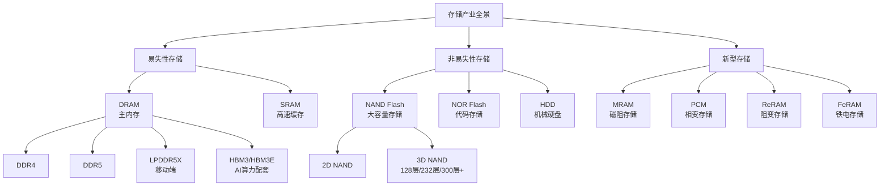
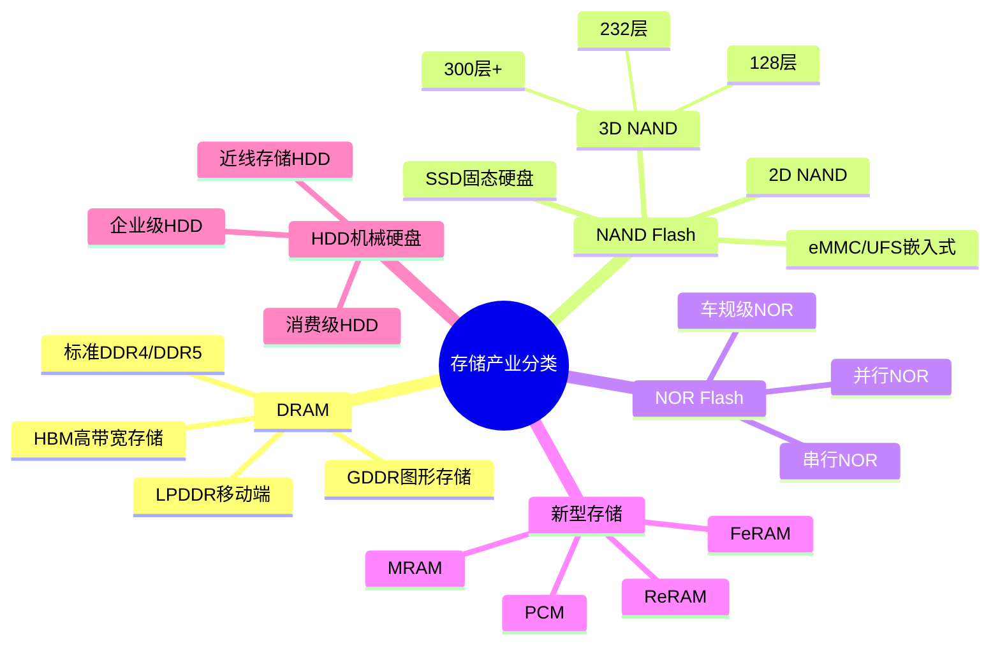
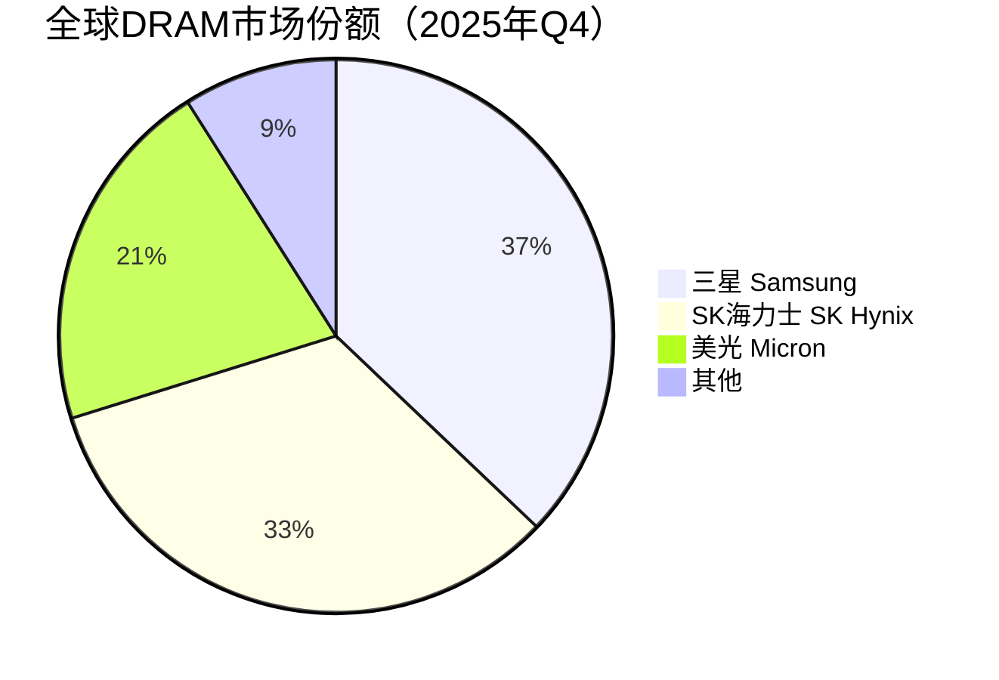
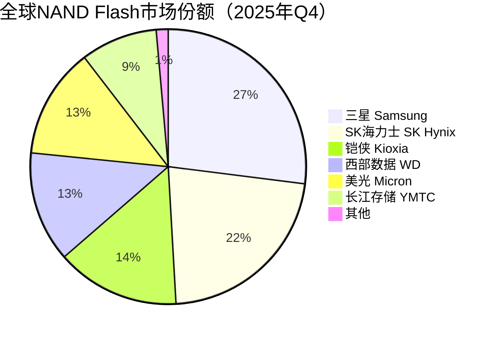

# 存储产业概览与市场分析

> 存储产业是现代信息社会的基石，涵盖从基础材料、制造设备到芯片设计、封装测试的完整产业链，市场规模超千亿美元。

## 概述

存储产业是半导体产业中最重要的细分领域之一，与逻辑芯片并列为半导体两大支柱。存储芯片广泛应用于智能手机、个人电脑、数据中心、汽车电子、物联网等各类终端设备中，是数据存储和处理的核心硬件基础。根据世界半导体贸易统计组织（WSTS）数据，存储器约占全球半导体市场的25%-30%，是半导体市场中波动性最大、周期性最强的细分领域。

从产业链结构来看，存储产业可分为上游（基础材料、制造设备）、中游（存储芯片设计与制造）和下游（模组组装、封装测试、终端应用）三大环节。上游材料包括硅片、光刻胶、电子特气、CMP材料等半导体基础材料，以及相变材料、铁电材料等功能材料；上游设备涵盖光刻、刻蚀、薄膜沉积、CMP、量检测、封装测试等各类专用设备。中游以NAND Flash、DRAM、NOR Flash等存储芯片的设计与制造为核心，三星、SK海力士、美光三巨头垄断全球市场。

近年来，人工智能（AI）技术的爆发式增长正在深刻重塑存储产业格局。AI大模型训练和推理对高带宽存储器（HBM）的需求急剧攀升，HBM作为AI算力芯片的关键配套存储，已成为存储产业增长最快的赛道。同时，AI数据中心的建设拉动了对企业级SSD、DDR5内存模组等产品的需求，存储产业正迎来新一轮由AI基建驱动的增长周期。

## 技术原理

存储产业从技术路线上可分为易失性存储和非易失性存储两大类。易失性存储以DRAM为代表，存取速度快但断电后数据丢失，主要用于计算系统的工作内存；非易失性存储以NAND Flash为代表，断电后数据可持久保存，主要用于数据存储。两类存储在架构设计、制造工艺和材料体系上各有特点，但共享大部分前道制造工艺和设备。

存储芯片的制造流程高度复杂，涉及数十道精密工艺步骤。核心流程包括：硅片制备→光刻→刻蚀→薄膜沉积→离子注入→CMP平坦化→量检测→晶圆测试→切割→封装→最终测试。其中，3D NAND的堆叠层数从早期的24层发展到目前的232层、300层以上，对刻蚀和沉积设备提出了极高要求；HBM则采用TSV（硅通孔）技术和3D堆叠封装，将多层DRAM芯片垂直堆叠，实现超高带宽和容量密度。

## 分类与技术路线

存储产业按产品类型可分为四大板块：DRAM、NAND Flash、NOR Flash及新型存储器。DRAM市场由三星、SK海力士、美光三家垄断，合计市占率超过95%。NAND Flash市场参与者相对更多，三星、铠侠、SK海力士、西部数据、美光是主要玩家。NOR Flash市场规模较小但战略意义重大，华邦电子、旺宏电子、兆易创新是主要供应商。

从技术演进看，DRAM从DDR4向DDR5迁移，速率从3200MT/s提升至6400MT/s以上；NAND Flash从2D平面缩微转向3D垂直堆叠，层数持续突破；HBM从第一代发展到HBM3E，单堆叠容量达24GB甚至36GB，带宽超过1.2TB/s。新型存储器如MRAM、PCM、ReRAM等在特定应用场景逐步渗透，但尚未形成大规模商业化。

## 市场格局

2025年全球DRAM+NAND市场规模达**2215.91亿美元**（同比+32.7%），全球半导体存储市场达**2342亿美元**（同比+13.7%）。其中DRAM约1290亿美元，NAND Flash约650-925亿美元，NOR Flash约30-35亿美元。存储市场具有显著的周期性特征，通常3-4年为一个完整周期。2024-2025年，受AI算力需求拉动，存储市场进入新一轮上行周期，2025年Q3 DRAM+NAND合计584.59亿美元创季度历史新高，Q4进一步达755.1亿美元。

从竞争格局看，韩国三星在全球存储市场占据领导地位，但份额有所下降。2025年Q4 DRAM份额：三星37.1%（↓）、SK海力士33.1%（→）、美光20.8%（↓），三家合计>91%，长江存储（CXMT）逐步进入。NAND Flash份额：三星27.0%（↓）、SK海力士（含Solidigm）22.1%（↑）、铠侠~14-15%、西部数据/闪迪~13%、美光~13%、长江存储9%→13%（↑↑）。SK海力士凭借在HBM领域的先发优势（份额~62%），成为AI存储的最大受益者。美光在2025年Q2首次在HBM出货超越三星。中国存储企业快速崛起，长江存储NAND份额从5%跃升至13%，挑战前三。

## 代表企业

| 企业 | 国家/地区 | 主要产品/技术 | 市场地位 |
|------|----------|-------------|---------|
| 三星电子 Samsung | 韩国 | DRAM、NAND Flash、HBM | 全球存储龙头，DRAM/NAND双第一 |
| SK海力士 SK Hynix | 韩国 | DRAM、NAND Flash、HBM | HBM全球第一，AI存储最大受益者 |
| 美光科技 Micron | 美国 | DRAM、NAND Flash、HBM | 全球第三大存储器厂商 |
| 铠侠 Kioxia | 日本 | NAND Flash | 全球NAND Flash第二大厂商 |
| 西部数据 WD | 美国 | NAND Flash、HDD | NAND/HDD双线布局 |
| 长江存储 YMTC | 中国 | 3D NAND Flash | 中国NAND龙头，232层量产 |
| 长鑫存储 CXMT | 中国 | DRAM | 中国DRAM领军企业 |
| 兆易创新 GigaDevice | 中国 | NOR Flash、DRAM | 全球NOR Flash前三 |
| 海力士 Solidigm | 美国 | NAND Flash | 原Intel NAND业务剥离 |
| 华虹半导体 | 中国 | NOR Flash、特色存储 | 中国特色工艺代工龙头 |

## 发展趋势

### 市场规模预测

| 年份 | 市场规模 | 同比增长 | 备注 |
|------|---------|---------|------|
| 2024 | ~1700亿美元 | — | 基准年（DRAM+NAND） |
| 2025 | 2215.91亿美元 | +32.7% | AI算力需求驱动，HBM量价齐升 |
| 2026E | 5516亿美元 | +134% | Counterpoint预测最高9750亿美元，存储超级周期 |
| 2027E | 8427亿美元 | +53% | 产能释放关键节点，供需逐步平衡 |

> 数据来源：TrendForce、Counterpoint Research。2025年Q3 DRAM+NAND合计584.59亿美元创季度历史新高，Q4达755.1亿美元。2026Q1价格预计上涨40-50%，Q2继续涨20%。

**1. 3D NAND层数持续突破。** 从232层向300层乃至400层以上迈进，单颗芯片容量持续提升。层数增加对刻蚀设备的高深宽比刻蚀能力提出极高要求，同时混合键合（Hybrid Bonding）技术成为进一步堆叠的关键使能技术。

**2. HBM成为AI存储核心赛道。** 随着AI大模型参数规模从百亿到万亿级，GPU对高带宽、高容量存储的需求激增。HBM3E已实现单堆叠24GB容量，HBM4预计将采用12-Hi/16-Hi堆叠，单堆叠容量达36GB以上，带宽突破1.6TB/s。

**3. 存算一体（PIM/CIM）技术加速落地。** 为解决"存储墙"瓶颈，将计算单元嵌入存储阵列内部的存算一体技术逐步走向商业化。三星的HBM-PIM、SK海力士的AiM方案均在积极推进，有望在AI推理场景实现能效大幅提升。

**4. CXL协议推动内存池化。** Compute Express Link（CXL）协议实现CPU与外部存储设备的高速缓存一致性互联，推动数据中心内存解耦与池化。CXL内存扩展模块预计在AI训练、内存数据库等场景快速渗透。

**5. 国产替代加速推进。** 在地缘政治和技术限制背景下，中国存储产业链国产化进程加速。从材料、设备到芯片设计制造，各环节国产替代率持续提升。长江存储、长鑫存储等企业在产品性能上已接近国际先进水平。

## AI基建拉动分析

AI基础设施建设对存储产业的拉动效应是多维度、深层次的。首先，AI大模型训练需要大量GPU集群，每颗GPU需配套HBM高带宽存储。以NVIDIA H100为例，单颗GPU搭载80GB HBM3，H100服务器需4-8颗GPU；H200需6颗HBM3E（每颗8层堆叠），B200需8颗HBM3E。HBM需求量随AI算力芯片出货量成比例增长，SK海力士作为HBM3/HBM3E的主力供应商（2025年份额~62%），TSV产能达150K领先，HBM营收占比已超过30%且产能持续满载。2025年Q2美光首次在HBM出货超越三星，HBM价格持续上涨。

其次，AI数据中心的建设拉动企业级SSD需求激增。2025年全球固态硬盘市场约1354.58亿美元，企业级SSD Q3三星份额32.3%（营收60亿美元，环比+15.4%），SK集团~19%（35.3亿美元）。AI训练数据集规模庞大，企业级QLC SSD凭借高密度和低成本优势，在AI数据湖、冷数据存储等场景快速渗透。同时，AI推理服务对DDR5内存模组的需求大幅增长，推动DDR5加速替代DDR4。2025年全球半导体存储市场达2342亿美元（+13.7%），2026年预计增长134%至5516亿美元，AI驱动存储超级周期。

从投资角度看，AI基建浪潮为存储产业链各环节带来结构性机遇：上游材料受益于存储芯片产能扩张和工艺升级带来的材料增量需求；设备厂商受益于先进制程对设备精度和产能的提升需求（2025年全球半导体设备销售1255亿美元创纪录）；存储芯片厂商直接受益于量价齐升。特别是HBM相关的TSV封装、混合键合等先进封装环节，成为AI存储产业链中增长最快、技术壁垒最高的细分赛道，投资价值显著。

---
[← 返回总目录](../README.md)
