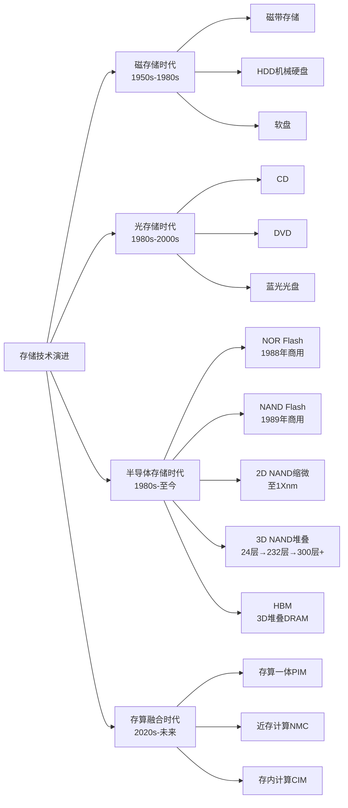
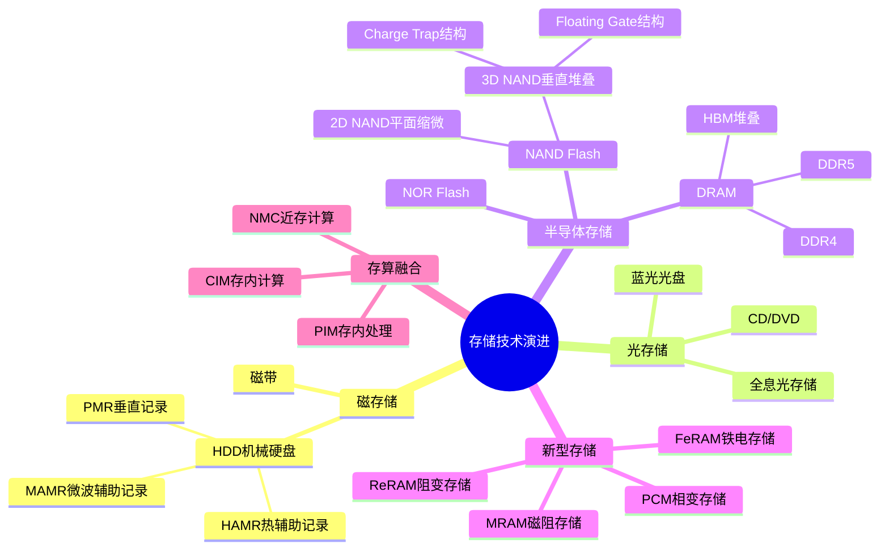
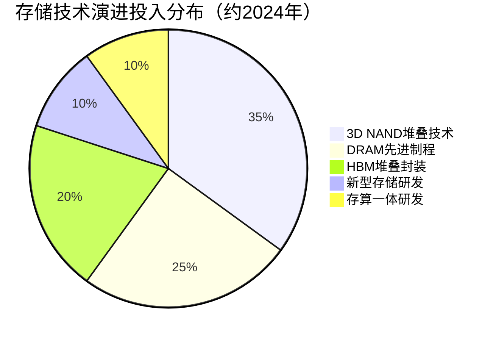

# 存储技术演进路线

> 存储技术从磁带、磁盘到半导体存储，再到3D堆叠与存算一体，经历了一条从机械到电子、从平面到立体、从存储到计算融合的演进之路。

## 概述

存储技术的发展史是一部人类追求更高密度、更快速度、更低成本的数据存储历史。从1950年代IBM发明第一台磁带存储器，到1980年代硬盘驱动器（HDD）的普及，再到1990年代闪存（Flash Memory）的商用化，存储技术经历了从磁存储到半导体存储的范式转变。每一次技术范式转换都带来了存储密度数量级的跃升和存储成本的指数级下降。

在半导体存储领域，技术演进遵循摩尔定律的缩微路径，从微米级到纳米级，晶体管尺寸不断缩小。但随着平面缩微逼近物理极限，存储技术开始转向三维堆叠方向。3D NAND通过将存储单元垂直堆叠，突破了平面缩微的限制，层数从2013年的24层发展到2024年的232层量产，实验室阶段已达300层以上。DRAM则通过引入EUV光刻、High-K材料等先进工艺，持续提升密度和性能。

面向未来，存储技术正朝着存算融合方向演进。传统冯·诺依曼架构中，计算单元与存储单元分离，数据在两者之间搬运产生巨大能耗和延迟，即"存储墙"问题。存算一体（Processing-in-Memory, PIM）技术将计算功能嵌入存储阵列，实现数据就近处理，有望突破存储墙瓶颈，成为后摩尔时代存储技术的重要方向。

## 技术原理

存储技术的核心原理是利用物理介质的某种可逆状态变化来表示二进制数据。磁存储利用磁性材料的磁化方向（北/南）表示0和1；光存储利用材料表面反射率的差异；半导体存储则利用浮栅中的电荷有无、电阻的高低、晶态/非晶态的相变等物理状态来存储数据。

NAND Flash的基本存储单元为浮栅晶体管（FGMOS），通过在浮栅中注入或释放电子来改变晶体管的阈值电压，从而表示不同的数据状态。SLC（单级单元）每个存储单元存储1比特数据，MLC存储2比特，TLC存储3比特，QLC存储4比特。存储比特数越多，单颗芯片容量越大，但可靠性下降。3D NAND将存储单元从水平排列改为垂直堆叠，通过增加堆叠层数来提升密度，突破了平面缩微的物理限制。

DRAM的基本存储单元为1T1C结构（一个晶体管+一个电容），利用电容中的电荷存储数据位。由于电容存在漏电，DRAM需要定期刷新（通常为64ms刷新周期）。DRAM技术的演进主要围绕缩小单元面积和提升电容值两个方向，采用High-K电介质材料、3D柱状电容结构等创新。

HBM（高带宽存储器）通过TSV（硅通孔）技术将多层DRAM芯片垂直堆叠，并配合中介层和封装实现超宽带宽数据传输。HBM3E的带宽已达1.2TB/s以上，是AI算力芯片GPU的关键配套存储。

## 分类与技术路线

存储技术演进可按物理介质分为磁存储→光存储→半导体存储→新型存储四个阶段。磁存储以HDD和磁带为代表，目前仍在冷数据和大容量存储场景有广泛应用。半导体存储从2D平面工艺向3D垂直堆叠演进，是当前存储技术的主流方向。新型存储器如MRAM（磁阻RAM）、PCM（相变存储）、ReRAM（阻变存储）、FeRAM（铁电存储）等，兼具高速和非易失特性，但受限于成本和工艺成熟度，尚未大规模替代DRAM和NAND。

## 市场格局

存储技术演进推动市场规模持续扩张。全球存储市场规模从2010年约600亿美元增长到2024年约1600-1700亿美元，年复合增长率约7%。其中3D NAND市场规模约650-700亿美元，DRAM市场规模约750-800亿美元。新型存储器市场规模约20-30亿美元，但增速最快。

在技术竞争方面，三星在3D NAND和DRAM领域均处于技术领先地位，率先量产232层3D NAND和1b nm DRAM。SK海力士在HBM领域拥有先发优势，率先量产HBM3和HBM3E。长江存储在3D NAND领域通过Xtacking架构实现了技术追赶，232层产品已量产。在新型存储领域，Everspin（MRAM）、Intel/Micron（PCM，原3D XPoint）、Crossbar（ReRAM）等企业积极布局。

## 代表企业

| 企业 | 国家/地区 | 主要技术/产品 | 市场地位 |
|------|----------|-------------|---------|
| 三星电子 Samsung | 韩国 | 3D NAND 232层、DDR5、HBM3E | 存储技术全面领先 |
| SK海力士 SK Hynix | 韩国 | HBM3/HBM3E、1b nm DRAM | HBM技术领跑者 |
| 美光科技 Micron | 美国 | 232层NAND、HBM3E | DDR5技术领先 |
| 长江存储 YMTC | 中国 | Xtacking 232层3D NAND | 中国NAND技术标杆 |
| 长鑫存储 CXMT | 中国 | DDR4/DDR5 DRAM | 中国DRAM技术追赶者 |
| 铠侠 Kioxia | 日本 | BiCS 3D NAND | NAND技术先行者 |
| Western Digital | 美国 | 3D NAND、OptiNAND | NAND+HDD双线布局 |
| Everspin | 美国 | MRAM | 独立MRAM市场龙头 |
| 希捷 Seagate | 美国 | HAMR硬盘 | HDD技术领导者 |
| 台积电 TSMC | 中国台湾 | 先进封装/CoWoS | HBM封装关键代工 |

## 发展趋势

**1. 3D NAND层数向400+层迈进。** 当前量产最高为232-232层，实验室阶段已探索300层以上。层数增加面临刻蚀深宽比极限、应力管理、热预算等挑战，需要博世工艺等高深宽比刻蚀技术和混合键合等新工艺突破。

**2. HBM向HBM4演进。** HBM4预计2025-2026年量产，采用12-Hi或16-Hi堆叠，单堆叠容量达36-48GB，带宽超过1.6TB/s。HBM4可能采用混合键合替代微凸点互连，并引入新的DRAM基础架构。

**3. 存算一体逐步商业化。** 三星HBM-PIM、SK海力士AiM方案已实现原型验证，预计在AI推理、向量数据库检索等特定场景率先落地。长期看，模拟存算一体芯片有望在边缘AI推理市场实现商业化。

**4. CXL推动内存架构变革。** CXL协议实现内存解耦和池化，使数据中心可以按需分配内存资源。CXL内存扩展模块预计在2025-2026年逐步上量，为存储产业带来新增长点。

**5. 先进封装成为关键竞争力。** 3D NAND和HBM的发展使先进封装（TSV、混合键合、CoWoS）成为存储技术竞争的关键环节。台积电的CoWoS封装产能成为制约HBM出货的瓶颈，各大存储厂和代工厂持续加大先进封装投入。

## AI基建拉动分析

AI大模型训练和推理对存储技术演进产生了革命性影响。传统存储技术演进以"容量密度提升"为核心驱动力，AI时代则叠加了"带宽和能效"维度的新要求。AI训练过程中，GPU需要频繁访问海量参数和中间激活值，存储带宽成为算力瓶颈的关键因素。HBM作为AI算力芯片的核心配套，其技术演进节奏直接影响AI系统性能。

AI基建对存储技术演进的拉动体现在三个层面：一是直接拉动了HBM技术的加速迭代，从HBM2到HBM3再到HBM3E，迭代周期明显缩短；二是推动了存算一体、CXL等新技术的研发投入加大和商业化进程加速；三是带动上游材料和设备环节的技术升级，如先进封装对键合精度要求提升、高深宽比刻蚀需求增大等。

从投资角度，AI基建浪潮使存储技术演进的投资逻辑从周期性转向成长性。HBM相关技术链（TSV封装、混合键合、中介层）和先进制造设备（EUV光刻、高深宽比刻蚀、ALD薄膜）是AI存储技术投资的核心标的。同时，国产存储技术替代在AI基建浪潮中获得更强政策支持，长江存储、长鑫存储等企业的技术追赶速度加快，为国产存储设备和材料带来结构性增长机遇。

---
[← 返回总目录](../README.md)
