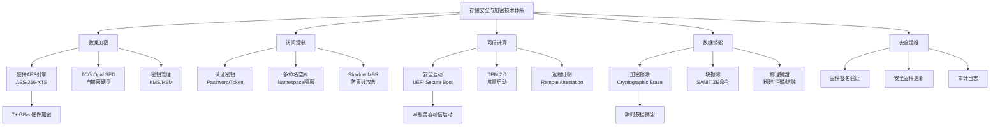
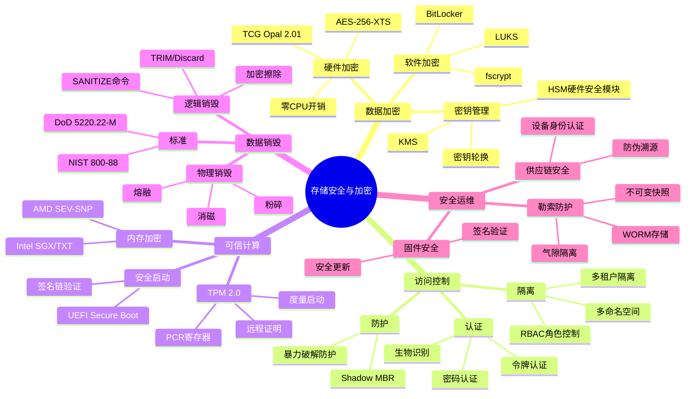
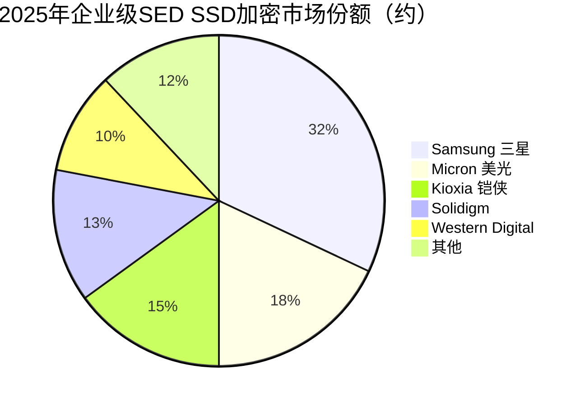

# 存储安全与加密

> 保障存储数据机密性、完整性与可用性的安全技术体系，涵盖硬件加密引擎（AES-256）、TCG Opal自加密、安全启动、数据销毁（加密擦除/物理销毁）和可信存储等技术，是AI数据资产保护的核心防线。

## 概述

存储安全与加密是保护存储系统中数据不被未授权访问、篡改或泄露的完整安全技术体系。在存储产业链中，安全与加密是存储器件和存储系统的"安全属性"层，贯穿芯片设计、固件开发、系统部署和运维管理的全生命周期。

AI大模型训练涉及海量敏感数据——商业机密、用户隐私、医疗记录、金融数据等，一旦泄露将造成巨大损失。同时，AI训练数据集通常包含PB级规模，传统软件加密因CPU开销过大无法满足性能需求，硬件加密和自加密存储（SED）成为刚需。此外，AI算力中心的多租户环境使数据隔离和安全擦除面临更大挑战。

存储安全的核心需求包括：**机密性**（数据加密保护，防止窃取）、**完整性**（防篡改检测，如哈希校验）、**可用性**（防勒索软件和灾难恢复）、**可销毁性**（安全擦除和物理销毁）、**可信性**（可信启动和信任链验证）。

随着数据合规法规趋严（GDPR、CCPA、中国《数据安全法》《个人信息保护法》），存储安全从"可选功能"变为"合规必需"。企业级SSD和存储阵列普遍标配硬件加密和TCG Opal支持；数据中心部署安全启动和可信计算基（TCB）；数据销毁需满足NIST 800-88等标准要求。

## 技术原理

**硬件加密引擎（AES-256）**：高级加密标准（Advanced Encryption Standard）AES是最广泛使用的对称加密算法，支持128/192/256位密钥长度。存储器件通常采用AES-256-XTS模式，XTS（XEX-based Tweaked-codebook mode with ciphertext Stealing）是专为磁盘加密设计的模式，通过对每个数据块使用不同的"调整值"（Tweak），确保相同明文在不同位置产生不同密文，防止模式分析攻击。

硬件AES引擎集成在SSD控制器内部，通过专用硬件电路（AES IP核）实现加密/解密，不占用CPU资源，吞吐率可达7+ GB/s（PCIe 5.0 x4），对I/O性能几乎无影响。加密密钥存储在SSD控制器内部的硬件安全区（Secure Element/TPM），不可通过软件读取。

**TCG Opal自加密硬盘（SED）**：TCG（Trusted Computing Group）Opal 2.0/2.01规范定义了自加密硬盘的安全管理标准。SED在硬件层面加密所有写入数据，解密需提供认证密钥（Authentication Key）。Opal支持多命名空间（Multiple Namespaces），每个命名空间可独立加密和访问控制。认证密钥可由BIOS、操作系统或管理软件（如SEDUtil、BitLocker硬件加密模式）提供。Opal还支持Shadow MBR（引导区隐藏），防止离线攻击。

**安全启动（Secure Boot）**：基于UEFI Secure Boot和TPM（Trusted Platform Module）的可信启动机制。启动时验证固件和引导加载程序的数字签名，确保启动链中每个环节的完整性。TPM 2.0芯片提供硬件级密钥存储和度量启动（Measured Boot）功能，将启动度量值存入PCR（Platform Configuration Register），支持远程证明（Remote Attestation）。

**数据销毁**：分为逻辑销毁和物理销毁两类。逻辑销毁包括：1）加密擦除（Cryptographic Erase）——删除加密密钥使数据永久不可解密，瞬时完成；2）块擦除（Block Erase）——发送TRIM/SANITIZE命令使NAND块擦除。物理销毁包括：1）消磁（Degaussing）——强磁场破坏磁性存储介质；2）物理粉碎/熔融——将存储介质物理破坏至不可恢复。NIST SP 800-88 Rev.1定义了Clear/Purge/Destroy三级销毁标准。

**可信存储**：基于TCG Storage Architecture和TPM的可信存储体系，包括存储设备身份认证、固件完整性校验、安全固件更新（Secure Firmware Update）和远程证明。可信存储确保存储设备在供应链运输和部署过程中未被篡改。

## 分类与技术路线

存储安全按防护层级和技术方案分为五大类：

**1. 硬件加密**：在SSD控制器内部集成AES加密IP核，对写入NAND的所有数据进行硬件加密。优势是零CPU开销、全盘加密（含元数据）、密钥不出芯片。主流标准为TCG Opal 2.01，支持IEEE 1667（Windows EDL）和NVMe Security Protocol。企业级SSD（如Samsung PM9A3、Micron 7450、Kioxia CD8）均标配AES-256-XTS硬件加密。

**2. 软件加密**：由操作系统或应用软件实现数据加密，如BitLocker（Windows）、FileVault（macOS）、LUKS（Linux）、eCryptfs/fscrypt。软件加密灵活但CPU开销大（5-15%性能损失），且密钥存储在操作系统中，安全性低于硬件加密。BitLocker硬件加密模式可利用TCG Opal SSD的硬件加密能力，兼顾安全与性能。

**3. 可信计算与安全启动**：基于TPM 2.0芯片和UEFI Secure Boot的可信启动链，确保系统从上电到操作系统加载的每个环节可信。AI服务器和数据中心普遍部署安全启动，防止供应链攻击和固件篡改。Intel TXT（Trusted Execution Technology）和AMD SEV（Secure Encrypted Virtualization）提供CPU级内存加密和虚拟机隔离。

**4. 数据销毁**：企业存储退役或租户切换时需安全销毁数据。加密擦除（Cryptographic Erase）是最快方案——删除加密密钥使所有数据瞬间不可解密，适用于全盘加密的SSD。SANITIZE命令（NVMe/SAS）触发NAND块擦除，耗时数分钟到数小时。物理销毁（粉碎/消磁）适用于高敏感数据，需专业设备和认证流程。

**5. 存储安全运维**：包括安全固件更新（数字签名验证）、供应链安全（设备身份认证和防伪）、安全审计（访问日志和事件记录）、勒索软件防护（不可变快照、WORM存储）。AI训练数据的不可变备份（Immutable Backup）和气隙隔离（Air Gap）是防勒索的关键手段。

## 市场格局

2025年全球存储安全市场规模约35-45亿美元，包括硬件加密芯片、SED SSD、TPM芯片、KMS/HSM密钥管理、数据销毁服务等。AI数据安全需求推动市场年增速15-20%。企业级闪存存储市场2025年达290.4亿美元，预计2030年达498.7亿美元（CAGR 11.42%），其中安全加密功能渗透率持续提升。

**硬件加密IP**：Arm CryptoCell、Rambus（包括前Inside Secure的AES/SM2/SM3 IP）、Synopsys、Cadence提供AES加密IP核。中国国密算法（SM2/SM3/SM4）IP由信安世纪、卫士通等提供。

**TCG Opal SSD**：主流企业级SSD均支持TCG Opal，包括Samsung、Micron、Kioxia、Western Digital、Solidigm。2025年企业级SSD市场中三星份额32.3%（Q3营收60亿美元），SK集团约19%，美光约13-17%。SED管理软件由Micro Focus（原Attachmate）、Wave Systems、CipherCloud等提供。中国自主可控存储安全方案由华为、浪潮、紫光等推进。

**TPM芯片**：Infineon（英飞凌）是全球TPM芯片市场份额第一，NTC（Nuvoton）和STMicroelectronics紧随其后。中国国家密码管理局推行TCM（Trusted Cryptography Module）芯片替代TPM。

**数据销毁服务**：Iron Mountain、Shred-it（Stericycle）提供专业数据销毁服务。中国电信、中国联通等运营商提供云存储数据销毁认证。Blancco提供软件级数据销毁方案。

## 代表企业

| 企业 | 国家/地区 | 主要产品/技术 | 市场地位 |
|------|----------|-------------|---------|
| Infineon 英飞凌 | 德国 | TPM 2.0芯片、安全控制器 | 全球TPM芯片龙头 |
| Rambus | 美国 | AES加密IP、安全协议 | 存储加密IP领先 |
| Arm | 英国 | CryptoCell安全IP | 嵌入式安全IP |
| Samsung 三星 | 韩国 | TCG Opal SED SSD、安全固件 | 企业SED SSD龙头 |
| Micron 美光 | 美国 | AES-256硬件加密SSD | 企业SED SSD领先 |
| Kioxia 铠侠 | 日本 | Opal SSD、安全擦除 | 企业SED SSD主力 |
| Western Digital | 美国 | Opal SSD、数据销毁 | 消费+企业SED |
| Solidigm | 美国 | AES-256 SSD、安全固件 | 企业SSD新锐 |
| Iron Mountain | 美国 | 数据销毁服务、介质管理 | 数据销毁服务龙头 |
| Blancco | 芬兰 | 软件数据销毁、合规认证 | 数据擦除软件领先 |
| 卫士通 | 中国 | 国密芯片、安全存储 | 中国安全存储龙头 |
| 信安世纪 | 中国 | 国密IP、加密协议 | 国密算法IP |

## 发展趋势

### 市场规模预测

| 年份 | 市场规模 | 同比增长 | 备注 |
|------|---------|---------|------|
| 2024 | ~32亿美元 | — | 基准年，SED SSD渗透率70%+ |
| 2025 | ~40亿美元 | +25.0% | AI数据安全需求增长，企业级闪存290.4亿美元 |
| 2026E | ~50亿美元 | +25.0% | 后量子加密预研集成，机密计算推广 |
| 2027E | ~62亿美元 | +24.0% | 数据合规法规深化，勒索防护升级 |

**1. 量子安全加密迁移**：量子计算威胁现有RSA/ECC公钥密码体系，NIST已发布后量子密码（PQC）标准（CRYSTALS-Kyber/CRYSTALS-Dilithium）。存储安全开始集成后量子加密算法，确保长期数据机密性。对称加密AES-256因密钥长度足够，对量子计算攻击具有足够安全裕量。

**2. 机密计算与可信执行环境**：基于Intel SGX/TDX、AMD SEV-SNP、ARM CCA等硬件可信执行环境（TEE）的机密计算，使数据在计算过程中保持加密状态。存储安全从"静态加密"（Data at Rest）扩展到"传输加密"（Data in Transit）和"计算加密"（Data in Use），形成全生命周期数据保护。

**3. AI安全存储**：针对AI训练数据的特殊安全需求，包括：训练数据完整性校验（防投毒攻击）、模型参数加密存储、推理结果隐私保护。联邦学习场景需要安全多方计算（MPC）和同态加密存储支持。

**4. 合规驱动数据治理**：GDPR、CCPA、中国《数据安全法》和《个人信息保护法》推动数据分级分类和最小化存储。AI训练数据需进行匿名化/脱敏处理，存储系统需支持数据血缘追踪和合规审计。

**5. 勒索软件防护升级**：AI数据中心面临勒索软件攻击风险升级。存储安全方案集成不可变快照（Immutable Snapshot）、WORM（Write Once Read Many）存储和气隙隔离，确保备份数据不可被勒索软件加密或删除。

## AI基建拉动分析

AI训练涉及的海量敏感数据和算力中心多租户环境，使存储安全成为AI基础设施的关键能力。每个AI数据中心都需部署端到端的数据加密、访问控制和安全销毁方案。

**需求拉动**：企业级SSD硬件加密和TCG Opal支持已成为AI存储的标配要求。2025年全球企业级闪存存储市场达290.4亿美元，支持硬件加密的SED SSD渗透率达70%+。企业级SSD市场中三星Q3份额32.3%（营收60亿美元），SK集团约19%。TPM 2.0芯片在AI服务器中100%标配。数据销毁服务需求随AI数据中心退役周期到来而增长。

**技术升级**：从软件加密向硬件加密迁移，从单盘加密向全链路加密升级。机密计算使AI训练数据在GPU内存中保持加密状态，防止内存侧信道攻击。后量子加密算法开始在存储安全方案中预研集成。

**市场机遇**：国产安全存储（国密SM4加密SSD、TCM芯片）受益于信创和自主可控需求。硬件加密IP和TPM芯片随AI服务器出货量增长。数据销毁和合规审计服务随AI数据治理需求增长。

**投资价值**：存储安全是AI数据合规和风险管理的必需品，具有"非选配"属性。随着数据安全法规趋严和AI数据资产价值提升，存储安全市场增速高于整体存储市场。国产替代空间大，国密算法和自主可控安全存储方案具有政策和市场双重驱动。

---
[← 返回总目录](../README.md)
