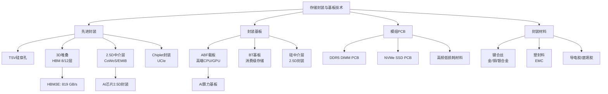
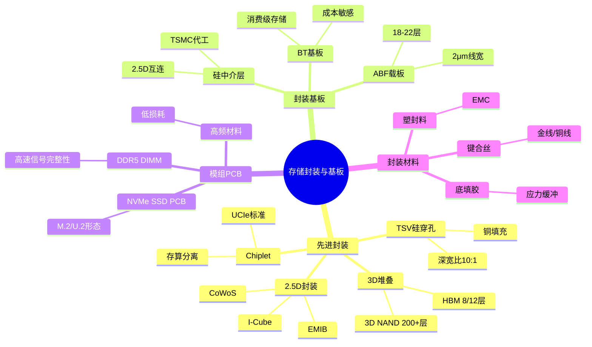
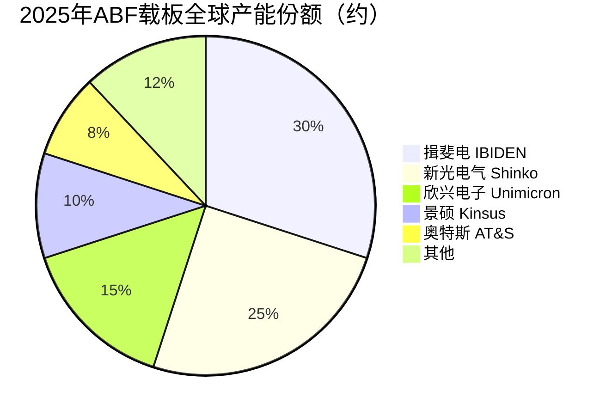

# 存储封装与基板

> 承载存储芯片与外部电路连接的物理载体，涵盖TSV硅穿孔、3D堆叠封装、BGA/ABF基板、HBM封装等先进封装技术，是AI高带宽存储的核心制造环节。

## 概述

存储封装与基板是连接存储芯片裸片（Die）与系统PCB板之间的物理桥梁，在存储产业链中处于晶圆制造之后、模组组装之前的中间环节。封装不仅保护脆弱的芯片裸片，还决定了芯片的电气性能、散热能力、信号完整性和最终产品形态。

在AI大算力时代，封装技术的重要性被空前放大。HBM（High Bandwidth Memory）通过TSV（Through-Silicon Via）硅穿孔技术和3D堆叠封装，将多层DRAM裸片垂直堆叠，实现远超传统DDR的带宽密度——HBM3E带宽达819 GB/s，是DDR5的十倍以上。这种"先进封装改变芯片性能"的范式，使封装从传统后段工序跃升为决定存储产品竞争力的核心环节。

基板方面，ABF（Ajinomoto Build-up Film）载板是高端CPU、GPU和HBM封装的关键基板材料，其多层布线能力决定了高引脚数芯片的封装密度。随着AI芯片引脚数突破数万，ABF载板的层数从10层向20层+演进，线宽线距从5μm向2μm逼近。模组PCB（如DDR5 DIMM、NVMe SSD PCB）则需要满足高速信号完整性要求，高频低损耗材料需求增长。

封装产业链涵盖封装代工（OSAT）、基板制造、封装材料（键合丝、塑封料、导电胶）等多个环节。日月光/矽品、安靠（Amkor）、长电科技/星科金朋、通富微电等OSAT厂商在存储先进封装领域积极布局。

## 技术原理

**TSV（Through-Silicon Via，硅穿孔）** 是3D堆叠封装的基础技术。其工艺流程为：在硅片上刻蚀深孔（深宽比可达10:1以上）→ 孔壁沉积绝缘层（SiO₂）→ 沉积阻挡层和种子层（Ta/TaN + Cu）→ 电镀铜填充 → 化学机械抛光（CMP）去除多余铜 → 晶圆减薄至50-100μm → 与另一片晶圆对准键合。TSV直径通常为5-10μm，间距20-50μm，每个TSV的电阻仅几十毫欧，寄生电容可忽略，实现了极低的互连损耗。

**3D堆叠封装** 通过两种方式实现多层裸片垂直集成：一是晶圆对晶圆（Wafer-to-Wafer）键合，良率高但要求每层晶圆尺寸一致；二是裸片对裸片（Die-to-Die）堆叠，灵活但堆叠对准精度要求高。HBM采用4/8/12层DRAM Die堆叠，层间通过TSV和微凸点（Microbump）连接。底层逻辑Die（Base Die/Buffer Die）位于最下方，通过微凸点与上方DRAM Die通信，再通过C4凸点（C4 Bump）连接到封装基板。

**BGA基板（Ball Grid Array）** 是芯片封装的载板，将芯片引脚通过基板内部布线扇出到底部焊球阵列。基板采用BT（Bismaleimide-Triazine）树脂或ABF（Ajinomoto Build-up Film）作为绝缘介质层，铜箔作为导电层，通过多次层压构建多层结构。高端ABF载板可达18-20层，最小线宽线距2-3μm。

**ABF载板（Ajinomoto Build-up Film）** 是味之素公司开发的环氧树脂薄膜材料，因其优异的绝缘性、低介电常数和精细图形化能力，成为CPU、GPU、HBM等高端芯片封装基板的核心材料。ABF载板的制作流程包括：芯板制作 → ABF薄膜层压 → 激光钻孔 → 化学镀铜和电镀填孔 → 外层线路制作 → 阻焊 → 表面处理。

## 分类与技术路线

存储封装按技术复杂度可分为四个层次：

**1. 传统引线键合封装（Wire Bonding）**：通过金线或铜线将芯片焊盘与引线框架/基板连接。适用于DDR4/DDR5 DRAM颗粒、eMMC、UFS等中低端存储。封装成本低，但引线寄生电感限制了高速信号传输，正在向倒装封装迁移。

**2. 倒装封装（Flip-Chip）**：芯片正面朝下，通过C4凸点或微凸点直接与基板连接，省去引线键合。信号路径极短，适合高引脚数、高速接口芯片。主流CPU、GPU、高端SSD控制器均采用倒装封装。C4凸点间距从130μm缩小至40μm以下。

**3. 2.5D先进封装**：通过硅中介层（Silicon Interposer）将多个裸片高密度互连。TSMC CoWoS（Chip-on-Wafer-on-Substrate）是代表性技术，在硅中介层上集成GPU裸片和HBM裸片，通过中介层内的TSV和超细布线（1μm以下）实现超高密度互连。Intel EMIB（Embedded Multi-die Interconnect Bridge）采用局部硅桥方案，成本更低但灵活性略逊。三星I-Cube是其2.5D封装品牌。

**4. 3D堆叠封装**：多层裸片通过TSV垂直堆叠，是HBM和3D NAND的核心技术。HBM堆叠4-12层DRAM裸片，通过TSV共享数据/地址/控制总线，实现极高带宽密度。3D NAND堆叠100+层浮栅/电荷俘获存储单元，通过BiCS（Bit Cost Scalable）或CuA（CMOS Under Array）工艺实现。3D SoC（3D System-on-Chip）将逻辑Die和存储Die垂直堆叠，是未来存算一体的方向。

基板方面，ABF载板面向高端AI芯片（如NVIDIA H100/B200），层数16-22层，线宽线距2-4μm；BT基板面向消费级存储模组，成本低但性能有限；硅中介层用于2.5D封装，TSMC和Intel提供代工。

## 市场格局

2025年全球存储封装与基板市场规模约400-500亿美元，其中先进封装（含2.5D/3D）约120-150亿美元，ABF载板约70-80亿美元。AI芯片封装是增长最快的细分市场。SK海力士2025年TSV产能达**150K**（月产能15万片晶圆），在HBM TSV封装领域全球领先。

**OSAT封装代工**：日月光（ASE）是全球最大OSAT，矽品（SPIL）为其子公司，合计市场份额约30%。安靠（Amkor）是第二大OSAT，在存储封装领域实力强，承担HBM后段贴片和模组封装。中国大陆长电科技（JCET）、通富微电（TFME）、华天科技位列全球前十，在存储封装和先进封装积极追赶。

**ABF载板**：日本揖斐电（IBIDEN）和新光电气（Shinko）合计占全球ABF载板产能60%以上。味之素（Ajinomoto）是ABF薄膜材料的唯一供应商，形成高度垄断。中国大陆欣兴电子（Unimicron）、景硕（Kinsus）扩产积极，奥特斯（AT&S）、深南电路在ABF载板国产化方向布局。

**HBM封装**：HBM的TSV和3D堆叠封装主要由三星和SK海力士在IDM模式下自主完成（前段TSV晶圆级封装），SK海力士2025年TSV产能达150K，领先优势稳固。后段贴片和模组封装由Amkor和JCET承担。TSMC在2.5D CoWoS封装领域占据垄断地位，是NVIDIA/AMD AI芯片封装的唯一选择，2025年CoWoS产能从2023年月产能1万片晶圆扩至3万+片。

**2.5D/3D先进封装代工**：TSMC凭借CoWoS技术占据AI芯片先进封装垄断地位，产能成为GPU出货瓶颈。Intel Foundry的Foveros和EMIB技术在自有产品中应用。三星3D IC封装（I-Cube/X-Cube）积极争取客户。

## 代表企业

| 企业 | 国家/地区 | 主要产品/技术 | 市场地位 |
|------|----------|-------------|---------|
| 日月光 ASE | 中国台湾 | 存储封装/先进封装代工 | 全球最大OSAT |
| 安靠 Amkor | 美国 | 存储封装/HBM后段封装 | 全球第二大OSAT |
| 长电科技 JCET | 中国 | 存储封装/先进封装 | 中国最大OSAT |
| 通富微电 TFME | 中国 | 存储封装/AMD GPU封装 | 中国先进封装领先 |
| 华天科技 | 中国 | 存储封装/TSV封装 | 中国存储封装主力 |
| TSMC | 中国台湾 | CoWoS 2.5D封装 | AI先进封装垄断者 |
| 三星电机 Samsung EM | 韩国 | ABF载板/FC-BGA | ABF载板扩产主力 |
| 揖斐电 IBIDEN | 日本 | ABF载板 | ABF载板全球第一 |
| 新光电气 Shinko | 日本 | ABF载板/封装基板 | ABF载板全球第二 |
| 欣兴电子 Unimicron | 中国台湾 | ABF载板/PCB | ABF载板扩产积极 |
| 味之素 Ajinomoto | 日本 | ABF薄膜材料 | ABF材料独家垄断 |
| 深南电路 | 中国 | PCB/封装基板 | ABF载板国产化先行 |

## 发展趋势

### 市场规模预测

| 年份 | 市场规模 | 同比增长 | 备注 |
|------|---------|---------|------|
| 2024 | ~350亿美元 | — | 基准年，先进封装约90亿美元 |
| 2025 | ~450亿美元 | +28.6% | SK海力士TSV产能150K，CoWoS扩产至3万+片/月 |
| 2026E | ~580亿美元 | +28.9% | HBM4量产，先进封装产能持续扩张 |
| 2027E | ~720亿美元 | +24.1% | 国产ABF载板中端量产，3D SoC封装落地 |

**1. Chiplet与UCIe标准推动封装标准化**：UCIe（Universal Chiplet Interconnect Express）标准正在推动多裸片互连的统一接口，使不同厂商的Chiplet能够混合封装。存储裸片（如HBM、DRAM Die）将作为标准Chiplet被集成到AI加速器中，封装密度和互连效率持续提升。

**2. 光子互连封装兴起**：随着电互连带宽密度逼近物理极限，光互连封装（Co-Packaged Optics, CPO）成为下一代方向。TSMC的COUPE（Compact Universal Photonic Engine）和Intel的CPO方案将光收发器集成到封装内部，实现Tbps级互连带宽。

**3. ABF载板层数持续增加**：AI芯片引脚数从H100的数万增至B200的十万+，ABF载板层数从16层向22-24层演进。高端ABF载板单价达数百美元，成为封装成本的重要组成。

**4. 3D SoC存算一体封装**：将存储裸片（SRAM/ReRAM/3D NAND）与逻辑裸片垂直堆叠，实现存算一体的3D SoC。台积电SoIC（System on Integrated Chips）和Intel Foveros Direct是代表性技术，预计2026-2028年在AI加速器中应用。

**5. 国产ABF载板加速替代**：深南电路、兴森科技等在ABF载板国产化方向积极布局，受AI需求和供应链安全双重驱动，预计2025-2027年实现中端ABF载板量产。

## AI基建拉动分析

AI芯片的封装复杂度和成本占比远超传统计算芯片。以NVIDIA H100 GPU为例，其采用TSMC CoWoS 2.5D封装，集成1个GPU裸片+6个HBM3裸片在硅中介层上，封装成本占芯片总成本的15-20%。B200 GPU更采用双裸片设计，封装复杂度进一步提升。

**需求拉动**：2025年全球AI加速芯片出货量约600-800万颗，每颗芯片需CoWoS封装和4-8颗HBM裸片，先进封装和HBM基板需求爆发式增长。TSMC CoWoS产能从2023年月产能1万片晶圆扩至2025年3万+片，仍供不应求。SK海力士2025年TSV产能达150K，HBM3E主力供应NVIDIA H100/H200/B200。

**技术升级**：HBM从3代（12层堆叠，24GB）向4代（12层堆叠，36GB）演进，TSV密度和堆叠层数持续增加。2.5D封装的硅中介层面积增大（B200中介层面积约为2000mm²），对光罩尺寸和良率提出挑战。

**市场机遇**：ABF载板需求随AI芯片放量而增长，揖斐电和新光电气扩产不及需求，国产替代空间大。封装材料方面，高端塑封料和底填胶国产化率低，受益于先进封装渗透。TSMC CoWoS产能扩张直接利好供应链。

**投资价值**：先进封装是AI芯片出货的"产能瓶颈"环节，TSMC CoWoS和HBM封装产能直接决定GPU出货节奏。封装基板和材料具有高壁垒、高毛利特征，是AI产业链中增长确定性极强的优质赛道。

---
[← 返回总目录](../README.md)
