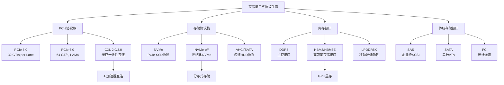
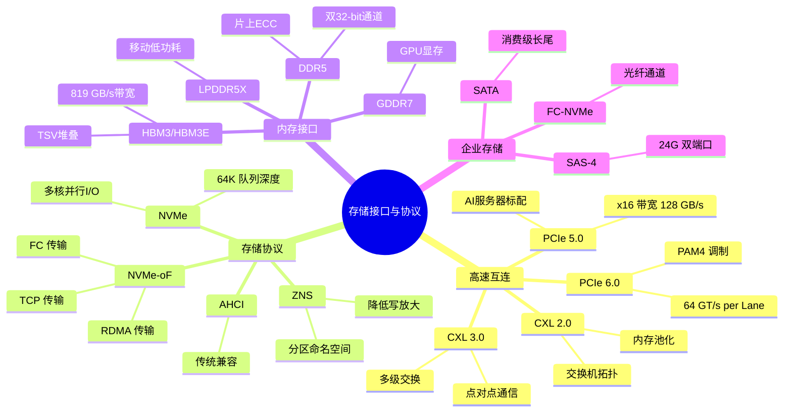
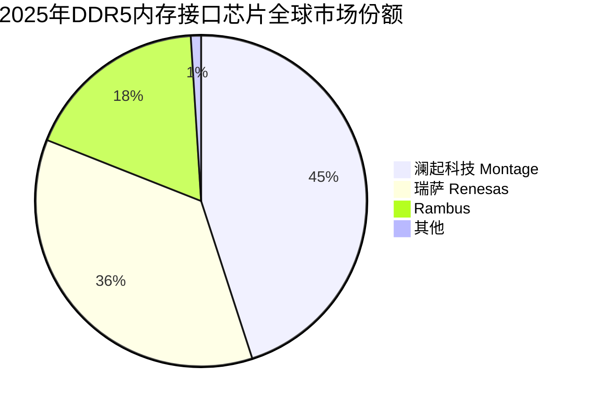

# 存储接口与协议

> 连接存储介质与计算系统的数据通道标准，涵盖PCIe、NVMe、CXL、DDR5、SAS/SATA等接口规范与协议栈，是AI算力基础设施中数据传输的"高速公路"。

## 概述

存储接口与协议是连接存储介质（DRAM、NAND Flash、HBM等）与计算处理器（CPU、GPU、DPU）之间的标准化数据通信规范。在存储产业链中，接口与协议处于上游芯片设计与下游系统集成之间的关键连接层，决定了数据传输的带宽、延迟、并发性和能效表现。

随着AI大模型训练对数据吞吐量的指数级增长，传统存储接口已成为算力瓶颈的关键节点。PCIe从3.0演进到5.0/6.0，带宽翻倍提升；CXL（Compute Express Link）作为新一代互连标准，突破了传统PCIe在缓存一致性方面的限制，实现了CPU与GPU/加速器之间的内存共享；NVMe-oF则将NVMe协议从本地DAS扩展到网络化存储，支持RDMA和FC传输；DDR5以更高频率和更低电压为AI训练提供高带宽主存支撑。

接口与协议的演进直接驱动了存储架构变革——从直连存储到网络存储，从共享总线到缓存一致互连，从单端口到多路径冗余。在AI基础设施中，CXL技术尤为关键，它使GPU能够直接访问CPU内存或远端存储，大幅降低数据搬运延迟，成为"内存墙"问题的核心解决方案。

## 技术原理

存储接口与协议的技术核心在于物理层信号传输、数据链路层帧处理和传输层协议栈的协同工作。

**PCIe（Peripheral Component Interconnect Express）** 采用点对点串行差分传输架构，每条Lane由TX/RX两对差分信号组成。PCIe 5.0单Lane带宽32 GT/s，x16配置可达128 GB/s双向带宽。PCIe 6.0引入PAM4（4电平脉冲幅度调制）编码，单Lane带宽翻倍至64 GT/s，同时采用FLIT（Flow Control Unit）模式实现更高效的链路层重传。

**NVMe（Non-Volatile Memory Express）** 是专为PCIe SSD设计的存储协议，替代传统AHCI/SATA协议栈。NVMe支持64K深度队列、多核并行I/O，协议层延迟从AHCI的~10μs降低至~10μs以下。NVMe-oF（NVMe over Fabrics）将NVMe协议扩展至网络传输，支持RDMA（RoCE/iWARP）、TCP和FC三种传输层，使远端存储获得接近本地NVMe SSD的访问性能。

**CXL（Compute Express Link）** 基于PCIe 5.0物理层构建，包含三种协议类型：CXL.io（兼容PCIe协议，用于设备发现和配置）、CXL.cache（允许加速器缓存CPU内存数据）、CXL.mem（允许CPU访问加速器内存）。CXL 2.0支持交换机拓扑和多主机共享内存池化，CXL 3.0进一步引入多级交换和点对点通信能力。

**DDR5（Double Data Rate 5）** SDRAM采用双32-bit通道架构（DDR4为单64-bit），起始频率4800 MT/s，未来可达8800 MT/s。DDR5引入片上ECC（On-Die ECC）和DFE（Decision Feedback Equalization）接收均衡，提升信号完整性和可靠性。

## 分类与技术路线

存储接口与协议按应用场景可分为四大类：

**1. 高速互连接口（PCIe/CXL）**：PCIe是当前最主流的设备互连标准，从PCIe 4.0到5.0已在AI服务器中普及，PCIe 6.0开始进入样品验证阶段。CXL是PCIe的扩展增强，专注于缓存一致性内存共享，是"内存池化"和"存算一体"架构的基础。CXL 3.0引入多级交换拓扑，支持数千节点级联，成为数据中心级内存解耦的关键技术。

**2. 存储访问协议（NVMe/AHCI）**：NVMe是PCIe SSD的事实标准，相比传统AHCI协议，队列深度提升1000倍，协议层延迟降低10倍。NVMe-oF分为三个子类：基于RDMA（RoCEv2/iWARP）的超低延迟方案、基于TCP的通用以太网方案、基于FC的存量兼容方案。ZNS（Zoned Namespace）作为NVMe扩展，将SSD空间划分为Zone，减少写放大。

**3. 内存接口（DDR5/HBM）**：DDR5是CPU主存接口标准，双通道设计提升并行度。HBM（High Bandwidth Memory）采用TSV硅穿孔+3D堆叠实现超高带宽（HBM3E达819 GB/s），通过专用接口连接GPU/ASIC。LPDDR5X面向移动端，兼顾带宽与功耗。

**4. 企业存储接口（SAS/FC）**：SAS-4（24G SAS）面向企业HDD和全闪存阵列，支持双端口冗余。FC（Fibre Channel）在金融行业存量市场仍占重要地位，FC-NVMe将NVMe映射到FC传输层。SATA逐步退出企业级高性能场景，但在消费级SSD中仍有长尾需求。

## 市场格局

2025年全球存储接口与协议市场规模约100-120亿美元，随AI基础设施扩张持续增长。其中CXL组件市场2025年达**7.101亿美元**，预计2026-2035年CAGR为27.5%，2035年达79亿美元；另一预测显示2025-2033年CAGR达36.2%，2033年达222.7亿美元。市场呈现"标准联盟+芯片IP+设备生态"三层结构。

**PCIe/CXL控制器IP市场**：Synopsys、Cadence、Alphawave Semi（前Banias Labs）是主要IP供应商。PCIe Retimer芯片市场由Astera Labs、Montage（澜起科技）和Astera主导，CXL控制器IP主要来自Synopsys和Cadence。

**NVMe控制器市场**：Marvell、Phison（群联）、Silicon Motion（慧荣）、慧荣科技、InnoGrit（英韧科技）是企业级和消费级NVMe控制器主力厂商。Broadcom和Microchip在SAS/FC市场占据主导。

**内存接口芯片市场**：DDR5 RCD/DB/RC内存缓冲芯片市场高度集中，2025年全球市场规模约15亿美元（2024年约11.68亿美元）。Montage Technology（澜起科技）全球份额第一，2025年份额达**43.5%-50%**（2024年为36.8%），净利润22.36亿元，毛利率突破70%。Rambus份额约17%-20%（2024年20.5%），瑞萨（Renesas）约36%。HBM接口PHY IP主要由Synopsys和Cadence提供。

**CXL生态**：英特尔是CXL标准的主要推动者，AMD、ARM、NVIDIA均支持。CXL交换芯片市场尚处早期，Astera Labs、Marvell等积极布局。CXL在AI加速中发挥关键作用——通过内存池化和缓存一致性，使GPU直接访问远端DRAM，成为突破"内存墙"的核心技术。

## 代表企业

| 企业 | 国家/地区 | 主要产品/技术 | 市场地位 |
|------|----------|-------------|---------|
| Synopsys | 美国 | PCIe/CXL/DDR5 PHY IP | 全球存储接口IP龙头 |
| Cadence | 美国 | PCIe/CXL控制器IP | IP供应商第一梯队 |
| Astera Labs | 美国 | PCIe Retimer/CXL连接 | PCIe/CXL连接芯片领导者 |
| 澜起科技 Montage | 中国 | DDR5 RCD/DB/MRCD、CXL内存加速 | DDR5接口芯片全球第一 |
| Rambus | 美国 | DDR5/HBM接口IP、CXL安全 | 内存接口IP先驱 |
| Marvell | 美国 | NVMe/SAS控制器、CXL | 存储控制器综合方案商 |
| 群联 Phison | 中国台湾 | NVMe控制器（消费+企业） | 消费级NVMe控制器领先 |
| 慧荣 Silicon Motion | 中国台湾 | NVMe/eMMC控制器 | 消费级存储控制器主力 |
| Broadcom | 美国 | SAS/FC HBA、PCIe交换 | 企业存储连接芯片龙头 |
| Microchip | 美国 | SAS/SATA/FC控制器 | 企业存储接口芯片 |
| 英韧科技 InnoGrit | 中国 | NVMe控制器 | 国产NVMe控制器新锐 |
| 瑞萨 Renesas | 日本 | DDR5内存接口、存储控制器 | 内存接口芯片第二 |

## 发展趋势

### 市场规模预测

| 年份 | 市场规模 | 同比增长 | 备注 |
|------|---------|---------|------|
| 2024 | ~85亿美元 | — | 基准年，内存接口芯片11.68亿美元 |
| 2025 | ~110亿美元 | +29.4% | CXL组件7.101亿美元，澜起份额升至45%+ |
| 2026E | ~145亿美元 | +31.8% | CXL内存扩展设备规模化部署，PCIe 6.0落地 |
| 2027E | ~190亿美元 | +31.0% | CXL交换机市场起量，DDR5向8800+演进 |

**1. PCIe 6.0/7.0加速落地**：PCIe 6.0采用PAM4编码实现带宽翻倍，2025-2026年将在AI服务器中逐步落地。PCIe 7.0已进入标准制定阶段，目标128 GT/s单Lane带宽，光学PCIe（Optical PCIe）将成为下一代互连方向。

**2. CXL 3.0推动内存池化**：CXL 3.0支持多级交换拓扑，使数据中心能够构建内存资源池，实现CPU内存和加速器内存的动态分配。2025年CXL组件市场已达7.101亿美元，预计2026-2035年CAGR 27.5%（另一预测2025-2033年CAGR 36.2%，2033年达222.7亿美元）。CXL在AI加速中的关键作用包括：内存池化使GPU直接访问远端DRAM、缓存一致性降低数据搬运延迟、CXL内存扩展型SSD为AI推理提供低成本大容量内存。预计2026-2027年CXL内存扩展设备将规模化部署，CXL交换机市场快速起量。

**3. NVMe-oF成为分布式存储标准**：基于RoCEv2的NVMe-oF因其低延迟和以太网兼容性，正成为AI分布式存储的首选传输协议。TCP-NVMe在通用以太网场景的渗透率持续提升。

**4. DDR5向8800+演进**：DDR5从4800 MT/s向6400/7200/8800 MT/s持续演进，MCR（Multiplexer Combined Ranks）DIMM技术突破单DIMM带宽瓶颈，支持AI训练的高带宽内存需求。

**5. 存储协议软件定义化**：随着存算分离架构普及，存储协议逐步从硬件绑定走向软件定义，SPDK（Storage Performance Development Kit）和io_uring等用户态I/O框架加速协议栈软件化。

## AI基建拉动分析

AI大模型训练对存储接口与协议提出了前所未有的高要求：GPU间通信需要NVLink/NVSwitch超高速互连（NVLink 5.0达1.8 TB/s），CPU与GPU间的数据搬运依赖PCIe 5.0 x16或CXL互连，训练数据加载需要NVMe-oF提供微秒级网络存储访问。

**需求拉动**：单台AI服务器（如NVIDIA DGX H100/B200）配备8张GPU，每张GPU需PCIe 5.0 x16连接，加上CXL内存扩展和NVMe SSD阵列，单服务器接口芯片价值量达数千美元。2025年全球AI服务器出货量约60-80万台，预计2026年达100万台+，存储接口芯片需求爆发式增长。澜起科技2025年净利润达22.36亿元，毛利率突破70%，直接反映AI基建对接口芯片的拉动。

**技术升级**：CXL成为AI内存墙突破的关键技术。通过CXL内存池化，GPU可直接访问远端DRAM，减少数据拷贝；CXL内存扩展型SSD（如Samsung CXL Memory Expander）为AI推理提供低成本大容量内存。

**市场机遇**：PCIe Retimer、CXL控制器、DDR5接口芯片是AI基建中确定性最高的增量市场。澜起科技作为DDR5 RCD全球龙头和CXL内存加速芯片先行者，直接受益于AI服务器放量。Astera Labs作为PCIe/CXL连接芯片纯标的，估值随AI基建热度持续攀升。

**投资价值**：存储接口与协议芯片具有"每台AI服务器必装"的属性，且技术壁垒高、竞争格局集中，是AI产业链中盈利确定性强、估值弹性大的优质环节。

---
[← 返回总目录](../README.md)
