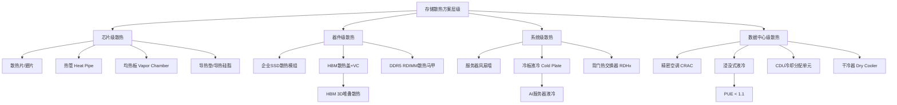
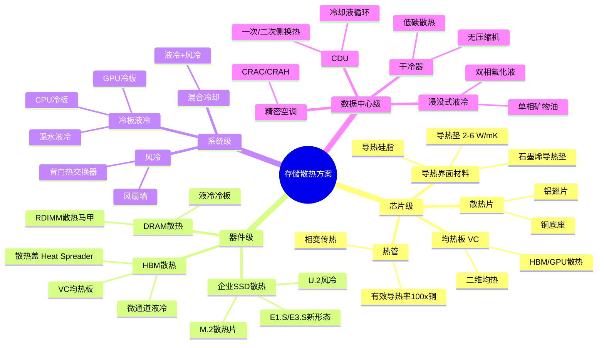
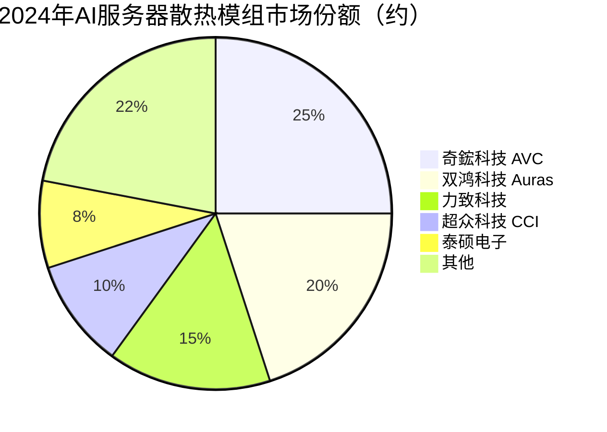

# 存储散热方案

> 保障存储器件在高功率密度下稳定运行的热管理技术体系，涵盖企业SSD散热片/热管、HBM微通道液冷、数据中心液冷/浸没式冷却等方案，是AI高功耗存储器件可靠性的关键保障。

## 概述

存储散热方案是保障存储器件在额定温度范围内稳定工作的热管理系统，涵盖从芯片级（散热片、热管、均热板）到系统级（风扇、液冷、浸没式）的多层次热管理技术。在存储产业链中，散热方案属于存储系统配套环节，与存储芯片、封装基板共同构成完整的存储解决方案。

AI大算力时代，存储器件功耗急剧攀升。企业级PCIe 5.0 SSD单盘功耗从PCIe 4.0的25W升至40W+；HBM3E单堆栈功耗约10-15W，8堆栈GPU总功耗达700W（NVIDIA H100）；AI服务器整机功耗从3-4kW飙升至10kW+（GB200 NVL72达120kW）。存储器件的热密度已接近甚至超过逻辑芯片，散热不足会导致性能降级（Thermal Throttling）、寿命缩短甚至永久损坏。

存储散热的核心挑战在于：存储器件（尤其DRAM和NAND）对温度高度敏感，NAND Flash在70°C以上时数据保持能力急剧下降，DRAM在85°C以上时刷新错误率升高。因此，散热方案不仅要降低器件峰值温度，还要保证温度均匀性和长期稳定性。

散热方案按层级可分为芯片级散热（散热片、热管、VC均热板）、器件级散热（SSD散热模组、HBM微通道冷板）、系统级散热（服务器风扇、冷板液冷）和数据中心级散热（精密空调、浸没式液冷、CDU冷却分配单元）。

## 技术原理

**热传导与热辐射基础**：存储散热本质是热量从高温热源（芯片Die）传递到低温环境（空气/液体）的过程。根据傅里叶导热定律 q = -k∇T，热流密度与材料热导率和温度梯度成正比。铜的热导率约400 W/m·K，铝约237 W/m·K，是散热片的主流材料。

**散热片与翅片**：通过增大散热面积提升对流换热效率。翅片效率 η = tanh(mL)/(mL)，其中 m = √(2h/kt)。企业SSD通常采用铝制散热片+导热垫（导热系数2-6 W/m·K）的组合，将NAND控制器和Flash芯片热量导出。

**热管与均热板（VC）**：热管利用工质（水/甲醇）的相变循环传热，有效热导率可达铜的100倍以上（10000-50000 W/m·K）。蒸发段液体吸热汽化→绝热段蒸汽流动→冷凝段蒸汽放热凝结→毛细结构回流液体。均热板（Vapor Chamber）是二维版热管，内壁为毛细吸液芯，可实现大面积均匀散热，广泛用于GPU和HBM散热。

**液冷技术**：液体比热容和热导率远高于空气（水的比热容4.2 kJ/kg·K，是空气的4倍），液冷散热效率显著优于风冷。冷板液冷（Cold Plate）将冷却液通过微通道冷板贴合芯片表面，带走热量；CDU（Coolant Distribution Unit）负责冷却液循环和温度控制。冷板液冷分为冷板式（间接液冷）和浸没式（直接液冷）两类。浸没式液冷将服务器整体浸入介电液体（如3M Novec/氟化液），消除风扇和散热片，PUE可降至1.05-1.1。

**HBM微通道散热**：HBM 3D堆叠的散热挑战在于中间层Die散热困难——上层Die阻挡热量向上传导，底层Die热量被HBM基板隔绝。解决方案包括：1）在堆叠Die之间插入薄散热层（Thermal TSV）增强层间导热；2）在HBM顶部加装VC均热板将热量导向GPU散热器；3）微通道液冷冷板集成到HBM封装基板内，冷却液直接流过堆叠Die侧面。

## 分类与技术路线

存储散热按应用层级和技术方案分为四大类：

**1. 企业SSD散热**：PCIe 5.0企业级SSD功耗达25-40W，需要主动散热。U.2/U.3形态SSD通常依靠服务器风扇强制风冷，M.2形态则需加装铝制散热片或铜热管散热模组。高端企业SSD采用石墨烯导热垫+VC均热板方案，将NAND和控制器热量均匀分散。E1.S/E3.S新形态SSD专为散热设计，具备更大散热面积和标准风道。

**2. HBM散热**：HBM 3D堆叠封装的热密度极高，是AI GPU散热最关键的环节之一。当前方案是在HBM顶部加装金属散热盖（Heat Spreader）和VC均热板，通过导热垫与GPU散热器集成。下一代方案探索微通道液冷集成到HBM封装内部，冷却液通过堆叠Die侧面或内部微通道带走热量。

**3. 服务器级液冷**：AI服务器（如NVIDIA DGX/HGX）采用冷板液冷为GPU/CPU降温，冷板贴合芯片表面，冷却液（水/乙二醇混合液）通过冷板微通道循环。冷板液冷分为温水液冷（供液温度30-40°C）和高温液冷（供液温度50-60°C），后者可使用干冷器替代制冷压缩机，进一步降低PUE。DRAM和SSD的冷板集成正在推进。

**4. 数据中心级散热**：浸没式液冷将整个服务器浸入介电液体中，分为单相（冷却液不发生相变，如矿物油）和双相（冷却液沸腾相变，如3M Novec氟化液）。双相浸没式散热效率最高，PUE可达1.05以下，但氟化液环保风险高（PFAS限制）。CDU（Coolant Distribution Unit）负责一次侧到二次侧的热量搬运，是液冷数据中心的核心设备。

## 市场格局

全球数据中心散热市场规模约150-200亿美元，其中液冷（冷板+浸没式）约30-40亿美元，增速显著高于整体散热市场。存储散热作为AI服务器散热的一部分，约占服务器散热成本的15-20%。

**散热模组**：台湾厂商主导全球散热模组市场。奇鋐科技（AVC）、双鸿科技（Auras）、力致科技是服务器散热模组前三。超众科技（CCI）、泰硕电子在VC均热板领域实力强。中国大陆超频三、飞荣达在中低端散热和导热材料领域布局。

**液冷设备**：Vertiv（艾默生）、Schneider Electric、英维克是数据中心液冷解决方案主要供应商。CoolIT Systems（被Viking收购）是冷板液冷技术先驱。Submer、GRC（Green Revolution Cooling）专注浸没式液冷。中国大陆曙光数创、英维克、高澜股份在冷板液冷国产化方向领先。

**导热界面材料（TIM）**：陶氏化学（Dow）、汉高（Henkel）、信越化学（Shin-Etsu）是高端导热垫和导热硅脂的主要供应商。石墨烯导热垫国产化正在推进，华为、碳元科技等布局。

**冷却液与设备**：3M曾是氟化液（Novec系列）主要供应商，因PFAS环保限制逐步退出。Solvay、Shell等推出替代产品。CDU设备由Vertiv、英维克等系统厂商提供。

## 代表企业

| 企业 | 国家/地区 | 主要产品/技术 | 市场地位 |
|------|----------|-------------|---------|
| 奇鋐科技 AVC | 中国台湾 | 服务器散热模组/VC | 全球散热模组龙头 |
| 双鸿科技 Auras | 中国台湾 | 服务器散热器/冷板 | AI散热模组领先 |
| 力致科技 | 中国台湾 | 散热模组/热管 | 服务器散热前三 |
| 超众科技 CCI | 中国台湾 | VC均热板/散热片 | VC技术领先 |
| Vertiv 艾默生 | 美国 | CDU/液冷系统 | 数据中心散热龙头 |
| 英维克 Envicool | 中国 | 冷板液冷/CDU/精密空调 | 中国液冷龙头 |
| 曙光数创 | 中国 | 冷板液冷/浸没式 | 中国液冷系统领先 |
| 高澜股份 | 中国 | 液冷设备/CDU | 液冷设备国产化 |
| CoolIT Systems | 加拿大 | 冷板液冷技术 | 冷板液冷先驱 |
| Submer | 西班牙 | 浸没式液冷 | 浸没式液冷新锐 |
| 陶氏化学 Dow | 美国 | 导热界面材料 | TIM材料龙头 |
| 信越化学 Shin-Etsu | 日本 | 导热硅脂/导热垫 | 导热材料领先 |

## 发展趋势

**1. 液冷渗透率快速提升**：AI服务器功耗从3kW升至10kW+，传统风冷散热能力已达极限（单机柜风冷上限约15-20kW）。冷板液冷成为AI服务器标配，渗透率从2023年约10%升至2026年预计40%+。GPU/CPU冷板率先普及，DRAM和SSD冷板集成正在推进。

**2. 浸没式液冷商业化加速**：浸没式液冷PUE最低（1.05-1.1），但部署成本和运维复杂度高。随着3M退出氟化液市场，单相矿物油浸没式方案重新获得关注。预计2026-2028年浸没式液冷在高密度AI数据中心中实现商业化部署。

**3. HBM散热技术升级**：HBM 3D堆叠的热密度持续攀升，传统散热盖+VC方案已接近极限。下一代方案包括：在HBM封装内部集成微通道液冷冷板、采用金刚石散热衬底（热导率2000+ W/m·K）作为堆叠Die间热传导层。

**4. 智能热管理**：基于传感器网络和AI算法的动态热管理成为趋势。通过实时监测每个存储器件温度，动态调节风扇转速、液冷流量和负载分配，实现散热效率和能耗的最优平衡。

**5. 绿色低碳散热**：液冷废热回收利用（热能回收供暖）成为数据中心减碳的重要方向。自然冷却（Free Cooling）利用外部冷空气或冷水减少制冷能耗，结合干冷器替代机械制冷。

## AI基建拉动分析

AI服务器的高功耗特性使散热方案从"附属配套"升级为"核心组件"。以NVIDIA GB200 NVL72为例，整机功耗达120kW，单机柜功耗是传统服务器的5-10倍，风冷完全无法满足，必须采用冷板液冷或浸没式方案。

**需求拉动**：全球AI服务器年出货量从2023年约30万台增至2026年预计100万+台，每台液冷AI服务器散热方案价值约$3000-8000，是传统风冷服务器的5-10倍。散热市场总增量约50-80亿美元。HBM散热模组随GPU出货量增长，单GPU的HBM散热价值约$50-100。

**技术升级**：从风冷→冷板液冷→浸没式液冷的升级路径明确。冷板液冷已在NVIDIA HGX/DGX平台普及，下一代将向DRAM和SSD扩展。浸没式液冷在Meta、微软等大型AI数据中心试点部署。

**市场机遇**：英维克、曙光数创等中国液冷厂商受益于国内AI算力建设。台湾散热模组厂商（双鸿、奇鋐）受益于全球AI服务器放量。导热界面材料国产化空间大。

**投资价值**：散热是AI服务器"必装"组件，且技术壁垒适中、竞争格局相对清晰，是AI产业链中受益确定性强的优质环节。液冷渗透率提升带来的结构性增长，使散热市场增速高于整体AI硬件市场。

---
[← 返回总目录](../README.md)
