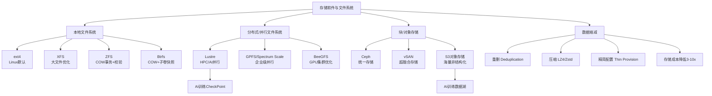
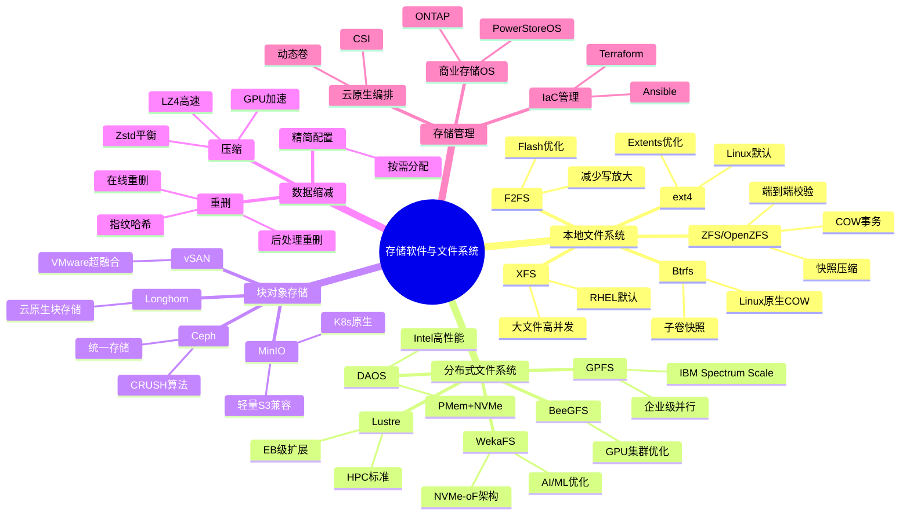
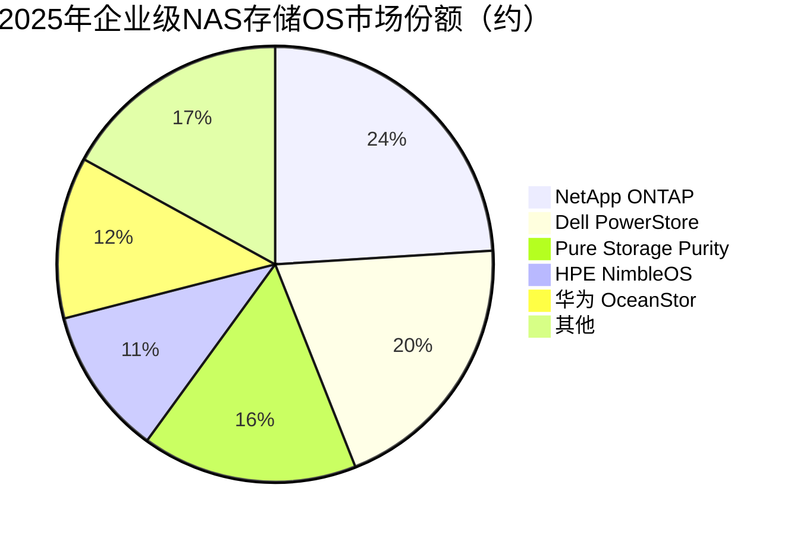

# 存储软件与文件系统

> 管理存储硬件资源并为上层应用提供数据存取服务的软件层，涵盖存储OS、文件系统（ext4/ZFS/Btrfs）、数据缩减（重删/压缩）、存储虚拟化等技术，是AI数据基础设施的软件底座。

## 概述

存储软件与文件系统是位于存储硬件与应用程序之间的软件中间层，负责管理存储资源、组织数据结构、提供数据访问接口和保障数据可靠性。在存储产业链中，存储软件处于最上游（芯片/硬件）和最下游（应用）之间的关键软件环节，决定了存储系统的功能丰富度、性能表现和管理效率。

AI大模型训练对存储软件提出了全新挑战：训练数据集从TB级跃升至PB甚至EB级，要求文件系统支持超大规模命名空间和高并发访问；检查点（Checkpoint）写入需要极高带宽（数十GB/s）以减少训练中断时间；多GPU并行训练要求存储系统提供一致性共享访问；推理阶段的海量小文件读取对元数据性能提出严苛要求。

传统文件系统（ext4、XFS）在AI场景面临瓶颈：单机文件系统无法支撑PB级数据；NAS协议（NFS/SMB）在高并发下延迟和带宽受限；块存储缺乏数据缩减能力。新一代存储软件栈应运而生：并行文件系统（Lustre、GPFS、BeeGFS）提供超高性能并行访问；对象存储（S3协议）支撑海量非结构化数据；分布式块存储（Ceph RBD）支持虚拟化场景。

数据缩减技术（重删+压缩）在AI存储中价值凸显：训练数据中大量重复样本和可压缩文本/图像，通过在线重删和压缩可将存储成本降低3-10倍。存储虚拟化（vSAN、Ceph）实现了存储资源的池化和按需分配，是云原生AI基础设施的基础。

## 技术原理

**文件系统核心机制**：文件系统将存储设备的线性地址空间组织为层次化的文件目录结构。核心数据结构包括：超级块（Superblock，存储文件系统元信息）、inode（索引节点，存储文件属性和数据块指针）、目录项（Dentry，文件名到inode的映射）、数据块（Data Block，实际文件内容）。ext4采用Extents替代传统间接块映射，大文件仅需少量Extents即可描述连续数据块范围，大幅提升大文件性能。ZFS采用COW（Copy-on-Write）事务模型，所有写操作先写入新位置，再原子性更新指针，保证数据一致性。Btrfs同样基于COW，支持子卷（Subvolume）、快照和透明压缩。

**数据缩减技术**：1）重复数据删除（Deduplication）——识别并消除重复数据块。分为在线重删（Inline Dedup，写入时检测）和后处理重删（Post-Process Dedup，写入后扫描）。指纹算法（如SHA-1/SHA-256）对数据块计算哈希值，相同哈希的数据块只存储一份，通过指针引用。重删率取决于数据特征，虚拟机镜像可达10:1，文档数据约3:1。2）数据压缩（Compression）——使用LZ4、Zstd、Gzip等算法压缩数据块。LZ4压缩/解压速度极快（500MB/s+），适合在线压缩；Zstd在压缩率和速度间平衡最优。AI训练数据中文本/JSON可压缩至原大小的20-30%。

**存储虚拟化**：将物理存储资源抽象为逻辑存储池，实现存储的池化分配、精简配置（Thin Provisioning）和动态扩展。vSAN（VMware）将服务器本地磁盘组成分布式存储池；Ceph通过RADOS提供统一的块/文件/对象存储服务。存储虚拟化的核心是数据分布策略——CRUSH算法（Ceph）伪随机分布数据到OSD节点，避免中心化元数据瓶颈。

**并行文件系统**：Lustre、GPFS（Spectrum Scale）、BeeGFS专为HPC/AI场景设计。核心思想是将文件数据条带化（Striping）分布到多个存储节点（OST/Object Storage Target），客户端通过Direct I/O并行读写多个OST，实现聚合带宽线性扩展。元数据服务器（MDS）分离处理文件创建/删除等元数据操作，避免数据I/O和元数据I/O争抢。Lustre单个文件系统可扩展至数百PB和数万客户端。

**对象存储**：S3（Simple Storage Service）协议将数据以对象（Object）形式存储在桶（Bucket）中，每个对象包含数据、元数据和唯一标识符（Key）。对象存储通过RESTful API访问，天然适合HTTP环境和海量非结构化数据。对象存储采用扁平化命名空间，避免了文件系统层次结构的元数据瓶颈。AI训练数据通常以对象形式存储，通过S3 Select或预处理管道加载。

## 分类与技术路线

存储软件按层次和功能分为五大类：

**1. 本地文件系统**：管理单机存储设备的文件系统。ext4是Linux默认文件系统，稳定可靠但缺乏高级特性（快照、校验）。XFS擅长大文件和高并发，是RHEL默认。ZFS（OpenZFS）集成了COW事务、端到端校验、快照、压缩和原生RAID-Z，是企业级本地存储首选，但 CDDL 协议限制其在Linux内核主线集成。Btrfs是Linux原生COW文件系统，支持子卷、快照、透明压缩和RAID，功能接近ZFS但稳定性仍在提升。F2FS（Flash-Friendly File System）专为NAND Flash优化，减少写放大。

**2. 分布式/并行文件系统**：Lustre是HPC领域事实标准，开源、高性能、支持EB级扩展。IBM Spectrum Scale（前GPFS）企业级功能丰富，支持POSIX和S3协议。BeeGFS（前FhGFS）轻量高效，在德国Fraunhofer和GPU AI集群中广泛应用。WekaFS（WekaIO）基于NVMe-oF和容器化架构，针对AI/ML工作负载优化。DAOS（Distributed Asynchronous Object Storage）是Intel推出的高性能分布式存储，基于PMem和NVMe。

**3. 块/对象存储**：Ceph是开源统一存储平台，提供RBD（块）、CephFS（文件）和RGW（S3对象）三种接口，通过CRUSH算法实现无中心化数据分布。vSAN是VMware超融合存储，与vSphere深度集成。MinIO是轻量级S3兼容对象存储，Kubernetes原生。Longhorn是Rancher的云原生分布式块存储。

**4. 数据缩减**：重删和压缩可显著降低存储成本。在线重删在写入路径检测重复，延迟略增但即时节省空间；后处理重删在后台扫描，对写入性能无影响但需额外存储空间。Zstd和LZ4是主流压缩算法，GPU加速压缩（如NVIDIA CUDALZ4）正在推进。全闪存阵列（AFA）普遍标配在线重删+压缩。

**5. 存储管理与编排**：存储OS和管理软件负责存储资源调度、监控和运维。Pure Storage Pure1、Dell PowerStoreOS、NetApp ONTAP是商业存储OS代表。Kubernetes CSI（Container Storage Interface）实现云原生存储编排，支持动态卷创建和快照。Ansible/Terraform用于存储基础设施即代码（IaC）管理。

## 市场格局

2025年全球存储软件市场规模约250-300亿美元，包括文件系统、存储管理软件、数据缩减软件、备份恢复软件等。AI存储软件是增速最快的细分市场。全闪存阵列市场2025年达233.8亿美元，2026年预计277.3亿美元。企业级存储系统市场中华为份额12.0%（营收67亿美元，排名#2），NetApp份额9.4%（53亿美元，#3），全闪存阵列YoY增长17.6%。

**并行文件系统**：Lustre由OpenSFS社区维护，HPE（Cray）、DDN、VAST Data等提供商业化支持。IBM Spectrum Scale在企业市场强势。WekaIO和VAST Data是AI存储软件新锐，获得大量融资。DAOS在Intel内部和HPC客户中部署。

**企业存储OS**：NetApp ONTAP是NAS存储OS市场领导者。Dell PowerStoreOS/Unity OS、Pure Storage Purity//FA（Q3营收38亿美元，排名#4）、HPE NimbleOS是企业全闪存阵列主流。华为OceanStor OS、浪潮AS13000在中国市场竞争力强。

**开源存储软件**：Ceph（Red Hat/IBM维护）是开源分布式存储事实标准。MinIO在S3兼容对象存储领域增长迅速。Linstor、Longhorn等云原生存储方案在Kubernetes生态普及。

**数据缩减**：Pure Storage、Dell PowerStore、NetApp AFF等全闪存阵列内置硬件加速重删压缩。SimpliVity（HPE）、Nimble Storage（HPE）以高重删率著称。Permabit（Red Hat Acropolis）提供软件级数据缩减。

## 代表企业

| 企业 | 国家/地区 | 主要产品/技术 | 市场地位 |
|------|----------|-------------|---------|
| NetApp | 美国 | ONTAP存储OS、NAS | NAS存储软件龙头 |
| Dell Technologies | 美国 | PowerStoreOS、Unity OS | 企业存储OS领先 |
| Pure Storage | 美国 | Purity//FA、FlashArray | 全闪存OS+重删领先 |
| IBM | 美国 | Spectrum Scale(GPFS)、StorageOS | 并行文件系统+企业存储 |
| WekaIO | 美国 | WekaFS并行文件系统 | AI存储软件新锐 |
| VAST Data | 美国 | VAST并行存储、DASE架构 | AI存储新星 |
| DDN | 美国 | Lustre商业化、EXAScaler | HPC/AI存储领先 |
| Red Hat/IBM | 美国 | Ceph分布式存储 | 开源分布式存储标准 |
| MinIO | 美国 | S3兼容对象存储 | 轻量对象存储领先 |
| 华为 | 中国 | OceanStor OS、FusionStorage | 中国存储软件龙头 |
| 浪潮 | 中国 | AS13000、并行存储 | 中国AI存储领先 |
| XSKY 星辰天合 | 中国 | Ceph商业化、对象存储 | 中国开源存储新锐 |

## 发展趋势

### 市场规模预测

| 年份 | 市场规模 | 同比增长 | 备注 |
|------|---------|---------|------|
| 2024 | ~220亿美元 | — | 基准年，全闪存阵列约200亿美元 |
| 2025 | ~275亿美元 | +25.0% | 全闪存阵列233.8亿美元，AI存储软件爆发 |
| 2026E | ~340亿美元 | +23.6% | 全闪存阵列277.3亿美元，CXL内存池化落地 |
| 2027E | ~410亿美元 | +20.6% | AI原生存储普及，云原生存储深化 |

**1. AI原生存储架构**：针对AI训练和推理工作负载优化的存储架构正在兴起。特征包括：GPU Direct Storage（GDS）绕过CPU直接从NVMe SSD读取数据到GPU内存；检查点写入带宽优化（数十GB/s）；小文件元数据缓存加速推理数据加载。WekaIO、VAST Data等专注AI原生存储。

**2. 存算分离与存储池化**：AI算力中心普遍采用存算分离架构，存储资源池化供多个计算集群共享。CXL技术使内存级存储池化成为可能，未来DRAM和NVMe可通过CXL交换机动态分配给不同计算节点。

**3. 云原生存储**：Kubernetes成为AI容器编排事实标准，CSI接口使存储与容器深度集成。容器化AI训练需要支持动态卷创建、快照恢复和多租户隔离。Longhorn、OpenEBS、Rook（Ceph on K8s）等云原生存储方案普及。

**4. 智能数据管理**：基于AI的存储管理（AIOps）实现智能分层、预测性故障检测和自动性能调优。元数据索引和搜索（如CephFS的MDS索引）使存储系统具备数据发现和语义检索能力。

**5. ZNS与开源生态**：ZNS（Zoned Namespace）SSD将存储空间划分为Zone，由主机软件控制写入顺序，减少SSD内部GC开销，提升写吞吐和寿命。openZFS、Ceph等开源存储生态持续活跃，降低存储软件门槛。

## AI基建拉动分析

AI训练和推理对存储软件的性能、规模和功能提出全新要求，驱动存储软件从传统企业级向AI原生架构升级。

**需求拉动**：单个AI大模型训练需PB级存储和数十GB/s带宽，传统NAS和块存储无法满足。Lustre/GPFS/BeeGFS等并行文件系统在AI超算中心部署量快速增长。2025年全球AI存储软件市场约35-40亿美元，全闪存阵列市场达233.8亿美元，预计2026年达277.3亿美元。企业级存储系统中华为份额12.0%（营收67亿美元），全闪存阵列YoY增长17.6%。WekaIO、VAST Data等AI存储软件公司估值快速增长。

**技术升级**：GPU Direct Storage（GDS）使NVMe SSD数据绕过CPU直接传输到GPU显存，减少数据搬运延迟。检查点写入优化包括并行写入、异步刷盘和压缩感知调度。元数据性能优化使百万级小文件场景的I/O吞吐提升10-100倍。

**市场机遇**：AI训练数据管理软件（数据版本控制、数据清洗、特征存储）是新兴市场。对象存储（S3）作为AI数据湖底座，部署量随AI数据增长而爆发。数据缩减（重删+压缩）在AI训练数据场景价值显著，可降低3-10倍存储成本。

**投资价值**：存储软件是AI基础设施中"软件定义"价值最大的环节，具有高毛利（60-80%）和高粘性特征。AI原生存储软件公司（WekaIO、VAST Data）估值弹性大。中国AI存储软件（华为OceanStor、浪潮AS13000）受益于国产替代和AI算力建设，增长确定性强。

---
[← 返回总目录](../README.md)
